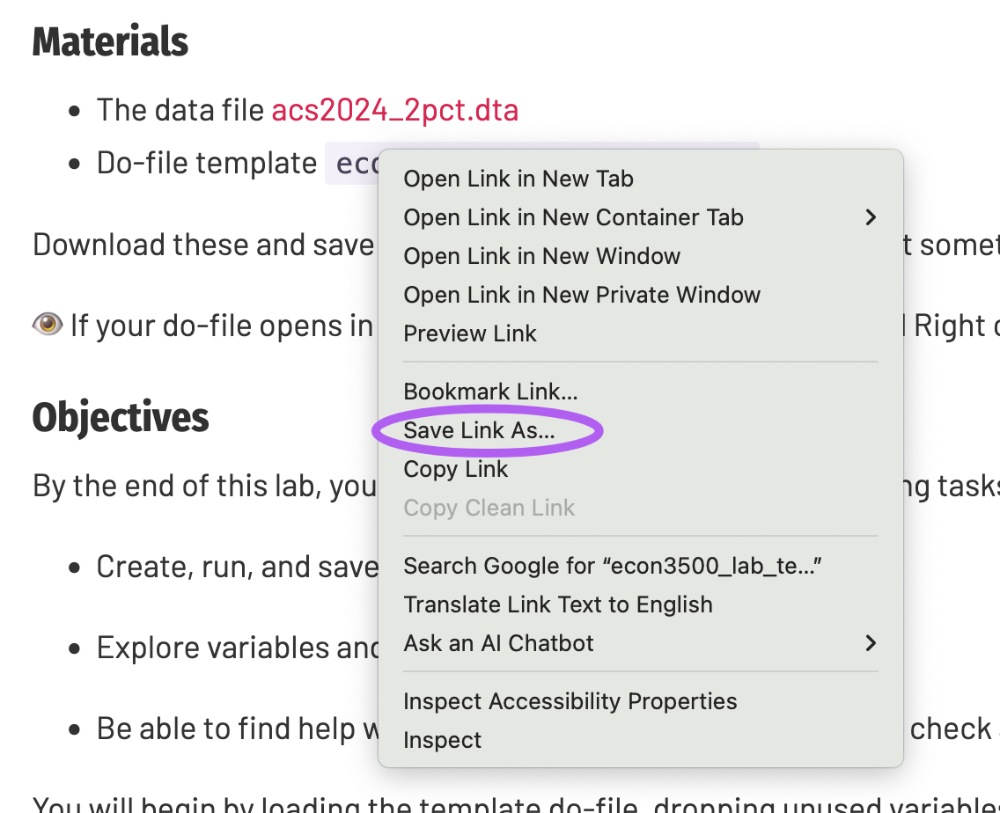
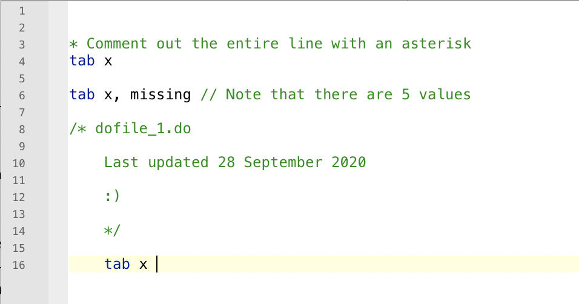

### Materials {#materials .unnumbered}

- The data file [acs2024_2pct.dta](../materials/acs2024_2pct.dta)
- Do-file template [`econ3500_lab_template.do`](../materials/econ3500_lab_template.do)

Download these and save in your lab folder (perhaps you named it something like `econ3500/labs`?)

:eye: If your do-file opens in a browser tab, you may want to instead Right click and select "Save Link As" :eye:

{width=50%}

### Objectives {#objectives .unnumbered}

By the end of this lab, you should be able to complete the following tasks in Stata:

-   Create, run, and save a do-file

-   Explore variables and generate new ones

-   Be able to find help with Stata issues - find new commands, check and debug your work, etc.

You will begin by loading the template do-file, dropping unused variables, and reporting how many variables remain. Then we are going to look at sample characteristics before excluding everyone under 23 and keep that restricted sample for the rest of the lab. Then, we will compare income and wages across age and gender groups and construct a post-secondary education indicator to investigate how the gender wage gap interacts with educational attainment. 

Before you start typing commands, skim the dataset we will work with by opening it in Stata. We now use [`acs2024_2pct.dta`](../materials/acs2024_2pct), a 2.5% subsample of the 2024 American Community Survey. 

### Key commands  {#key-commands .unnumbered}

|command|description|
| :------------- | ----------: |
|Viewing data||
|`tab var1` | tabulate one variable, `var1`|
|`tab var1, missing` |tabulate `var1`, include missing values |
|`tab var1, nolabel` |tabulate `var1`, show values rather than labels (if applicable) |
|||
|Summarizing data| |
|`tabstat var1`| calculate mean of `var1`|
|`tabstat var1,by(var2)`| calculate mean of `var1` separately for each value of `var2`|
|`tabstat var1,by(var2) stat(mean count p25 p50 p75)`| calculate mean of `var1` separately for each value of `var2`, with added statistics|
|Changing your data||
| `gen newvar =var1` | generate a new variable, `newvar`, and set it equal to values of ` var1`|
| `gen newvar =1 if var2 == [exp]` | generate a new variable, `newvar`, and set it equal to 1 if ` var2` equals some expression, and missing otherwise |
| `gen newvar = var2 == [exp]` | generate a new variable, `newvar`, and  set it equal to 1 if ` var2` equals some expression, and 0 otherwise |
|`drop var1 var2 `| drop the variables ` var1` and ` var2`.|
|`drop if [exp]` | drop observations for which `exp` is true|
|`keep var1 var2` | drop everything but ` var1` and ` var2`.|
|`keep if [exp]` | keep observations _only_ if `exp` is true|
|Displaying your data||
|`graph twoway histogram var1` | make a histogram for `var1.` Check help files for more options|

Looking for more examples? Check out these [**Stata Cheat Sheets**](https://geocenter.github.io/StataTraining/portfolio/01_resource/)

Suppose I asked you to recreate your analysis from Lab 01. How long would it take you? If you used a do-file, you would just have to click a button, because your analysis would be replicable. We're going to learn about the glory of do-files and a few other descriptive statistics tricks.

The instant gratification of the Command window is tempting, but getting comfortable with do-files will save you lots of time, make collaboration easier, and reduce errors!

### Aside:  Bad documentation, big problems
> For an economist, the five most terrifying words in the English language are: I can’t replicate your results.But for economists Carmen Reinhart and Ken Rogoff of Harvard, there are seven even more terrifying ones: I think you made an Excel error.
>
> – [Matthew O’Brien, The Atlantic (18 April 2013)](https://www.theatlantic.com/business/archive/2013/04/forget-excel-this-was-reinhart-and-rogoffs-biggest-mistake/275088/)

A summary from [The Conversation, (22 April, 2013)](https://theconversation.com/the-reinhart-rogoff-error-or-how-not-to-excel-at-economics-13646)

> Reinhart and Rogoff’s work showed average real economic growth slows (a 0.1% decline) when a country’s debt rises to more than 90% of gross domestic product (GDP) – and this 90% figure was employed repeatedly in political arguments over high-profile austerity measures...
>
> The most serious was that, in their Excel spreadsheet, Reinhart and Rogoff had not selected the entire row when averaging growth figures: they omitted data from Australia, Austria, Belgium, Canada and Denmark.
>
> In other words, they had accidentally only included 15 of the 20 countries under analysis in their key calculation.
>
> When that error was corrected, the “0.1% decline” data became a 2.2% average increase in economic growth. 
>
> So the key conclusion of a seminal paper, which has been widely quoted in political debates in North America, Europe Australia and elsewhere, was invalid. 

](../../static/media/reinhart-rogoff-error.png){width=50%}

### Do-files and the do-file editor

You can get pretty far in Stata relying on the Command and Review window, but we may want a record of the commands we want to run for our analysis. One thing that makes Stata different from a program like Excel is that you can create do-files, essentially small programs that will
run your analysis again and again, in exactly the same way. For
econometric analysis this is CRUCIAL.

A do-file can be written in any text file and then saved with the extension `.do`, but we'll use the do-file editor. You can start a new do-file by
clicking on the do-file button. Or, you can open the do-file template. 

The do-file editor is where we will write our programs, and it has some nice color coding to help us avoid mistakes. For your problem sets and
papers, you must ALWAYS submit a do-file along with your results. Some people will like to practice in the Command window and then copy the
commands they're satisfied with to the do-file, while others will prefer to work entirely in the do-file. It's your call, though the second one
is a little less risky.

#### Comment, comment, comment

Do-files are used to record your past work and possibly to share your
work with others. It's important to properly **document** your work
using comments. There are three ways to comment

1. Comment the whole line with an asterisk

2. Comment the whole line or part of a line with two forward slashes (`//`)

3.   Use slash-asterisk to open (`/*`) and close (`*/`) a comment section

{width=50%}

The do-file editor will turn all your comments green so you don't get
confused.

### Programming tips

-   **Put everything in a do-file!** An important feature of any good
    research project is that the results should be reproducible. For
    Stata the easiest way to do this is to create a text file that lists
    all your commands in order, so anyone can re-run all your Stata work
    on a project anytime. Such text files that are produced within Stata
    or linked to Stata are called do-files, because they have an
    extension .do (like `intro_exercise.do`). These files feed commands
    directly into Stata without you having to type or copy them into the
    command window.

    Imagine you're just about done with the analysis for your research
    paper. While working on the final regression, you discover that one
    of your variables wasn't cleaned properly, and you need to drop some
    outliers from the data. Do you correct it and redo everything from
    scratch? Could you even do that? How long would it take?

    With a set of do-files, all you have to do is correct the variable
    early in the code, and re-run everything. If your code is quick, it
    will take just a few minutes. Easy!

    An added bonus is that having do-files makes it very easy to fix
    your typos, re-order commands, and create more complicated chains of
    commands that wouldn't work otherwise. You can now quickly reproduce
    your work, correct it, adjust it, and build on it.

-   **Log your results.** Maintaining logs can help you quickly retrieve
    results and serve as a record of past work in case you accidentally
    overwrite commands. Logs contain the commands *and* the results.

-   **Never overwrite your original files.** A good do-file structure
    starts with your original, raw data, then cleans and analyzes it to
    get your final results. A "master" do-file can piece all these
    together.

-   **Replicability is key.** Your code should be replicable to someone
    else who picks up your raw files and code.

-   **Comment, comment, comment!** Clear commenting is essential to help
    others understand your code and to remember what you did.

### Finding new commands

One of the strengths of Stata is that complicated processes can be
completed with simple commands. One of its weaknesses is that it's not
always obvious what those specific commands are. In our problem sets and
your research paper, you will (I promise) have to calculate or estimate
something in a way we haven't covered.

-   Stata help file: `help command`

-   Search Stata documentation: `findit keyword`

-   Google/ChatGPT the thing you are trying to do
    
    

## Lab Exercise 2 {#lab-2 .unnumbered}

### What do I submit?

   -  Your written-up answers to exercise questions (1) - (11). This can be typed or written out, then scanned (or photographed). If scanning, please upload as a `.pdf`, not a `.jpg` or `.png`! 
      -  Please put your answers in a separate file rather than your do-file. This makes it easier for us! Also, you'll need to include at least one figure, which you cannot paste into a do-file.

   -  The do-file you've created that runs this analysis 
   -  A log file that contains the results from this exercise.

### Questions

1. If you haven't yet done so, download our dataset, [acs2024_2pct.dta](../materials/acs2024_2pct.dta), and the do-file template [`econ3500_lab_template.do`](../materials/econ3500_lab_template.do). Move them to your labs folder

2. Open `econ3500_lab_template.do` and run it. Does it work? Probably not! Fix it until you can run the file from start to finish with no errors.

3. Drop some variables we don't need right now: `gq`, `serial`, and `hhwt`. How
   many variables remain?

4. What is the age distribution of the sample? Specifically, report the
   mean, median, minimum, and maximum age of the sample.

5. Because very young workers might still be in school, drop anyone in
   your sample who is less than 23 years old (maintain this sample
   restriction for the rest of the lab). How many people are left in
   your sample?

6. Generate a new variable, `lt35`, that is equal to one if a person is
   less than 35 years old and 0 otherwise. What is the mean of `lt35` and
   what is its interpretation?

7. Using the `tabstat` command, find the average income and wages for  hose under age 35 and those at least age 35. How does it compare to the *median* income and wages for each group?

8. Using the `tabstat` command, find the average income and wages for  men and women.

9. There are several reasons why men might earn more than women. Suppose you hypothesized that men have completed more education than women, and workers with higher education levels earn more. We will test this in two ways.

   a. First, generate a variable equal to one if a person has completed at least some post-secondary education, and zero otherwise. What is the mean of this variable?

   b. What share of men have at least some post-secondary education? What about women?

   c. We can also see if gender-wage gaps are bigger for lower vs. higher-educated workers. For those without post-secondary education, what is the average wage gap? For those with post-secondary education, what is the average wage gap?

   d. Use the `lt35` indicator you already created to compare the gender wage gap for younger workers (under 35) and older workers (35 and over). Does the gap appear larger in one age group? What might that tell you about experience or life-cycle effects?

10. Name **two** additional reasons that may explain why men's income is higher than women's income on average. How would you test each one? _You do not have to actually do this test, just describe in as much detail as possible. You can assume you have additional data beyond what is provided here._

11. Make two histograms, one of the income distrition for men and one of the income distribution for women. Make sure the y-axis indicates the "fraction" of individuals, not the density. Copy and paste it into your responses. 

## Video Recording 

[YouTube video](https://www.youtube.com/watch?v=ssCWM4IE6i8)