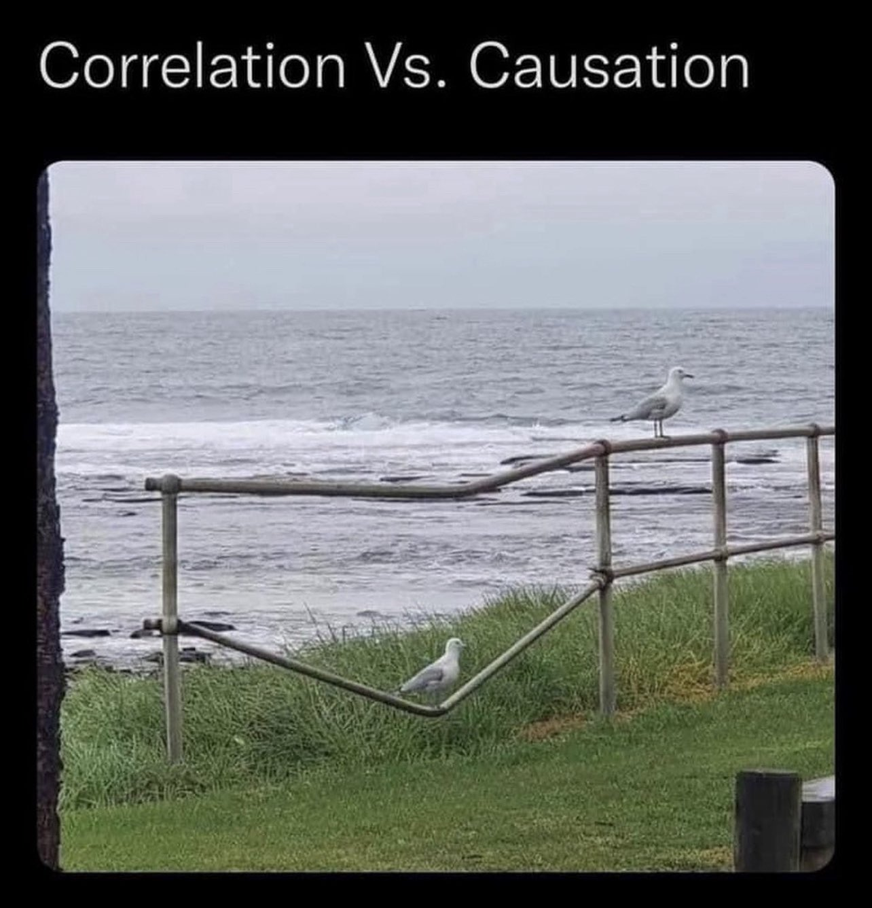

`r blogdown::shortcode("courseinfo")`


# Course description {#course-description .unnumbered}

**Credits: 3**

This course will provide a theoretical and practical background in basic
econometric techniques. We will review probability and statistics before
covering classical linear regression with two or more variables,
estimation and hypothesis testing, and violations of classical
assumptions. ECON3500 is a challenging course. If you are not interested in
taking a challenging course, you should take a different course. The
prerequisites are STAT1410, ECON2400, and ECON2450

The course will combine lectures, discussion, and lots of practice.
Learning econometrics requires a healthy blend of theory and practice,
so you will complete problem sets throughout the semester, and you will
design and and write a short research paper that applies some of the
techniques we've learned about to real-world data. We won't have enough
course time to cover all the Stata preparation you'll need, but I'll
cover the basics and you'll have to rely on other resources to figure
out the rest.

# Learning objectives:  {#learning-objectives .unnumbered}

-   To understand and apply foundational tools in econometric theory

-   To use econometric tools and statistical packages (Stata) to analyze
    real-world data and interpret findings

-   To formulate, assess, and answer economic questions by selecting and
    applying appropriate econometric techniques

# Required materials  {#required-materials .unnumbered}

-   **Textbook:** Stock, James H. and Mark W. Watson. *Introduction to
    Econometrics*, 4th edition, Pearson. ISBN-13:
    9780134448046. (about $95)

    -   **The ISBN :point_up: is for the cheaper, electronic edition (rental). International is fine, but your problems/solutions may differ from mine. For             problem sets, I will provide the full text of problems.**

    -   If you want to save money by purchasing an older 3rd updated edition, that would be a reasonable approch, but **you are responsible for the 4th edition content**, so make sure you've compared what might be different. 
    
    -   We are **not** using any digital Pearson tools.

-   **Stata**: We will use Stata extensively in this course, including
    outside of class. It is compatible with Windows/MacOS/Linux. You
    should download a copy at <https://www.uvm.edu/software/>.^[1] Note that
    there is a link to a pdf file that contains the licensing
    information.

[^1]: You'll be required to install Apps Anywhere. It's obnoxious, but it is a real thing.

# Course components {#course-components .unnumbered}

## Embarking on the week {#class-meetings-m .unnumbered}

If you arrive at class without preparing, things will feel bad! I take a **hybrid** approach to this class to maximize in-class practice and feedback. Check the calendar to see what you need to do. 

Before we start on a new unit, you should: 
1. Always read the associated chapters. 
1. There is usually an assigned or optional lecture video to get your prepared. Watch it! 
1. If assigned, you'll also need to earn an 80% on that week's lecture quiz. 

Our class meetings will be a combination of lecture, practice, and labs. 

We will have eight labs throughout the class. During labs you should bring a laptop to class. On thse days, I will demo some concepts and commands and give you time to practice. A final version of your [lab](/assignment#labs) will be due one week later.


# Deadlines  {#deadlines-and-extensions .unnumbered}

-   With the exception of a handful of research paper assignments, deadlines are at **1:15pm** (before class!)
    -   As a general rule, problem sets are due on Thursdays at 1:15pm. Video
    quizzes are usually due Tuesdays, and final labs bounce around depending on the schedule.
-   Please submit all assignments through Brightspace. If you encounter
    technical issues, e-mail is a fine last resort.
-   Late problem sets and labs will be penalized 10\% per day. Late video quizzes are not accepted.
-   Regarding **research papers intermediate elements *only***, I have an *"extensions for all"* policy
    - If you need an extension, request it by e-mail **before** the deadline and provide a proposed new deadline. 
    - Some assignments build on previous ones, so be careful when requesting that you don't put yourself in a tricky position. I don't need to know why you need the extension. 
    - If you exceed your revised deadline (or you request an extension *after* the due date), then I will start applying the 10\% deduction per day. 
    - This does not apply to the final paper submission, which remains fixed.


# Class engagement and attendance {#class-engagement-and-attendance .unnumbered}

This is a challenging course, and you'll get the most out of it if you
engage with the material both during and outside of class. You are
responsible for finding a classmate or checking Brightspace for any
content you may miss during class. 

## What if I'm sick? 

Please stay home! Get notes from a classmate.

# Grading {#grading .unnumbered}

## Assignment weights {#assignment-weights .unnumbered}

|    Assignment    |   Percent
| :------------- | :----------: | 
| Attendance                   |           5%    |
| Lecture video quizzes        |           4%    |
| Labs                              |      8%   |
| Problem sets                      |      8%   |
| Exams (3 quizzes at 5%, 15%, 15%)       |      35%   |
| Research paper                           |     40%   |

*You can miss **two** classes without any penalty*

## Grading distribution {#grading-distribution .unnumbered}

| Range       | Grade  
| :------------- | :----------: | 
|  93.0 - 100.0| A/A+   | 
| 90.0 - 92.99   | A-|
|  87.0 - 89.99 | B+|
 |83.0 - 86.99  | B|
 |80.0 - 82.99   |B-| 
|  77.0 - 79.99   |C+|
 | 73.0 - 76.99   |C|
  | 70.0 - 72.99   |C-|
   | 67.0 - 69.99   |D+|
    |     63.0 - 66.99|   D|
     |        $<$ 60.0 |      F|


-   I determine grades by a threshold - 93.01 is an A, and 92.97 is an
    A-. In cases of very near misses of higher grades, however, I will
    take into account class participation/attendance.

-   I will never curve quizzes down, but I may curve them up if the
    median grade is less than a B-.

# Quizzes {#quizzes .unnumbered}


There are two unit exams (15% each) and one stats exam (5%). All exams are in-class. You can bring a single page formula sheet (double sided is fine) that you prepare to each exam

These exams are not explicitly cumulative, but you'll need to master skills from earlier
chapters to tackle the newer material.

# FAQ {#frequently-asked-questions .unnumbered}


1.  *I don't remember ANYTHING from statistics. Will I be able to pass
    this class?* The stronger your stats background, the more useful
    you'll find this class. Whether or not you can recall the formula
    for a one-sample hypothesis test should have no bearing on your
    ability to succeed (you can always look it up!) But having a sense
    of what big concepts mean will be very important. We'll
    review together at the beginning of the term.

1.  *I am sick and need to miss class. Will I lose points? Do I need to
    tell you?* You don't need to let me know if you will be missing
    class. If you need an extension, though, I will need to know that in
    advance of the deadline.

1.  *Do I really need to buy a textbook?* Yes. 4th edition. You can probably get by with a used 3rd updated edition. 
    
1.  Do I need a computer for this class? You will need a computer for any work with Stata. I *think* there is a way to get Stata to run on a Chromebook, but I can provide you with roughly zero technical support for setting that up!

<!-- 1.  *My computer is broken/missing/on fire and I cannot submit my 
    assignment on time!* Give me a heads up prior to the deadline, and
    we can work out an extension.
    --> 

1. *Can I use open-source, glorious, R?* Sure. But I have many caveats and warnings. (1) You will need to to be comfortable reading and interpreting Stata output in order to be successful on exams. (2) I will be teaching in Stata exclusively, and the technical support I will be able to provide is limited. 

<!-- 1.  *Can I use another software program (i.e. Excel, SPSS, EViews, R, -->
<!--     Gretl, etc.)?* In special cases, maybe. Talk to me first if you have -->
<!--     a compelling reason why you would like to use another program. It needs to be something with replicable code (ie R, not Excel). I -->
<!--     won't be able to provide assistance with problem sets or your -->
<!--     project if you decide not to use Stata, and you will still be -->
<!--     responsible for any Stata-related questions that come up on quizzes. -->


```{r echo=FALSE}
blogdown::shortcode('tweet', '1482505999441227777')
```

1. **Can't I just ChatGPT my way through this course?** Please don't. That would be a silly way to spend your one precious life and many precious dollars. Also, it's unlikely to serve your grade very well. 

That said, generative AI is also a useful tool that *can* enhance your learning---when it's a complement rather than a substitute to your own practice and review.  

My general policy is this: 

I do not expect or encourage the use of ChatGPT. However, if you use it, then *ChatGPT should be no more than a friend*:

For regular homework, assignments, studying: 
- You may ChatGPT/genAI as a study aid, just as you might study with a friend. **However,** know that you alone are responsible for learning the material so you can demonstrate your knowledge during our broad range of in-class activities, and there is no guarantee it will effectively cover all the important topics at the depth required. 
- Consulting these tools to explain something you're stuck on or check your work is not a violation in this course - just as you might run your answers by a friend 
- Having ChatGPT entirely do your work would be, well, cheating. Just as it would if your friend did your problem set for you. 

For our research paper: 
- You might have ChatGPT check your grammar, or help you reword something you're stuck on. 
- It might teach you a new way to code something you didn't know how to do, help you troubleshoot a problem, or make your figure prettier.
- But if it writes your paper for you or conducts all your analysis, that's cheating. And ChatGPT is being a bad friend. 
- For submissions, I'll ask you to include an AI attribution statement indicating how, if at all, you used genAI in the submission. Please err on the side of over-disclosure.

I will bring violations of this policy to the Academic Intregity board. If you're unsure about something, reach out!


# [I am in college and having some problems]{#i-am-having-some-problems .unnumbered}

Check out available [resources](/bonus/ihaveproblems).


# Student responsibilities and rights {#student-responsibilities-and-rights .unnumbered}


**Student learning accommodations** In keeping with University policy,
any student with a documented disability interested in utilizing
accommodations should contact ACCESS, the office of Disability Services
on campus. ACCESS works with students to create reasonable and
appropriate accommodations via an accommodation letter to their
professors as early as possible each semester.

Contact [ACCESS](http://www.uvm.edu): A170 Living/Learning Center; 802-656-7753;
access\@uvm.edu; 

[UVM's policy on disability certification and student support](http://www.uvm.edu/~uvmppg/ppg/student/disability.pdf)

[**Academic integrity:**](http://www.uvm.edu/~uvmppg/ppg/student/acadintegrity.pdf) Do not cheat, and do not plagiarize. Although you are permitted to work together on problem sets and labs, the work you submit should be *your own*. This policy addresses plagiarism, fabrication, collusion, and cheating:


[**Grade Appeals**](http://www.uvm.edu/~uvmppg/ppg/student/gradeappeals.pdf) If you would like to contest a grade, please follow
the procedures outlined in this policy.
 
[**Code of Student Rights and Responsibilities**](http://www.uvm.edu/~uvmppg/ppg/student/studentcode.pdf)

[**FERPA Rights Disclosure**](http://www.uvm.edu/~uvmppg/ppg/student/ferpa.pdf) The purpose of this policy is to communicate
the rights of students regarding access to, and privacy of their student
educational records as provided for in the Family Educational Rights and
Privacy Act (FERPA) of 1974.


<!-- ^[https://twitter.com/DBelardoMD/status/1482505999441227777?s=20]
-->

