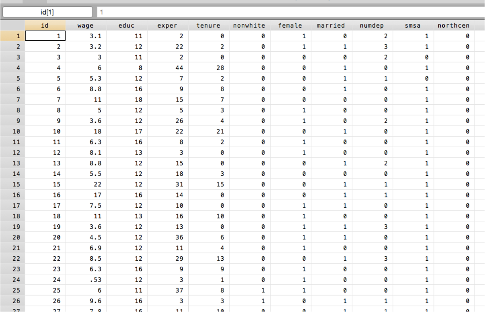
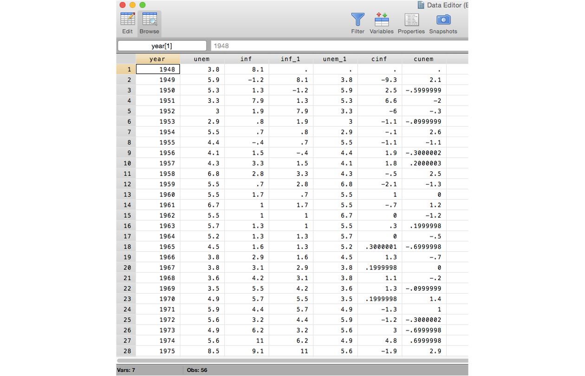
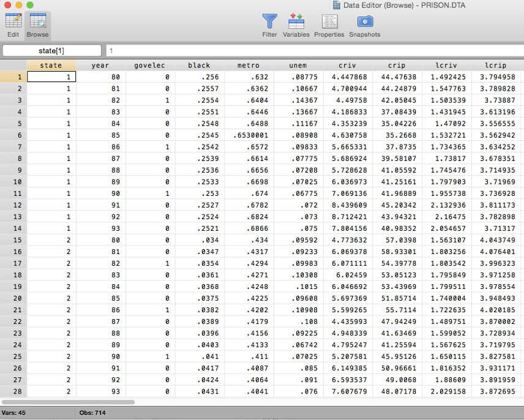
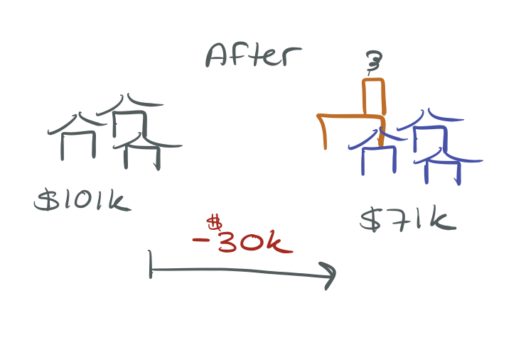
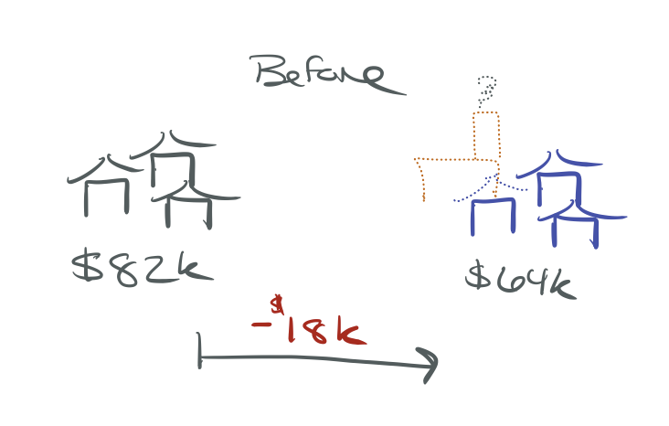
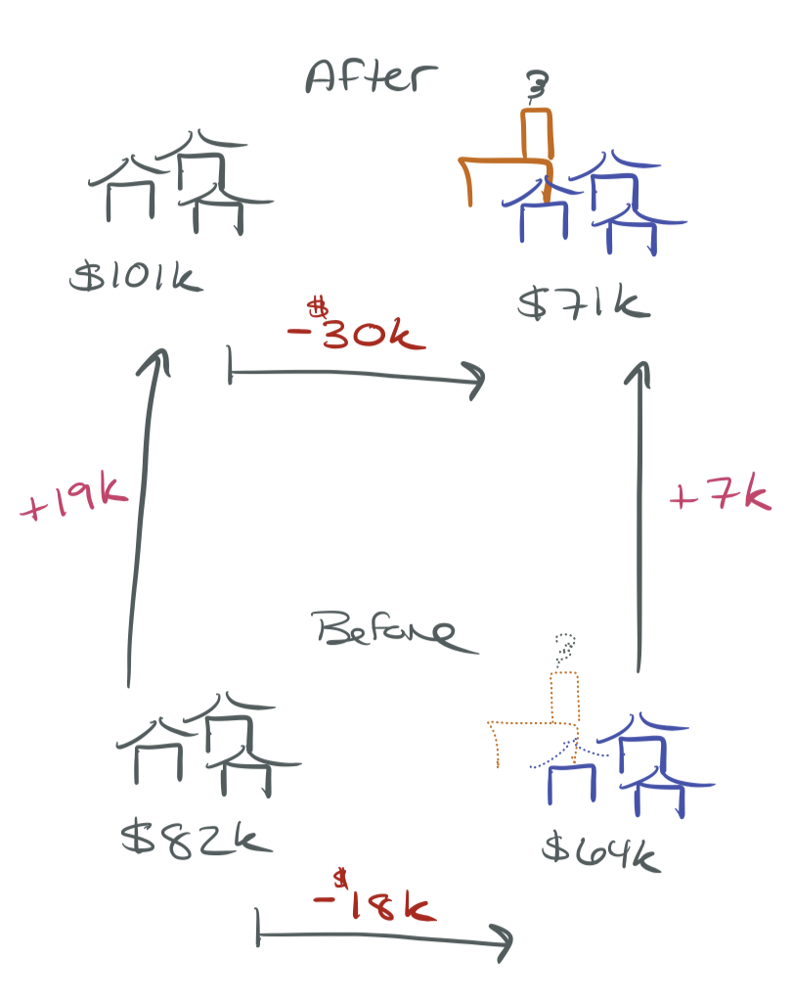
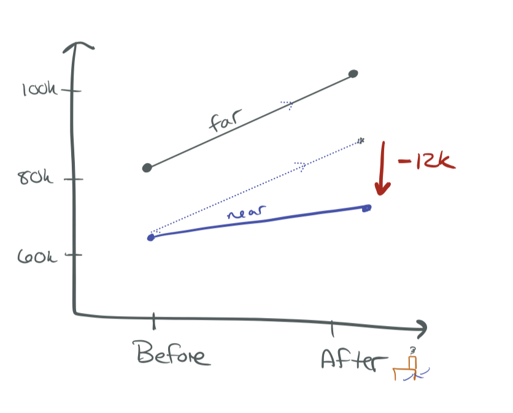

## Learning Objectives

By the end of this chapter, you will be able to:

1. Distinguish [cross-sectional]{.kw}, [time-series]{.kw}, and [panel]{.kw} data
2. Estimate and interpret [difference-in-differences]{.kw} regressions
3. Understand the [first-difference]{.kw} estimator and why fixed effects drop out
4. Estimate regressions with [entity]{.kw} and [time fixed effects]{.kw}
5. Explain when [clustered standard errors]{.kw} are needed

# Types of Data

## Cross-Sectional Data

A random sample of units observed at [one point in time]{.kw}.

. . .

**This is what we've been using so far!**

- Relationship between hours worked and wages
- How CEO tenure relates to compensation
- Test scores and class size across California districts

## Cross-Sectional Data

{width=70% fig-align="center"}

## Time-Series Data

Observations on [one unit over time]{.kw}.

. . .

- Stock-market dividends for Apple over the past 10 years
- GDP growth over time
- Annual infant mortality rates for the U.S.

## Time-Series Data

{width=60% fig-align="center"}

## Panel (Longitudinal) Data {.smaller}

[Multiple units]{.kw} observed across [multiple time periods]{.kw} — cross-sections over time.

. . .

- Track how individuals' earnings change over time
- Crime rates by city over time
- [Very useful for policy analysis!]{.alert}

. . .

::: {.callout-warning}
## Panel vs. Pooled Cross-Sections
A [panel]{.kw} tracks the [same units]{.alert} over time (Bob in 1990 and Bob in 1991).

A [pooled cross-section]{.kw} draws [different units]{.alert} each period (Bob in 1990, Jane in 1991) — like multiple waves of the ACS.
:::

## Panel Data

{width=55% fig-align="center"}

## Panel vs. Repeated Cross-Sections {.smaller}

**Repeated (pooled) cross-sections:**

- Draw randomly from a large population at various points in time
- Observations are [independent]{.kw} over time
- Independence $\Rightarrow$ inference is straightforward

. . .

**Panel data:**

- Track the [same]{.alert} observational units over time
- Population may be independent at first draw: Bob in 1990 is independent of Jane in 1990
- But [dependence over time]{.alert}: Bob in 1990 is related to Bob in 1991
- Detroit will probably have high crime rates next year too

. . .

This dependence has important implications for [standard errors]{.kw} (more on this later).

# Difference-in-Differences

## Motivating Example: Garbage Incinerator {.smaller}

**Question:** What is the effect of a garbage incinerator on nearby housing prices?

. . .

**After** the incinerator was built:

{width=55% fig-align="center"}

$$\widehat{rprice} = 101{,}308 - 30{,}688 \cdot nearinc$$

Houses near the incinerator sell for ~\$30k less. Did the incinerator cause this?

## Not So Fast... {.smaller}

Look at the relationship **before** the incinerator was built:

{width=55% fig-align="center"}

$$\widehat{rprice} = 82{,}517 - 18{,}824 \cdot nearinc$$

. . .

The incinerator was built in a place where housing prices were [already depressed]{.alert}!

The \$30k gap reflects both the incinerator effect [and]{.alert} pre-existing differences.

## The Before-and-After Picture

{width=50% fig-align="center"}

## The Difference-in-Differences Estimate {.smaller}

We need to [subtract out]{.kw} the pre-existing difference:

$$\hat{\delta}_1 = \underbrace{(-30{,}688)}_{\text{after gap}} - \underbrace{(-18{,}824)}_{\text{before gap}} = -11{,}864$$

. . .

The incinerator reduced nearby prices by ~\$12k — not \$30k.

. . .

Equivalently:

$$\hat{\delta}_1 = (\bar{y}_{after, near} - \bar{y}_{after, far}) - (\bar{y}_{before, near} - \bar{y}_{before, far})$$

This is the [difference-in-differences]{.kw} (DiD) estimator.

## DiD Graphically

{width=55% fig-align="center"}

The dashed line shows where near-incinerator prices [would have been]{.kw} if they followed the same trend as far-away prices.

## DiD in a Regression Framework {.smaller}

We can capture all of this in a single regression:

$$rprice_i = \beta_0 + \delta_0 \cdot after_i + \beta_1 \cdot nearinc_i + \delta_1 \cdot (after_i \times nearinc_i) + u_i$$

. . .

| | Before ($after = 0$) | After ($after = 1$) | After $-$ Before |
|---|:---:|:---:|:---:|
| **Control** (far) | $\beta_0$ | $\beta_0 + \delta_0$ | $\delta_0$ |
| **Treatment** (near) | $\beta_0 + \beta_1$ | $\beta_0 + \delta_0 + \beta_1 + \delta_1$ | $\delta_0 + \delta_1$ |
| **Treat $-$ Control** | $\beta_1$ | $\beta_1 + \delta_1$ | [$\delta_1$]{.alert} |

. . .

$\delta_1$ is the [DiD estimate]{.kw} — the coefficient on the interaction term.

## Policy Evaluation with DiD {.smaller}

This logic applies broadly to any setting with:

- A [before/after]{.kw} period
- [Treatment/control]{.kw} groups

$$y_{it} = \beta_0 + \delta_0 \cdot after_t + \beta_1 \cdot treated_i + \delta_1 \cdot (after_t \times treated_i) + u_{it}$$

. . .

**Adding controls is fine:** Additional covariates can be included without changing how $\delta_1$ is identified — they [reduce residual variance]{.kw} and [improve precision]{.alert} (tighter standard errors).

. . .

::: {.callout-important}
## The Parallel Trends Assumption *(common trends assumption in SW)*
DiD requires that in the [absence of treatment]{.alert}, the gap between treatment and control groups would have stayed [parallel]{.kw} over time.

- There [can]{.kw} be unobserved factors at one point in time, if they affect both groups equally
- The two groups [can]{.kw} be very different from each other, so long as they are on the same trajectories
:::

::: {.callout-tip}
## Knowledge Check
In the incinerator example, what would violate parallel trends?

. . .

If, say, a new highway was built near the incinerator site at the same time — affecting near-incinerator prices but not far-away prices — that would break parallel trends.
:::

# Two-Period Panel Data: First Differencing

## From DiD to Panel Data {.smaller}

Now assume we observe the [same entities]{.kw} in two time periods.

. . .

**Example:** Unemployment and crime across cities in 1982 and 1987.

- Detroit has high unemployment and high crime
- Does high unemployment [cause]{.alert} high crime, or is there another explanation?
- Explanatory variables might help — but what if we don't have them?

. . .

::: {.callout-note}
## Key Insight
By observing the same cities in two periods, we can control for [all time-invariant city-specific factors]{.alert} — even unobserved ones — by examining how outcomes changed *within* each city over time.
:::

## The Panel Data Model {.smaller}

$$crmrte_{it} = \beta_0 + \delta_0 \cdot d87_t + \beta_1 \cdot unemp_{it} + \alpha_i + u_{it}$$

where $t = 1982, 1987$

. . .

- $d87_t$: time dummy for the second period
- $\alpha_i$: [unobserved]{.alert} time-constant factors ([entity fixed effects]{.kw})
    - Detroit's culture, geography, historical factors, etc.
- $u_{it}$: other unobserved factors ([idiosyncratic error]{.kw})

. . .

**The problem:** $\alpha_i$ is likely correlated with $unemp_{it}$ — cities with certain unobserved characteristics have both high unemployment and high crime. This is [OVB]{.alert}.

## The First-Difference Trick {.smaller}

Write the model for each period:

$$crmrte_{i,1987} = \beta_0 + \delta_0 + \beta_1 \cdot unemp_{i,1987} + \alpha_i + u_{i,1987}$$
$$crmrte_{i,1982} = \beta_0 + \beta_1 \cdot unemp_{i,1982} + \alpha_i + u_{i,1982}$$

. . .

Subtract the second from the first:

$$\Delta crmrte_i = \delta_0 + \beta_1 \cdot \Delta unemp_i + \Delta u_i$$

. . .

::: {.callout-important}
## The Fixed Effect Drops Out!
Because $\alpha_i - \alpha_i = 0$, [all time-invariant unobserved factors]{.alert} are eliminated. We don't need to measure or control for them.
:::

## First-Difference Estimate

Estimate the first-differenced equation by OLS:

$$\Delta \widehat{crmrte} = 15.4 + 2.22 \cdot \Delta unemp$$

. . .

**Interpretation:** A 1 percentage point increase in the unemployment rate is associated with 2.22 more crimes per 1,000 people.

. . .

::: {.callout-warning}
## What First-Differencing Can and Cannot Do
- [Solves]{.kw}: Time-invariant omitted variable bias (city culture, geography, etc.)
- [Does not solve]{.alert}: Time-varying endogeneity (factors that change across cities over time)
- [Limitation]{.alert}: Imprecise if $X$ varies little over time; impossible to estimate effects of time-invariant variables
:::

# Fixed Effects Estimation

## The Idea Behind Fixed Effects {.smaller}

Instead of differencing, what if we [control for]{.kw} each entity directly?

. . .

Consider a panel of wages over time. There might be unobserved Bob-specific characteristics:

- Bob is hard-working (+)
- Bob is a competitive negotiator (+)
- Bob smells funny (−)

. . .

We can never control for all of Bob's unique quirks.

. . .

But we can ["control for" Bob]{.alert} — give Bob his very own [fixed effect]{.kw}: the unique "stuff" that Bob brings to the table.

This only covers things that [stay constant over time]{.alert}.

## Fixed Effects: The Math {.smaller}

Start with:
$$y_{it} = \beta_1 x_{it1} + \cdots + \beta_k x_{itk} + \alpha_i + u_{it}$$

. . .

Average over time for each entity:
$$\bar{y}_i = \beta_1 \bar{x}_{i1} + \cdots + \beta_k \bar{x}_{ik} + \alpha_i + \bar{u}_i$$

. . .

Subtract (time-demeaning):
$$[y_{it} - \bar{y}_i] = \beta_1 [x_{it1} - \bar{x}_{i1}] + \cdots + \beta_k [x_{itk} - \bar{x}_{ik}] + [u_{it} - \bar{u}_i]$$

. . .

Because $\alpha_i - \alpha_i = 0$, the fixed effect drops out!

- Estimate the time-demeaned equation by OLS
- This uses [within-entity variation]{.kw} only: how $X$ and $Y$ move [within]{.alert} the same entity over time
- This is called [within estimation]{.kw}

## Three Ways to Estimate FE in Stata {.smaller}

::: {.callout-note}
## Option 1: Manual Demeaning
Demean your data by hand, then estimate OLS on demeaned data.
:::

. . .

::: {.callout-note}
## Option 2: Dummy Variables / `areg`
Include entity dummies directly, or use `areg` which "absorbs" one set of fixed effects:

```stata
areg scrap grant d88 d89, absorb(fcode) cluster(fcode)
```
:::

. . .

::: {.callout-note}
## Option 3: `xtreg` (Recommended)
Tell Stata you have panel data, then estimate with the fixed effects option:

```stata
xtset fcode year
xtreg scrap grant d88 d89, fe vce(cluster fcode)
```
:::

## Entity Fixed Effects: What They Control For

::: {.callout-important}
## Key Principle
Entity fixed effects control for [all time-invariant factors]{.alert} — observed or unobserved.

You don't need to include time-invariant covariates in a fixed-effects model — they are already accounted for!
:::

. . .

**Practical notes:**

- We don't usually interpret the fixed effect coefficients themselves
- Which entity is the "omitted" group (avoiding the dummy variable trap) doesn't matter — we're not interpreting them
- Fixed effects are typically not reported in regression output

## Time Fixed Effects {.smaller}

What about shocks that affect [all entities equally]{.kw} at a given time?

. . .

- A national recession hits all cities in 2008
- A federal policy change affects all states simultaneously
- Inflation affects all firms' costs in the same year

. . .

Add [time fixed effects]{.kw}: a dummy for each time period.

$$y_{it} = \beta_1 x_{it} + \alpha_i + \lambda_t + u_{it}$$

- $\alpha_i$: entity fixed effect (absorbs entity-specific, time-invariant factors)
- $\lambda_t$: time fixed effect (absorbs time-specific, entity-invariant factors)

## Entity + Time Fixed Effects: What's Left? {.smaller}

With [both]{.kw} entity and time fixed effects:

$$y_{it} = \beta_1 x_{it} + \alpha_i + \lambda_t + u_{it}$$

. . .

**Controlled for:**

- All time-invariant entity characteristics ($\alpha_i$)
- All entity-invariant time shocks ($\lambda_t$)

. . .

**Not controlled for:**

- Factors that vary [across both entities and time]{.alert}

. . .

::: {.callout-tip}
## Knowledge Check
You estimate the effect of a state-level minimum wage increase on employment, with state and year fixed effects. What kind of omitted variable could still bias your results?

. . .

A factor that varies across states *and* over time — e.g., state-specific economic booms that coincide with minimum wage increases.
:::

# Assumptions and Inference

## Least Squares Assumptions for Panel Data {.smaller .scrollable}

Consider a single $X$:

$$Y_{it} = \beta_1 X_{it} + \alpha_i + u_{it}, \quad i = 1, \ldots, n; \; t = 1, \ldots, T$$

. . .

1. $E[u_{it} | X_{i1}, \ldots, X_{iT}, \alpha_i] = 0$
    - $u_{it}$ cannot be correlated with [any present, past, or future]{.alert} values of $X$!
2. $(X_{i1}, \ldots, X_{iT}, u_{i1}, \ldots, u_{iT})$ are i.i.d. draws across entities
    - Only need independence [across]{.kw} entities, not within
3. $(X_{it}, u_{it})$ have finite fourth moments
4. No perfect multicollinearity

. . .

If these hold, FE estimates are [consistent and normally distributed]{.kw} for large $n$.

## The Problem of Serial Correlation {.smaller}

$$Y_{it} = \alpha_i + \beta_1 X_{it} + \omega_{it}$$

The time-varying error $\omega_{it}$ reflects factors that change over time but affect the outcome.

. . .

**Example:** If $Y_{it}$ is traffic fatalities, maybe $\omega_{it}$ includes road quality in state $i$.

- Road quality last year $\approx$ road quality this year
- $\omega_{i,t}$ and $\omega_{i,t-1}$ are [correlated]{.alert}

. . .

This is [autocorrelation]{.kw} (or serial correlation) — observations on the same entity over time are not independent.

## Why Autocorrelation Matters

Previously, we assumed different observations were independent.

. . .

- Implausible for data on the same entity over time
- Without correction, we estimate [incorrect standard errors]{.alert}
- Confidence intervals will [not have 95% coverage]{.alert}

. . .

::: {.callout-important}
## Autocorrelation Does Not Bias $\hat{\beta}$
The coefficients are still consistent — but our [inference]{.alert} (standard errors, $p$-values, CIs) is wrong.
:::

## The Solution: Clustered Standard Errors {.smaller}

[Clustered standard errors]{.kw} allow for autocorrelation within entities.

. . .

**Idea:** Allow the error terms $\omega_{it}$ for different time periods [within the same entity]{.kw} to be correlated, while maintaining independence [across]{.kw} entities.

. . .

**In Stata:**

```stata
* With regress or areg:
regress y x i.entity, cluster(entity)
areg y x, absorb(entity) cluster(entity)

* With xtreg:
xtreg y x, fe vce(cluster entity)
```

. . .

::: {.callout-warning}
## Always Cluster in Panel Data
If you're using panel data, you should [almost always]{.alert} cluster your standard errors at the entity level. Failing to do so overstates precision and leads to false rejections.
:::

# Recent Developments in DiD

## The Staggered Adoption Problem {.smaller}

The classic DiD has two groups and two periods. In practice, policies are often adopted by [different units at different times]{.alert} — [staggered adoption]{.kw}.

. . .

**Example:** States adopt a job training program in different years.

The natural approach: two-way fixed effects (TWFE).

$$y_{it} = \beta_1 \cdot treated_{it} + \alpha_i + \lambda_t + u_{it}$$

. . .

Recent research (roughly 2018–2024) has shown that this "obvious" approach can produce [severely misleading estimates]{.alert} — including [wrong signs]{.alert}.

Let's see exactly how this happens.

## A Concrete Example: Setup {.smaller}

Suppose a job training program has a [true effect]{.kw} that [grows over time]{.alert}:

- Year 1 after adoption: productivity rises by **+10**
- Year 2 after adoption: productivity rises by **+50** (the program grows dramatically)

. . .

Two states, three years. Without treatment, both would follow the same trend:

| | 2018 | 2019 | 2020 |
|---|:---:|:---:|:---:|
| **No-treatment baseline** (both states) | 100 | 105 | 110 |

. . .

- [State E (Early)]{.kw}: adopts the program in **2019**
- [State L (Late)]{.kw}: adopts the program in **2020**
- No pure control group exists (both eventually get treated)

## What Actually Happens {.smaller}

| | 2018 | 2019 | 2020 |
|---|:---:|:---:|:---:|
| **State E** (treats in 2019) | 100 | [115]{style="color: #008080;"} | [160]{style="color: #008080;"} |
| **State L** (treats in 2020) | 100 | 105 | [120]{style="color: #008080;"} |

. . .

- State E in 2019: $105 + 10 = 115$ (year 1 effect)
- State E in 2020: $110 + 50 = 160$ (year 2 effect — program grows dramatically)
- State L in 2020: $110 + 10 = 120$ (year 1 effect)

. . .

The true effect for State L in 2020 is [+10]{.kw}. Can TWFE recover this?

## What TWFE Does {.smaller}

With no pure control group, TWFE takes a [weighted average]{.kw} of all possible 2×2 DiD comparisons — including contaminated ones.

. . .

**Comparison 1 — valid:** E treated vs. L as untreated control (2018→2019)

$$\underbrace{(115 - 100)}_{\Delta \text{State E}} - \underbrace{(105 - 100)}_{\Delta \text{State L}} = 15 - 5 = [+10]{.kw}$$

. . .

**Comparison 2 — contaminated:** L treated vs. E [already-treated]{.alert} as "control" (2019→2020)

$$\underbrace{(120 - 105)}_{\Delta \text{State L}} - \underbrace{(160 - 115)}_{\Delta \text{State E}} = 15 - 45 = [-30]{.alert}$$

. . .

With equal-sized groups, TWFE weights these comparisons equally:

$$\hat{\beta}_{TWFE} = \tfrac{1}{2}(+10) + \tfrac{1}{2}(-30) = [-10]{.alert}$$

::: {.callout-important}
## TWFE Says the Effect is −10
All true effects are [positive]{.kw} (+10 or +50), but TWFE estimates [−10]{.alert}. The sign flipped!
:::

. . .

**Why?** State E's outcome rose by 45 from 2019→2020 — not from a trend, but because its [treatment effect grew]{.alert} from +10 to +50. TWFE treats this jump as a "normal trend" in the control, making State L's +15 gain look like a relative [decline]{.alert}.

## The Core Problem {.smaller}

Goodman-Bacon (2021) showed this formally: the TWFE estimate is a [weighted average]{.kw} of all possible 2×2 DiD comparisons.

. . .

Some comparisons are fine:

- [Newly treated vs. never treated]{.kw} — exactly what we want

Some are problematic:

- [Newly treated vs. already treated]{.alert} — uses treated units as "controls"

. . .

When treatment effects [change over time]{.alert} (grow, fade, or vary across groups), the already-treated comparisons introduce bias — and can even get [negative weights]{.alert}.

. . .

This is not a rare edge case. Dynamic treatment effects are the norm in applied economics: job training programs build skills gradually, minimum wage effects accumulate, policy impacts evolve.

## New Estimators {.smaller}

Several estimators have been developed to handle staggered adoption correctly:

. . .

- **Callaway and Sant'Anna (2021):** Estimate group-time-specific effects, then aggregate. Only uses not-yet-treated or never-treated units as controls.

- **Sun and Abraham (2021):** Interaction-weighted estimator that corrects for heterogeneous effects across adoption cohorts.

- **de Chaisemartin and D'Haultfoeuille (2020):** Identifies which comparisons get negative weights and proposes robust alternatives.

. . .

All share one insight: [never use already-treated units as controls]{.alert}.

## What This Means for Practice {.smaller}

::: {.callout-tip}
## Practical Guidance

- **Classic 2×2 DiD** (two groups, two periods): TWFE is [fine]{.kw}. The new concerns don't apply.
- **Staggered adoption** with [constant treatment effects]{.kw}: TWFE is usually okay.
- **Staggered adoption** with [dynamic or heterogeneous effects]{.alert}: Use a robust estimator.
:::

. . .

**How to check:** Run both TWFE and a robust estimator. If results are similar, the standard approach is probably fine. If they diverge, trust the robust estimator.

. . .

::: {.callout-note}
## Beyond ECON3500
You won't need to implement these in this course. But if you do applied research with staggered DiD (very common in policy evaluation), you should be aware of these issues. Stata packages: `csdid`, `did_multiplegt`, `eventstudyinteract`.
:::

# Putting It All Together

## Comparison of Panel Data Methods {.smaller .scrollable}

| Method | Data Required | What It Controls | Key Assumption | What Remains |
|--------|:---:|---|---|---|
| [DiD]{.kw} | 2 groups, 2 periods | Group-level differences; common time trends | [Parallel trends]{.alert} | Group-specific time-varying shocks |
| [First Difference]{.kw} | Panel (same units, 2+ periods) | All time-invariant entity factors | No time-varying OVB | Time-varying omitted variables |
| [Entity FE]{.kw} | Panel (same units, 2+ periods) | All time-invariant entity factors | No time-varying OVB | Time-varying omitted variables |
| [Entity + Time FE]{.kw} | Panel (same units, 2+ periods) | Time-invariant entity factors + entity-invariant time shocks | No entity-and-time-varying OVB | Entity-time-specific shocks |

## When to Use What {.smaller}

**Difference-in-Differences:**

- Repeated cross-sections or panel data
- Clear treatment/control groups and before/after periods
- Need parallel trends assumption

. . .

**First Differencing:**

- Panel data with 2 periods
- Equivalent to entity FE with 2 periods
- Simple, transparent

. . .

**Fixed Effects:**

- Panel data with 2+ periods
- More efficient than first differencing with $T > 2$ (when errors are serially uncorrelated)
- Can include entity FE, time FE, or both

. . .

::: {.callout-tip}
## Knowledge Check
A researcher has data on 50 states over 20 years and wants to estimate the effect of a policy that was adopted by some states at different times. Which method is most appropriate?

. . .

Entity + time fixed effects — controls for permanent state differences and common national trends. This is sometimes called a "generalized DiD" or "two-way fixed effects" design.
:::

## Common Pitfalls {.smaller}

::: {.callout-warning}
## 1. Forgetting to Cluster
Panel data almost always requires clustered standard errors. Unclustered SEs will be [too small]{.alert}.
:::

. . .

::: {.callout-warning}
## 2. Trying to Estimate Time-Invariant Effects
With entity FE, you [cannot]{.alert} estimate the effect of variables that don't change over time (e.g., gender, race in a person-panel). The fixed effect already absorbs them.
:::

. . .

::: {.callout-warning}
## 3. Assuming FE Solves All OVB
Fixed effects only eliminate [time-invariant]{.alert} omitted variables. Time-varying confounders can still bias your estimates.
:::

## Key Takeaways

1. [Panel data]{.kw} tracks the same entities over time — unlike pooled cross-sections

2. [DiD]{.kw} compares changes over time across treatment and control groups; requires [parallel trends]{.alert}

3. [First differencing]{.kw} and [fixed effects]{.kw} eliminate all time-invariant omitted variables by exploiting [within-entity variation]{.kw}

4. With entity + time FE, only [entity-and-time-varying]{.alert} confounders remain a threat

5. Always use [clustered standard errors]{.kw} with panel data to account for autocorrelation

6. Fixed effects [cannot estimate]{.alert} effects of time-invariant variables — that's the price of eliminating time-invariant OVB
