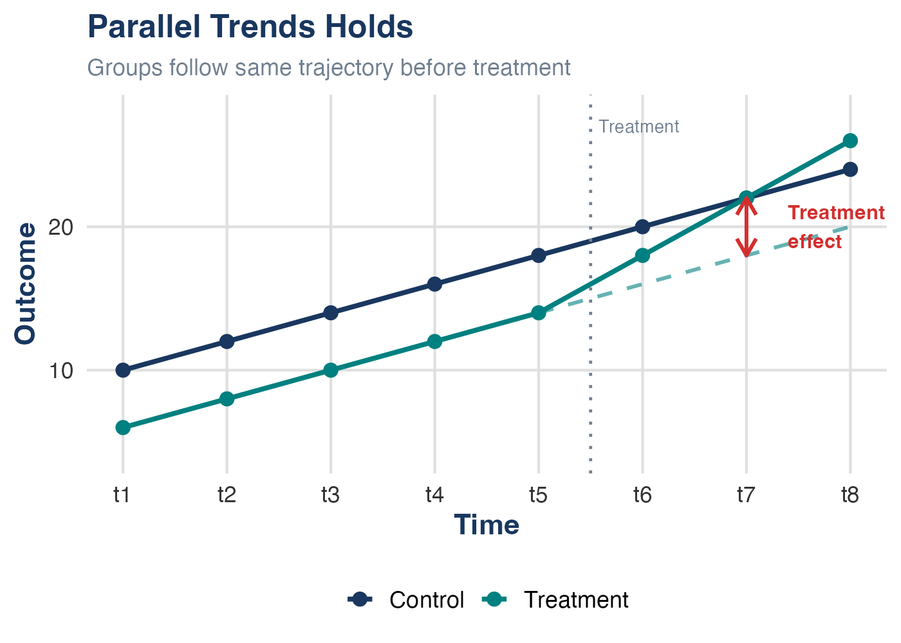
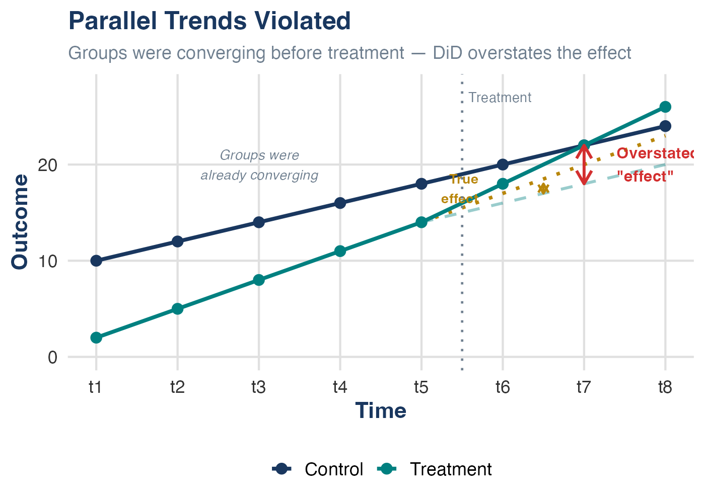

## Where We Are {.smaller}

Last time, we learned how [panel data]{.kw} lets us control for unobserved, time-invariant factors:

- [First differencing]{.kw}: Subtract one period from another — $\alpha_i$ drops out
- [Fixed effects]{.kw}: Demean within each entity — same result, works with $T > 2$
- Both eliminate OVB from [time-invariant]{.alert} unobservables (Ch 9, Threat #1)

. . .

Today: a specific research design that uses these tools to [credibly estimate]{.kw} the effects of policies and events — under clearly stated assumptions.

. . .

::: {.callout-tip}
## The Big Idea
Difference-in-differences (DiD) combines a [treatment/control comparison]{.kw} with a [before/after comparison]{.kw} to address confounding — even without randomization — *if* the [parallel trends assumption]{.alert} holds.
:::

# The Problem with Simple Comparisons

## Motivating Example: Garbage Incinerator {.smaller}

**Question:** What is the effect of a garbage incinerator on nearby housing prices?

. . .

**After** the incinerator was built:

{width=50% fig-align="center"}

$$\widehat{rprice} = 101{,}308 - 30{,}688 \cdot nearinc$$

Houses near the incinerator sell for ~\$30k less. Did the incinerator cause this?

## Not So Fast... {.smaller}

Look at the relationship **before** the incinerator was built:

{width=50% fig-align="center"}

$$\widehat{rprice} = 82{,}517 - 18{,}824 \cdot nearinc$$

. . .

The incinerator was built in a place where housing prices were [already depressed]{.alert}!

The \$30k gap reflects both the incinerator effect [and]{.alert} pre-existing differences.

## Two Flawed Comparisons {.smaller}

::: {.callout-warning}
## Cross-Sectional Comparison (After Only)
Compare near vs. far houses **after** the incinerator: $-\$30{,}688$

**Problem:** Near-incinerator houses were [already cheaper]{.alert}. Location characteristics (neighborhood quality, amenities) are [confounders]{.kw} — they affect both proximity to the incinerator *and* housing prices. In DAG terms (Ch 8b): there's an open [backdoor path]{.alert} through location characteristics.
:::

. . .

::: {.callout-warning}
## Before/After Comparison (Treatment Only)
Compare near-incinerator houses before vs. after: $+\$18{,}790$

**Problem:** Housing prices were [rising everywhere]{.alert}. Time trends (inflation, economic growth) affect prices regardless of the incinerator. We're mixing the treatment effect with a common time shock.
:::

. . .

Both comparisons violate [conditional mean independence]{.kw} ($E(u_i | X_i) \neq 0$, Ch 9). We need a method that handles [both]{.kw} problems simultaneously.

# Difference-in-Differences

## The Core Logic {.smaller}

{width=50% fig-align="center"}

. . .

**Step 1:** How much did the gap change over time?

$$\hat{\delta}_1 = \underbrace{(-30{,}688)}_{\text{after gap}} - \underbrace{(-18{,}824)}_{\text{before gap}} = -11{,}864$$

. . .

The DiD estimate suggests the incinerator reduced nearby prices by ~\$12k — not \$30k. (We'll discuss the assumption needed for a [causal]{.alert} interpretation shortly.)

## The 2×2 Table {.smaller}

The name says it all — it's the [difference]{.kw} of two [differences]{.kw}:

| | Before | After | $\Delta$ (After $-$ Before) |
|---|:---:|:---:|:---:|
| **Control** (far from incinerator) | \$82,517 | \$101,308 | [+\$18,790]{style="color: #008080;"} |
| **Treatment** (near incinerator) | \$63,693 | \$70,619 | [+\$6,927]{style="color: #008080;"} |
| $\Delta$ (Treatment $-$ Control) | $-$\$18,824 | $-$\$30,688 | [$-$\$11,864]{.alert} |

. . .

Reading the bottom-right cell:

$$\underbrace{(70{,}619 - 63{,}693)}_{\Delta \text{ treatment}} - \underbrace{(101{,}308 - 82{,}517)}_{\Delta \text{ control}} = 6{,}927 - 18{,}790 = [-11{,}864]{.alert}$$

## DiD Graphically {.smaller}

{width=55% fig-align="center"}

. . .

The [DiD estimate]{.kw} is the vertical gap between:

- What [actually happened]{.kw} to the treatment group
- The [counterfactual]{.alert}: what would have happened without treatment

## DiD Animated {.smaller}

::: {.columns}
::: {.column width="55%"}
)](https://nickchk.com/anim/Animation%20of%20DID.gif){fig-align="center"}
:::

::: {.column width="45%"}
Watch the steps:

1. Raw data: two groups over time
2. Collapse to group means
3. Measure the control group's time trend
4. [Subtract]{.alert} that trend from the treatment group
5. What remains = the [DiD estimate]{.kw}

The key: use the control group's trajectory to build the [counterfactual]{.kw} for the treatment group.
:::
:::

## The Counterfactual

::: {.callout-important}
## What DiD Really Estimates
DiD doesn't compare treatment and control groups directly. It asks:

*How much did the treatment group change [relative to what would have happened without treatment]{.alert}?*

The control group's trajectory provides the counterfactual — but only if parallel trends holds.
:::

. . .

This is why DiD is so useful for [policy evaluation]{.kw}:

- Treatment and control groups can have [very different levels]{.kw} (the backdoor path from time-invariant confounders is closed by differencing — Ch 8b)
- They just need to be on [similar trajectories]{.alert} before the policy hits
- The identifying assumption is about [trends]{.kw}, not [levels]{.kw}

# The Regression Framework

## DiD as a Regression {.smaller}

We can capture the entire DiD logic in one regression:

$$rprice_i = \beta_0 + \delta_0 \cdot after_i + \beta_1 \cdot nearinc_i + \delta_1 \cdot (after_i \times nearinc_i) + u_i$$

. . .

| | Before ($after = 0$) | After ($after = 1$) | After $-$ Before |
|---|:---:|:---:|:---:|
| **Control** (far) | $\beta_0$ | $\beta_0 + \delta_0$ | $\delta_0$ |
| **Treatment** (near) | $\beta_0 + \beta_1$ | $\beta_0 + \delta_0 + \beta_1 + \delta_1$ | $\delta_0 + \delta_1$ |
| **Treat $-$ Control** | $\beta_1$ | $\beta_1 + \delta_1$ | [$\delta_1$]{.alert} |

. . .

$\delta_1$ — the coefficient on the [interaction term]{.kw} — is the DiD estimate.

## Interpreting Each Piece {.smaller}

$$y_i = \underbrace{\beta_0}_{\text{baseline}} + \underbrace{\delta_0 \cdot after_i}_{\text{time trend}} + \underbrace{\beta_1 \cdot treated_i}_{\text{group difference}} + \underbrace{\delta_1 \cdot (after_i \times treated_i)}_{\text{treatment effect}} + u_i$$

. . .

| Coefficient | Meaning |
|---|---|
| $\beta_0$ | Average outcome for control group, before |
| $\delta_0$ | How the control group changed over time (time trend) |
| $\beta_1$ | Pre-existing difference between groups |
| [$\delta_1$]{.alert} | **The DiD estimate** — causal *if* parallel trends holds |

. . .

::: {.callout-tip}
## Knowledge Check
In the regression $rprice_i = 82{,}517 + 18{,}790 \cdot after_i - 18{,}824 \cdot nearinc_i - 11{,}864 \cdot (after_i \times nearinc_i) + u_i$, what does $18{,}790$ represent?

. . .

The increase in housing prices among far-away houses over time — the common time trend.
:::

## Adding Control Variables {.smaller}

DiD works fine with additional covariates:

$$y_{it} = \beta_0 + \delta_0 \cdot after_t + \beta_1 \cdot treated_i + \delta_1 \cdot (after_t \times treated_i) + \gamma' \mathbf{X}_{it} + u_{it}$$

. . .

**Why add controls?** Two distinct reasons:

1. **Precision:** Controls [reduce residual variance]{.kw} → tighter standard errors, even if parallel trends already holds unconditionally.

2. **Credibility:** Parallel trends may only hold [conditional on covariates]{.alert}. If treatment and control groups differ on observables that predict trends, controlling for those variables can make parallel trends more plausible.

. . .

::: {.callout-warning}
## Controls Can Matter for Identification
Unlike in an RCT, where controls are purely about precision, in DiD the parallel trends assumption may only hold *after conditioning* on observables. If so, omitting those variables is [OVB]{.alert} (Ch 9, Threat #1) — the controls are closing a [backdoor path]{.kw} (Ch 8b).
:::

. . .

**Example:** Controlling for house characteristics (square footage, bedrooms, lot size) when estimating the incinerator effect. If newer/larger homes were built farther from the site during this period, the controls aren't just adding precision — they're needed for parallel trends.

# The Parallel Trends Assumption

## The Key Assumption {.smaller}

::: {.callout-important}
## Parallel Trends Assumption *(common trends assumption in SW)*
In the [absence of treatment]{.alert}, the difference between treatment and control groups would have remained [constant over time]{.kw}.

Equivalently: both groups would have followed [parallel trajectories]{.kw}.
:::

. . .

What this [allows]{.kw}:

- Treatment and control groups can have [different levels]{.kw} of the outcome
- There can be [time-invariant]{.kw} unobserved confounders — DiD differences them out (just like FE)

. . .

What this [requires]{.alert}:

- No [time-varying confounders]{.alert} that differentially affect the two groups
- In Ch 9 terms: after the DiD structure removes time-invariant OVB, no remaining threat to $E(u_{it} | X_{it}) = 0$

## Parallel Trends Holds {.smaller}

{width=65% fig-align="center"}

The dashed line = the [counterfactual]{.kw}: where the treatment group would have been if it followed the control group's trend.

## Parallel Trends Violated {.smaller}

{width=65% fig-align="center"}

The gold dotted line = the [true counterfactual]{.kw} (continuing convergence). The dashed line = what DiD [incorrectly assumes]{.alert}. The difference between the two counterfactuals is the bias.

## What Would Violate Parallel Trends? {.smaller}

::: {.callout-warning}
## In the Incinerator Example
- A new highway built near the incinerator site at the same time → affects near-incinerator prices but not far-away prices
- A neighborhood revitalization program targeting the area → changes near-incinerator prices independent of the incinerator
- Differential migration patterns (people leaving the area because the incinerator was *announced*)
:::

. . .

::: {.callout-warning}
## More Generally — Time-Varying OVB (Ch 9, Threat #1)
Any factor that:

1. [Changes over time]{.kw} (not absorbed by entity or time FE)
2. Affects treatment and control groups [differently]{.alert}
3. Coincides with the timing of treatment

In DAG terms (Ch 8b): these are [time-varying confounders]{.kw} — variables that open a backdoor path between treatment status and the outcome *that DiD cannot close*. Entity FE closes backdoor paths from time-invariant confounders; parallel trends assumes no time-varying backdoor paths remain.
:::

## Assessing Parallel Trends {.smaller}

We can never [prove]{.alert} parallel trends — it's about what [would have happened]{.kw} without treatment, which we don't observe.

. . .

But we can look for [supporting evidence]{.kw}:

. . .

**1. Pre-treatment trend test:**
Plot the outcome for both groups over time. Do they move in parallel *before* treatment?

. . .

**2. Placebo/falsification tests:**

- Run DiD using a [fake treatment date]{.kw} (before the real one). If you find an "effect," something else is going on.
- Run DiD on an outcome that [should not be affected]{.kw} by treatment. A significant result suggests a violation.

. . .

**3. Event study plot:** Estimate treatment effects for each period relative to treatment. Pre-treatment coefficients should be [near zero and flat]{.alert}.

## The Event Study Plot {.smaller}

An [event study]{.kw} estimates separate effects for each period relative to treatment:

$$y_{it} = \alpha_i + \lambda_t + \sum_{k \neq -1} \delta_k \cdot D_{it}^k + u_{it}$$

where $D_{it}^k = 1$ if unit $i$ is $k$ periods from treatment at time $t$.

. . .

**What to look for:**

- [Pre-treatment coefficients]{.kw} ($k < 0$): Should be close to zero and statistically insignificant → supports parallel trends
- [Post-treatment coefficients]{.kw} ($k \geq 0$): Show the dynamic treatment effect over time
- The reference period ($k = -1$) is normalized to zero

. . .

::: {.callout-tip}
## Why Event Studies Matter
Event study plots have become nearly [mandatory]{.alert} in applied DiD papers. Referees expect to see them. They are the most credible way to support the parallel trends assumption.
:::

# Real-World DiD Examples

## Classic Example: Card & Krueger (1994) {.smaller}

**Question:** Does raising the minimum wage reduce employment?

. . .

**Setting:**

- New Jersey raised its minimum wage from \$4.25 to \$5.05 in April 1992
- Pennsylvania did not change its minimum wage
- Surveyed fast-food restaurants in both states, before and after

. . .

| | Before | After | $\Delta$ |
|---|:---:|:---:|:---:|
| **NJ** (treatment) | 20.44 FTE | 21.03 FTE | +0.59 |
| **PA** (control) | 23.33 FTE | 21.17 FTE | $-$2.16 |
| **NJ $-$ PA** | | | [+2.76]{.alert} |

. . .

**Result:** The DiD estimate suggests employment [increased]{.kw} in NJ relative to PA — the opposite of the standard prediction. The causal interpretation rests on parallel trends: that NJ and PA employment would have moved together absent the wage increase. One of the most influential papers in labor economics.

## Why Is Card & Krueger Compelling? {.smaller}

::: {.callout-note}
## Good DiD Design Features
1. **Sharp treatment**: NJ raised the minimum wage on a specific date; PA didn't
2. **Geographic neighbors**: NJ and PA share economic conditions → plausible parallel trends
3. **Same industry**: Fast food in both states faces similar demand shocks
4. **Pre-trends**: Employment was trending similarly before the increase
:::

. . .

::: {.callout-warning}
## Potential Concerns (Ch 9 Threats in Disguise)
- Were NJ restaurants [anticipating]{.alert} the wage increase? (announcement effects violate the sharp timing)
- Did PA have its own employment shocks unrelated to the minimum wage? ([time-varying confounders]{.alert} — OVB)
- Are the two states similar *enough* for parallel trends?
- [Measurement error]{.kw} (Ch 9, Threat #3): Employment data came from phone surveys of managers — how accurate are the FTE counts?
:::

## Quick Recall: Fixed Effects Intuition {.smaller}

Remember what we learned last time about how fixed effects work:

)](https://nickchk.com/anim/Animation%20of%20Fixed%20Effects.gif){width=65% fig-align="center"}

DiD and fixed effects are closely related — DiD [uses]{.kw} entity and time fixed effects, plus adds a specific treatment-timing structure (the interaction term). FE removes time-invariant confounders; the DiD design layer addresses the causal question *if* parallel trends holds.

# Staggered Adoption and Recent Developments

## Beyond Two Groups and Two Periods {.smaller}

The classic DiD has two groups and two periods. In practice, policies are often adopted by [different units at different times]{.alert} — [staggered adoption]{.kw}.

. . .

**Example:** States adopt a job training program in different years.

The natural approach: two-way fixed effects (TWFE).

$$y_{it} = \beta_1 \cdot treated_{it} + \alpha_i + \lambda_t + u_{it}$$

. . .

Recent research (roughly 2018–2024) has shown that this "obvious" approach can produce [severely misleading estimates]{.alert} — including [wrong signs]{.alert}.

Let's see exactly how this happens.

## A Concrete Example: Setup {.smaller}

Suppose a job training program has a [true effect]{.kw} that [grows over time]{.alert}:

- Year 1 after adoption: productivity rises by **+10**
- Year 2 after adoption: productivity rises by **+50** (the program grows dramatically)

. . .

Two states, three years. Without treatment, both would follow the same trend:

| | 2018 | 2019 | 2020 |
|---|:---:|:---:|:---:|
| **No-treatment baseline** (both states) | 100 | 105 | 110 |

. . .

- [State E (Early)]{.kw}: adopts the program in **2019**
- [State L (Late)]{.kw}: adopts the program in **2020**
- No pure control group exists (both eventually get treated)

## What Actually Happens {.smaller}

| | 2018 | 2019 | 2020 |
|---|:---:|:---:|:---:|
| **State E** (treats in 2019) | 100 | [115]{style="color: #008080;"} | [160]{style="color: #008080;"} |
| **State L** (treats in 2020) | 100 | 105 | [120]{style="color: #008080;"} |

. . .

- State E in 2019: $105 + 10 = 115$ (year 1 effect)
- State E in 2020: $110 + 50 = 160$ (year 2 effect — program grows dramatically)
- State L in 2020: $110 + 10 = 120$ (year 1 effect)

. . .

The true effect for State L in 2020 is [+10]{.kw}. Can TWFE recover this?

## What TWFE Does {.smaller}

With no pure control group, TWFE takes a [weighted average]{.kw} of all possible 2×2 DiD comparisons — including contaminated ones.

. . .

**Comparison 1 — valid:** E treated vs. L as untreated control (2018→2019)

$$\underbrace{(115 - 100)}_{\Delta \text{State E}} - \underbrace{(105 - 100)}_{\Delta \text{State L}} = 15 - 5 = [+10]{.kw}$$

. . .

**Comparison 2 — contaminated:** L treated vs. E [already-treated]{.alert} as "control" (2019→2020)

$$\underbrace{(120 - 105)}_{\Delta \text{State L}} - \underbrace{(160 - 115)}_{\Delta \text{State E}} = 15 - 45 = [-30]{.alert}$$

. . .

With equal-sized groups, TWFE weights these comparisons equally:

$$\hat{\beta}_{TWFE} = \tfrac{1}{2}(+10) + \tfrac{1}{2}(-30) = [-10]{.alert}$$

## The Sign Flipped! {.smaller}

::: {.callout-important}
## TWFE Says the Effect is −10
All true effects are [positive]{.kw} (+10 or +50), but TWFE estimates [−10]{.alert}. The sign flipped!
:::

. . .

**Why?** State E's outcome rose by 45 from 2019→2020 — not from a trend, but because its [treatment effect grew]{.alert} from +10 to +50. TWFE treats this jump as a "normal trend" in the control, making State L's +15 gain look like a relative [decline]{.alert}.

. . .

::: {.callout-note}
## The Core Problem (Goodman-Bacon, 2021)
TWFE is a [weighted average]{.kw} of all possible 2×2 DiD comparisons. When treatment effects [change over time]{.alert}, comparisons using [already-treated units as controls]{.alert} introduce bias — and can even get negative weights.
:::

## Solutions: New Estimators {.smaller}

Several estimators have been developed to handle staggered adoption correctly:

. . .

- **Callaway and Sant'Anna (2021):** Estimate group-time-specific effects, then aggregate. Only uses not-yet-treated or never-treated units as controls.

- **Sun and Abraham (2021):** Interaction-weighted estimator that corrects for heterogeneous effects across adoption cohorts.

- **de Chaisemartin and D'Haultfoeuille (2020):** Identifies which comparisons get negative weights and proposes robust alternatives.

. . .

All share one insight: [never use already-treated units as controls]{.alert}.

## What This Means for Practice {.smaller}

::: {.callout-tip}
## Practical Guidance

- **Classic 2×2 DiD** (two groups, two periods): TWFE is [fine]{.kw}. The new concerns don't apply.
- **Staggered adoption** with [constant treatment effects]{.kw}: TWFE is usually okay.
- **Staggered adoption** with [dynamic or heterogeneous effects]{.alert}: Use a robust estimator.
:::

. . .

**How to check:** Run both TWFE and a robust estimator. If results are similar, the standard approach is probably fine. If they diverge, trust the robust estimator.

. . .

::: {.callout-note}
## Beyond ECON3500
You won't need to implement these in this course. But if you do applied research with staggered DiD (very common in policy evaluation), you should be aware of these issues. Stata packages: `csdid`, `did_multiplegt`, `eventstudyinteract`.
:::

# DiD in Stata

## Estimating DiD {.smaller}

**Option 1: Interaction regression**

```stata
* Generate interaction term
gen after_treat = after * treated

* Estimate DiD
reg y after treated after_treat, robust
```

. . .

**Option 2: Factor variable notation (preferred)**

```stata
* Stata creates the interaction automatically
reg y i.after##i.treated, robust
```

. . .

The coefficient on `1.after#1.treated` is the DiD estimate $\hat{\delta}_1$.

## DiD with Panel Data in Stata {.smaller}

With true panel data (same entities over time), combine DiD with fixed effects:

```stata
* Set panel structure
xtset entity_id year

* Entity + time FE with DiD
xtreg y treated_post i.year, fe vce(cluster entity_id)
```

. . .

Or equivalently, using `reghdfe`:

```stata
reghdfe y treated_post, absorb(entity_id year) vce(cluster entity_id)
```

::: {.callout-note}
## Getting `reghdfe`
`reghdfe` (Correia, 2019) is a community-contributed command — install it with `ssc install reghdfe`. Stata 18+ added a built-in `absorb()` option to `regress`, but `reghdfe` remains the standard in applied work because it handles multi-way FE efficiently, reports useful diagnostics, and is what you'll see in published papers.
:::

. . .

::: {.callout-warning}
## Don't Forget to Cluster!
With panel data, [always]{.alert} cluster standard errors at the entity level. Failing to do so overstates precision because of [serial correlation]{.kw}.
:::

# Wrapping Up

## DiD and the Internal Validity Framework {.smaller}

DiD is a direct response to the threats we catalogued in Ch 9:

| Ch 9 Threat | How DiD Helps | What DiD [Cannot]{.alert} Fix |
|---|---|---|
| [OVB]{.kw} (Threat #1) | Eliminates [time-invariant]{.kw} confounders (via FE/differencing) | [Time-varying]{.alert} confounders that differentially affect groups |
| [Wrong functional form]{.kw} (#2) | Flexible — can add covariates, nonlinearities | Misspecified treatment timing or group definitions |
| [Measurement error]{.kw} (#3) | Not addressed | Attenuation bias in treatment or outcome still applies |
| [Sample selection]{.kw} (#4) | Not addressed | Differential attrition (e.g., people move away *because* of treatment) creates [collider bias]{.alert} (Ch 8b) |
| [Simultaneous causality]{.kw} (#5) | Treatment timing helps — policy happens at a known date | If treatment is *responsive* to anticipated outcomes, timing is endogenous |

. . .

In DAG terms: DiD closes backdoor paths from time-invariant confounders. Parallel trends assumes no [time-varying backdoor paths]{.alert} remain open.

## DiD Checklist {.smaller}

Before you trust a DiD estimate, ask:

. . .

- [ ] Is there a clear [treatment group]{.kw} and [control group]{.kw}?
- [ ] Is there a clear [before]{.kw} and [after]{.kw} period?
- [ ] Is [parallel trends]{.alert} plausible? What evidence supports it?
- [ ] Are there [pre-trend tests]{.kw} or an [event study plot]{.kw}?
- [ ] Could any [time-varying confounder]{.alert} have changed differentially at the same time? (Draw the DAG — Ch 8b)
- [ ] If staggered adoption: is TWFE appropriate, or do you need a robust estimator?
- [ ] Are standard errors [clustered]{.kw} appropriately?

## Key Takeaways

1. DiD combines a [cross-sectional]{.kw} comparison with a [time]{.kw} comparison — the causal interpretation requires the [parallel trends assumption]{.alert}

2. The [interaction term]{.kw} in the regression captures the DiD estimate ($\hat{\delta}_1$)

3. The [parallel trends assumption]{.alert} is [untestable]{.alert} (it's about a counterfactual), but you can look for supporting evidence via pre-trends and event studies

4. DiD addresses [time-invariant OVB]{.kw} (Ch 9, Threat #1) by differencing it out — but [time-varying confounders]{.alert} that differentially affect groups still threaten validity (open backdoor paths that DiD cannot close — Ch 8b)

5. With [staggered adoption]{.kw}, standard TWFE can give misleading results — newer estimators fix this

6. Always [cluster standard errors]{.kw} at the entity level with panel data
