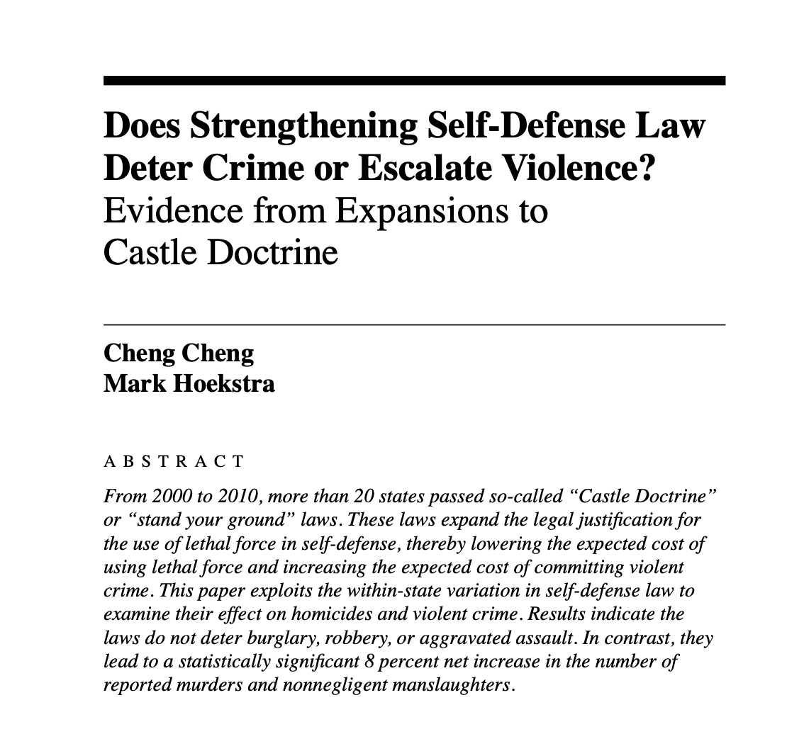
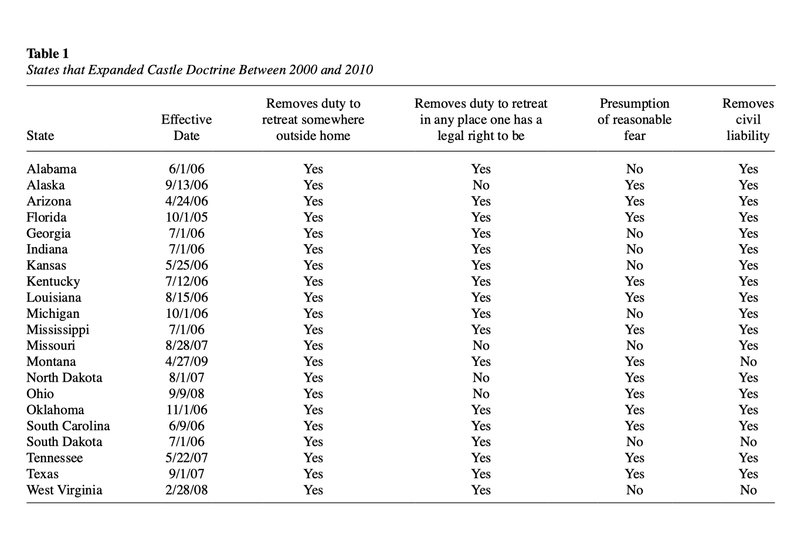
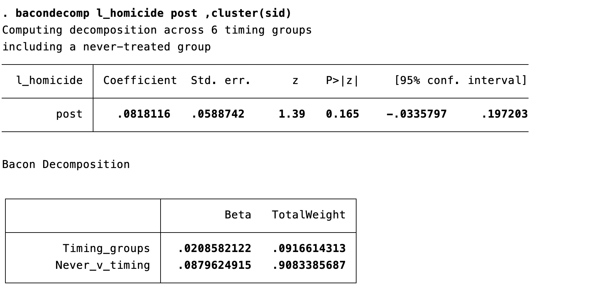
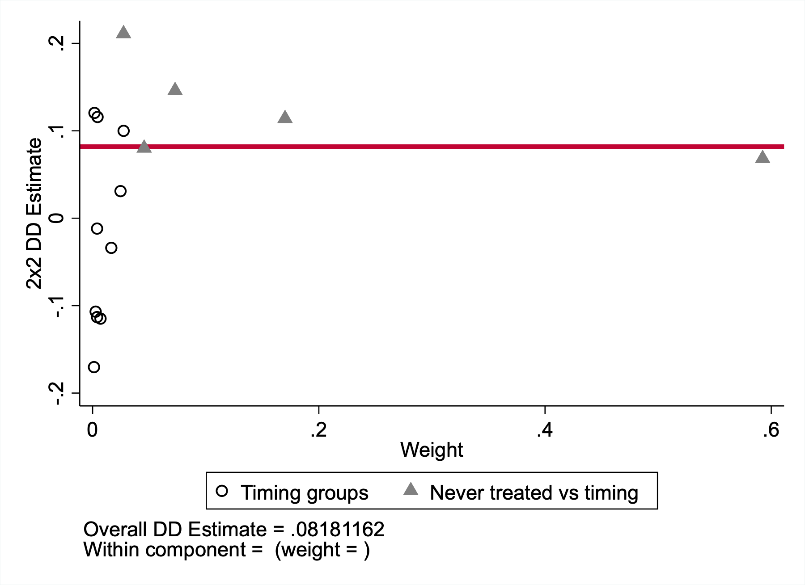
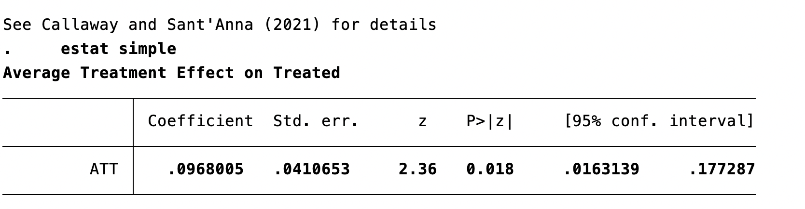

## Quick Review: What We Covered Thursday

Last class, we covered **difference-in-differences (DiD)**:

- Combines a [treatment/control]{.kw} comparison with a [before/after]{.kw} comparison
- The interaction term $\hat{\delta}_1$ in $y = \beta_0 + \delta_0 \cdot after + \beta_1 \cdot treated + \delta_1 \cdot (after \times treated) + u$ is the DiD estimate
- Requires [parallel trends]{.alert}: in the absence of treatment, both groups would have followed the same trajectory
- Pre-trend tests and event study plots provide supporting evidence

Today: extending fixed effects — [time FEs]{.kw}, [clustered inference]{.kw}, and where modern DiD is heading.

# From Entity FE to Time FE

## Why Demeaning Works {.smaller}

Recall: with [entity fixed effects]{.kw}, we give each unit its own intercept $\alpha_i$.

. . .

Mathematically, this is [demeaning]{.kw} — subtracting each entity's time-average from its observations:

$$[y_{it} - \bar{y}_i] = \beta_1[x_{it} - \bar{x}_i] + [u_{it} - \bar{u}_i]$$

. . .

Because $\alpha_i - \bar{\alpha}_i = 0$, the fixed effect drops out completely.

. . .

::: {.callout-note}
## The Within Estimator
This is why FE is called the **within** estimator — we're using variation *within* each entity over time, not variation *between* entities.
:::

. . .

**Now:** What if we also want to control for shocks that hit [all entities equally]{.kw} in the same period?

## Time Fixed Effects {.smaller}

Examples of entity-invariant time shocks:

. . .

- A national recession hits all cities in 2008

. . .

- A federal policy change affects all states simultaneously

. . .

- Inflation affects all firms' costs in the same year

. . .

Add [time fixed effects]{.kw} $\lambda_t$: a dummy for each time period.

$$y_{it} = \beta_1 x_{it} + \alpha_i + \lambda_t + u_{it}$$

- $\alpha_i$: entity fixed effect — absorbs entity-specific, time-invariant factors
- $\lambda_t$: time fixed effect — absorbs time-specific, entity-invariant factors

. . .

::: {.callout-tip}
## Connection to DiD
The $\delta_0 \cdot after_t$ term in the DiD regression *is* a (two-period) time fixed effect — it absorbs the common time trend affecting both groups.
:::

## What Time FEs Actually Do {.smaller}

A national recession hits **all states** in 2008. Unemployment rises everywhere:

| State | 2006 | 2008 | Change | 2008 Avg | 2008 State - Avg |
|---|:---:|:---:|:---:|:---:|:---:|
| Vermont | 5.2% | 7.8% | +2.6pp | 7.8% | 0.0pp |
| Ohio | 5.9% | 8.6% | +2.7pp | 7.8% | +0.8pp |
| Texas | 4.4% | 7.0% | +2.6pp | 7.8% | -0.8pp |

. . .

Vermont and Texas each rose 2.6pp; Ohio rose 2.7pp — an average of about 2.6pp across all three states. This [common shock]{.kw} reflects national conditions, not any state policy. The small variation around that average is noise; the common component is [not variation we want]{.alert} to exploit.

. . .

A **year dummy for 2008** absorbs this common shift exactly. After removing the year mean, only [within-year, across-state variation]{.kw} remains.

. . .

::: {.callout-note}
## The Analogy to Entity FE
**Entity FE removes:** "Detroit is always high-crime regardless of unemployment" — a unit-specific level

**Time FE removes:** "2008 was a bad year for everyone" — a year-specific level
:::

## Entity + Time Fixed Effects: What's Left? {.smaller}

With [both]{.kw} entity and time fixed effects:

$$y_{it} = \beta_1 x_{it} + \alpha_i + \lambda_t + u_{it}$$

. . .

**Controlled for:**

- All time-invariant entity characteristics ($\alpha_i$)
- All entity-invariant time shocks ($\lambda_t$)

. . .

**Not controlled for:**

- Factors that vary [across both entities and time]{.alert}

. . .

::: {.callout-tip}
## Knowledge Check
You estimate the effect of a state-level minimum wage increase on employment, with state and year fixed effects. What omitted variable could still bias your results?
:::

. . .

**Answer:** A factor that varies across states *and* over time — e.g., a state-specific economic boom that coincides with the minimum wage increase. *(Instructor: reveal verbally or advance slide.)*

# Implementing FE in Stata

## Three Ways to Estimate FE {.smaller}

::: {.callout-note}
## Option 1: Manual Demeaning
Demean your data by hand (subtract entity means), then estimate OLS on the demeaned data.
:::

. . .

::: {.callout-warning}
## Why This Is Usually Not Recommended
It is easy to make mistakes, hard to extend cleanly once you add time fixed effects or clustered standard errors, and harder for someone else to read and audit later. It is useful for understanding the estimator, but not the default workflow for real applied work.

Manual demeaning reproduces the FE coefficient, but naive OLS on demeaned data may also mishandle degrees of freedom and therefore inference unless you adjust things correctly.
:::

## Two Standard Commands for FE {.smaller}

::: {.callout-note}
## Option 2: Dummy Variables / `areg`
Include entity dummies directly, or use `areg` to "absorb" one set of fixed effects:

```stata
areg scrap grant d88 d89, absorb(fcode) cluster(fcode)
```
:::

. . .

::: {.callout-note}
## Option 3: `xtreg` (Recommended)
Declare your panel structure, then estimate with the `fe` option:

```stata
xtset fcode year
xtreg scrap grant d88 d89, fe vce(cluster fcode)
```
:::

. . .

::: {.callout-note}
## `areg` vs. `xtreg fe` — Are They the Same?
For a single level of fixed effects, `areg` and `xtreg fe` give **identical point estimates and standard errors**. They differ in how they report R² (different denominators) and in small-sample degrees-of-freedom adjustments for clustered SEs. For this course, treat them as equivalent.
:::

## What Entity FE Controls For

::: {.callout-important}
## Key Principle
In an [entity fixed effects]{.alert} model, you do **not** need to include time-invariant covariates. They are already absorbed by the fixed effects.
:::

. . .

**Practical notes:**

- We don't usually interpret the fixed effect coefficients themselves
- Which entity is the "omitted" group (avoiding the dummy variable trap) doesn't matter
- Fixed effects are typically not reported in regression output

. . .

::: {.callout-warning}
## The Price of Entity FE
You [cannot]{.alert} estimate the effect of variables that don't change over time — gender, race, state geography, etc. The fixed effect absorbs them completely.
:::

# Inference: Serial Correlation and Clustering

## Least Squares Assumptions for Panel Data

$$Y_{it} = \beta_1 X_{it} + \alpha_i + u_{it}, \quad i = 1, \ldots, n; \; t = 1, \ldots, T$$

. . .

::: {.incremental}
1. $E[u_{it} | X_{i1}, \ldots, X_{iT}, \alpha_i] = 0$
    - $u_{it}$ cannot be correlated with [any present, past, or future]{.alert} values of $X$
2. $(X_{i1}, \ldots, X_{iT}, u_{i1}, \ldots, u_{iT})$ are i.i.d. draws [across entities]{.kw}
    - Only need independence across entities, not within
3. $(X_{it}, u_{it})$ have finite fourth moments
4. No perfect multicollinearity
:::

. . .

If these hold, FE estimates are [consistent and asymptotically normal]{.kw} for large $n$.

## Why Autocorrelation Matters

Previously, we assumed observations were independent.

. . .

- Implausible for data on the [same entity over time]{.alert}
- Without correction, we estimate [incorrect standard errors]{.alert}
- Confidence intervals will [not have 95% coverage]{.alert}

. . .

::: {.callout-important}
## Autocorrelation Does Not Bias $\hat{\beta}$
The coefficients are still consistent — but our [inference]{.alert} (standard errors, $p$-values, confidence intervals) is wrong. Typically: SEs are [too small]{.alert}, so we reject too often.

Autocorrelation does not violate LS Assumption 2, which only requires independence across entities, not within.
:::

## The Solution: Clustered Standard Errors {.smaller}

[Clustered standard errors]{.kw} allow for arbitrary correlation within entities.

. . .

**Idea:** Allow $\omega_{it}$ and $\omega_{is}$ (same entity, different times) to be correlated freely, while maintaining independence [across]{.kw} entities.

. . .

**In Stata:**

```stata
* With regress:
regress y x i.entity, cluster(entity)

* With areg:
areg y x, absorb(entity) cluster(entity)

* With xtreg (recommended):
xtreg y x, fe vce(cluster entity)
```

. . .

::: {.callout-warning}
## Cluster in Panel Data
In this course, if you are using panel data, [cluster standard errors at the entity level]{.alert} unless there is a strong reason not to. Failing to do so overstates precision and leads to false rejections.
:::

## What Clustered SEs Allow {.smaller}

**Clustered on entity:** block-diagonal error structure (2 entities × 3 periods):

| | E1-t1 | E1-t2 | E1-t3 | E2-t1 | E2-t2 | E2-t3 |
|:---:|:---:|:---:|:---:|:---:|:---:|:---:|
| **E1-t1** | ✓ | ✓ | ✓ | 0 | 0 | 0 |
| **E1-t2** | ✓ | ✓ | ✓ | 0 | 0 | 0 |
| **E1-t3** | ✓ | ✓ | ✓ | 0 | 0 | 0 |
| **E2-t1** | 0 | 0 | 0 | ✓ | ✓ | ✓ |
| **E2-t2** | 0 | 0 | 0 | ✓ | ✓ | ✓ |
| **E2-t3** | 0 | 0 | 0 | ✓ | ✓ | ✓ |

✓ = arbitrary covariance allowed · 0 = assumed independent (across-entity blocks)

. . .

| | Regular OLS SEs | Clustered SEs |
|---|---|---|
| **Errors across observations** | Must be independent | Must be independent *across entities* |
| **Errors within an entity over time** | Must be independent | Can be correlated freely |
| **What is assumed** | i.i.d. errors everywhere | i.i.d. across entities; anything within |
| **Appropriate for panel data?** | No — implausible | Yes — the standard approach |

. . .

*Example:* State-clustered standard errors assume that, in a given year, errors across states are independent, but errors over time within a state can be correlated freely.

## Notes on Clustering

- **Standard practice:** Cluster across entities — the natural unit of independence in panel data.
- **Direction matters:** You could cluster across time periods instead (if worried about common period-level shocks), but this is less common.
- **Two-way clustering:** Some settings cluster on both entities and time. Use when you suspect both within-entity serial correlation and correlation across units within the same period. Not needed in this class.
- **Minimum clusters:** Clustered SEs perform poorly with [fewer than ~30–50 clusters]{.alert}. With fewer, consider a wild bootstrap.

Clustered SEs do not change the point estimates, only the standard errors. They are often larger than unclustered SEs when within-entity errors are positively correlated.

Wild bootstrap is a resampling method that repeatedly re-creates the test statistic in a way that respects the clustered error structure, which can improve inference when the number of clusters is small.

# Staggered Adoption and Recent Developments

## Castle Doctrine Laws (Cheng and Hoekstra 2013)

:::: {.columns}
::: {.column width="42%"}
{width=100%}
:::

::: {.column width="58%"}
**Research question:** Do castle doctrine laws deter violent crime, or do they increase homicide?

::: {.incremental}
- State-by-year panel for all 50 states, 2000--2010
- "Stand your ground" / castle doctrine laws make it easier to use lethal force in self-defense
- Treatment: whether a castle doctrine law is in effect in a state-year
- Adoption is [staggered across states]{.kw}
:::
:::
::::

## Natural Approach: Two-Way FE

**Natural approach:** Two-way FE regression:
$$\log(\text{homicide rate}_{it}) = \beta_1 \cdot post_{it} + \alpha_i + \lambda_t + u_{it}$$

- $\log(\text{homicide rate}_{it})$: log homicide rate in state $i$ and year $t$
- $post_{it}$: equals 1 once a castle doctrine law is in effect
- $\alpha_i$: state fixed effects
- $\lambda_t$: year fixed effects
- $u_{it}$: unobserved shocks not captured by the model

. . .

If treatment effects are [homogeneous]{.kw} across states and stable over time, TWFE gives the right answer. But what if the effect in Florida looks different from the effect in Texas, or grows over time after adoption?

## The Treatment Timing Is Staggered {.smaller}

{width=78%}

. . .

- Florida adopts in 2005
- Many states adopt in 2006
- Others adopt in 2007, 2008, and 2009
- This is exactly the staggered-adoption setting that creates trouble for standard TWFE

. . .

::: {.callout-note}
## The Problem
This is [staggered adoption]{.kw} with potentially [heterogeneous treatment effects]{.kw}. What TWFE does under the hood — and when it fails — is the topic of this section.
:::

## The Staggered Adoption Problem {.smaller}

The classic DiD has two groups and two periods. In practice, policies are often adopted by [different units at different times]{.alert} — [staggered adoption]{.kw}.

. . .

**Toy analogy:** States adopt a job training program in different years.

The natural approach is still two-way fixed effects (TWFE).

$$y_{it} = \beta_1 \cdot treated_{it} + \alpha_i + \lambda_t + u_{it}$$

. . .

Recent research (roughly 2018–2024) has shown that this "obvious" approach can produce [severely misleading estimates]{.alert} — including [wrong signs]{.alert}.

## A Concrete Example {.smaller}

A job training program with a [true effect that grows over time]{.alert}: +10 in year 1, +50 in year 2.

| | 2018 | 2019 | 2020 |
|---|:---:|:---:|:---:|
| **No-treatment baseline** | 100 | 105 | 110 |
| **State E** (treats in 2019) | 100 | <span style="color:#008080">115</span> | <span style="color:#008080">160</span> |
| **State L** (treats in 2020) | 100 | 105 | <span style="color:#008080">120</span> |

. . .

TWFE takes a [weighted average]{.kw} of all 2×2 DiD comparisons — including contaminated ones.

**Valid comparison** (E treated vs. L as control, 2018→2019):
$$\underbrace{(115 - 100)}_{\Delta E} - \underbrace{(105 - 100)}_{\Delta L} = +10$$

. . .

**Contaminated comparison** (L treated vs. already-treated E as "control," 2019→2020):
$$\underbrace{(120 - 105)}_{\Delta L} - \underbrace{(160 - 115)}_{\Delta E} = -30$$

. . .

$$\hat{\beta}_{TWFE} = \tfrac{1}{2}(+10) + \tfrac{1}{2}(-30) = \mathbf{-10}$$

## The Sign Flipped! {.smaller}

::: {.callout-important}
## TWFE Gives the Wrong Sign
All true effects are [positive]{.kw} (+10 or +50), but TWFE estimates [−10]{.alert} — the wrong sign.

**Why?** State E's outcome rose by 45 from 2019→2020 because its treatment effect *grew*. TWFE treats this as a normal trend, making State L's +15 gain look like a relative decline.
:::

. . .

Goodman-Bacon (2021) showed TWFE is a [weighted average]{.kw} of all possible 2×2 DiD comparisons. When treatment effects [change over time]{.alert}, already-treated units used as "controls" introduce bias — and can receive [negative weights]{.alert}.

- TWFE automatically gives more influence to some comparisons than others.
- Roughly: comparisons with more useful treatment-timing variation get more weight in the final estimate.

## Castle Doctrine Through the Bacon Lens {.smaller}

:::: {.columns}
::: {.column width="44%"}
**Regression output**

{width=100%}
:::

::: {.column width="56%"}
**Diagnostic plot**

{width=100%}
:::
::::

. . .

- In this application, the overall TWFE estimate is about [0.082 log points]{.kw}
- About [91\% of the weight]{.kw} comes from treated states compared with never-treated states
- About [9\% of the weight]{.kw} comes from comparisons across treatment-timing groups
- So this is a useful cautionary example: the estimator is still averaging many smaller DiD comparisons, even though the clean treated-vs-never-treated comparisons dominate here

. . .

::: {.callout-note}
## Contrast: Stevenson and Wolfers (2006)
When looking at the impact of unilateral divorce on [female suicide rates]{.kw}, the Bacon decomposition is much messier. The problematic [timing-group comparisons]{.alert} get [about 38\% of the total weight]{.alert}, and the other major 2×2 pieces point in different directions. That is the kind of setting where staggered-adoption TWFE can become seriously misleading.
:::

## New Estimators {.smaller}

Several estimators have been developed to handle staggered adoption correctly:

. . .

- **Callaway and Sant'Anna (2021):** Group-time-specific effects, then aggregate. Only uses not-yet-treated or never-treated units as controls.

- **Sun and Abraham (2021):** Interaction-weighted estimator correcting for heterogeneous effects across adoption cohorts.

- **de Chaisemartin and D'Haultfoeuille (2020):** Identifies which comparisons get negative weights and proposes robust alternatives.

. . .

All share one insight: [never use already-treated units as controls]{.alert}.

. . .

Some of these methods effectively implement TWFE with [restricted control groups]{.kw} (never-treated or not-yet-treated only) — preserving the fixed-effects machinery while eliminating the contaminated comparisons.

. . .

::: {.callout-note}
## Beyond ECON3500
You won't implement these in this course. **If you use DiD in your research paper** with staggered adoption, simply discussing the staggered adoption limitation is completely acceptable — you do not need to implement an alternative estimator. If you want to go further, the packages below are the standard options.

Current Stata packages (checked April 7, 2026): `csdid` (Callaway-Sant'Anna), `eventstudyinteract` (Sun-Abraham), `did_multiplegt_stat` / `did_multiplegt_dyn` (de Chaisemartin-D'Haultfoeuille).
:::

## A Modern DiD Estimate for Castle Doctrine {.smaller}

:::: {.columns}
::: {.column width="44%"}
Using Callaway and Sant'Anna's estimator in Stata:

```stata
gen gvar = treatment_date
replace gvar = 0 if missing(gvar)
csdid l_homicide, ivar(sid) time(year) gvar(gvar) notyet
estat simple
```
:::

::: {.column width="56%"}
{width=100%}
:::
::::

. . .

Interpretation: using [not-yet-treated states as controls]{.kw}, the estimated effect of castle doctrine laws is about a [9.7\% increase]{.alert} in homicide.

# Putting It All Together

## Comparison of Panel Data Methods {.smaller .scrollable}

| Method | Data Required | What It Controls | Key Assumption | What Remains |
|--------|:---:|---|---|---|
| [DiD]{.kw} | 2 groups, 2 periods | Group differences; common time trend | [Parallel trends]{.alert} | Group-specific time-varying shocks |
| [Staggered DiD]{.kw} | Multiple groups, multiple adoption years | Group differences; cohort-specific time trends | [Parallel trends]{.alert} by adoption cohort | Cohort-specific time-varying shocks |
| [First Difference]{.kw} | Panel, 2 periods | All time-invariant entity factors | No time-varying OVB | Time-varying omitted variables |
| [Entity FE]{.kw} | Panel, 2+ periods | All time-invariant entity factors | No time-varying OVB | Time-varying omitted variables |
| [Time FE only]{.kw} | Panel or repeated cross-sections | Entity-invariant time shocks | No entity-specific time trends | Entity differences; time-varying confounders |
| [Entity + Time FE]{.kw} | Panel, 2+ periods | Time-invariant entity factors + entity-invariant time shocks | No entity-and-time-varying OVB | Entity-time-specific shocks |

## When to Use What {.smaller}

**Difference-in-Differences:**

- Repeated cross-sections or panel data
- Clear treatment/control groups and before/after periods
- Requires parallel trends assumption

. . .

**First Differencing:**

- Panel data with 2 periods
- Equivalent to entity FE with 2 periods; simple and transparent

. . .

**Fixed Effects:**

- Panel data with 2+ periods
- Include entity FE, time FE, or both depending on threats
- More efficient than first differencing when $T > 2$ and errors are not serially correlated

## Common Pitfalls {.smaller}

1. [Forgetting to cluster]{.alert}

Panel data almost always requires clustered standard errors. Unclustered SEs will usually be [too small]{.alert} (though in some designs they can be too large), leading to false precision or false rejection.

. . .

2. [Trying to estimate time-invariant effects]{.alert}

With entity FE, you [cannot]{.alert} estimate the effect of variables that do not vary over time. The fixed effect absorbs them.

. . .

3. [Assuming FE solves all OVB]{.alert}

Fixed effects only eliminate [time-invariant]{.alert} omitted variables. Time-varying confounders can still bias your estimates.

## Key Takeaways

1. [Time fixed effects]{.kw} $\lambda_t$ absorb entity-invariant time shocks — the same demeaning logic applied across time

. . .

2. With entity + time FEs, only [entity-and-time-varying]{.alert} confounders remain a threat

. . .

3. Panel data creates [serial correlation]{.kw} — always use [clustered standard errors]{.kw} at the entity level

. . .

4. FE [cannot estimate]{.alert} effects of time-invariant variables — the price of eliminating time-invariant OVB

. . .

5. With [staggered adoption]{.kw}, standard TWFE can give misleading results — modern estimators (Callaway-Sant'Anna, Sun-Abraham) fix this by never using already-treated units as controls
