## Learning Objectives {.smaller}

1. Understand **why** we need instrumental variables to address endogeneity
2. Identify the three key characteristics of a valid instrument
3. Explain the mechanics of **two-stage least squares** (2SLS)
4. Test for **weak instruments** using first-stage F-statistics
5. Combine IV with **panel data** and fixed effects

. . .

::: {.callout-note}
## Textbook Coverage
- 12.1: IV estimator with single regressor and single instrument
  - *We won't manually compute standard errors*
- 12.2: General IV regression model
- 12.3: Checking instrument validity
  - *Weak instruments and exogeneity* 
  - **Exclude** *overidentifying restrictions test*
- 12.4/12.5: Interesting examples!
:::

# Why Instrumental Variables?

## The Endogeneity Problem

Three threats to internal validity all produce **endogeneity**---the regression $X_i$ is correlated with the error term. That is, $E(u_i | X_i) \neq 0$:

. . .

1. **Omitted variable bias**: An unobserved variable correlated with $X$ is left out

. . .

2. **Simultaneous causality**: $X$ causes $Y$, but $Y$ also causes $X$

. . .

3. **Errors-in-variables bias**: $X$ is measured with error


## What We've Tried So Far

Solutions to endogeneity considered previously:

- **Difference-in-differences**
  - Requires a clear before/after treatment
- **Fixed effects** (Ch. 10)
  - Requires panel data
  - Endogeneity source must be time-constant
  - Regressors must not be time-constant

. . .

Today: **Instrumental variables (IV)**

- Widely-used method for addressing endogeneity
- IV can **eliminate bias** when $E(u_i | X_i) \neq 0$ if we have a valid [instrumental variable]{.kw} $Z$

## Wages and Schooling {.smaller}

$$\log(wage_i) = \beta_0 + \beta_1 schooling_i + \delta V_i + u_i$$

- $\beta_1$ measures the returns to schooling
- One omitted variable $V$: innate ability as a worker
  - Innate ability positively affects *wages* ($\delta > 0$)
  - Likely that innate ability is positively correlated with *schooling*: $\text{corr}(schooling, V) > 0$

. . .

- OLS estimator of $\beta_1$ may have **omitted variable bias**
- If this is the only omitted variable, bias is **positive**
  - $\hat{\beta}_1$ overestimates the financial returns to schooling

## Can We Fix This with Multiple Regression? {.smaller}

$$\log(wage_i) = \beta_0 + \beta_1 schooling_i + \delta V_i + u_i$$

- How do we measure innate ability?

. . .

- IQ tests may capture *some* part of ability; hard to get IQ data for large samples

. . .

- IQ is not a perfect measure of innate ability in the workplace
  - Example: IQ tests wouldn't measure social skills
  - Note: you *should* include IQ or equivalent if available

. . .

- Since IQ tests are imperfect, *schooling* likely remains correlated with the omitted part of innate ability

. . .

- Multiple regression doesn't fully solve this problem!

## Can We Fix This with Panel Data? {.smaller}

$$\log(wage_i) = \beta_0 + \beta_1 schooling_i + \delta V_i + a_i + u_i$$

- Innate ability might be reasonably constant over a career, captured by $a_i$
- But *schooling* is also typically constant for adult workers

. . .

- Adults who go back to school after working are a non-representative group
- Panel data do not provide convincing variation in schooling over a worker's career
- Fixed effects won't work here! (and if they do, won't capture the type of variation we care about)

. . .

::: {.callout-warning}
## Bottom Line
Neither multiple regression nor panel data convincingly addresses the ability bias in estimating returns to schooling. We need a different approach.
:::

# Endogeneity as a DAG

## The Problem in a DAG {.smaller}

To understand how IV solves this, let's visualize the problem using causal diagrams from Ch 8b.

:::: {.columns}
::: {.column width="45%"}
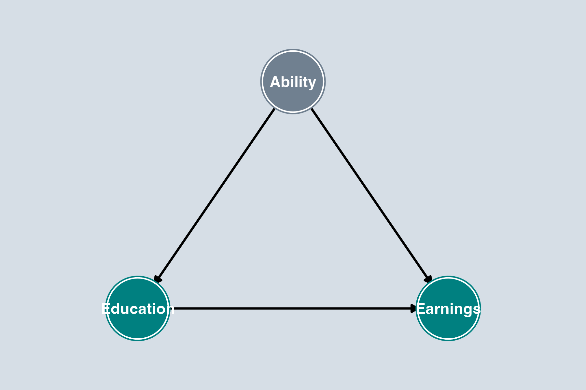{width=100% fig-align="center"}

::: {.smaller}
[Gray]{style="color: #708090; font-weight: bold;"} = unobserved
:::
:::

::: {.column width="55%"}
From Ch 8b, we know this DAG:

- **Causal path**: Education → Earnings ✓
- **Backdoor path**: Education ← [Ability]{style="color: #708090; font-weight: bold;"} → Earnings ✗

The backdoor path is [open]{.alert} and Ability is [unobserved]{.alert}.

- Can't control for it (Ch 6/7)
- Can't difference it out (Ch 10)
- **We need a new tool to close this path.**
:::
::::

## The IV Solution in a DAG {.smaller}

:::: {.columns}
::: {.column width="55%"}
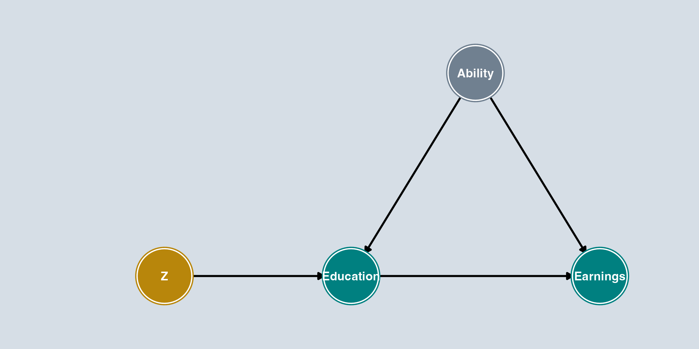{width=100% fig-align="center"}

::: {.smaller}
[Gold]{style="color: #B8860B; font-weight: bold;"} = instrument, [Gray]{style="color: #708090; font-weight: bold;"} = unobserved
:::
:::

::: {.column width="45%"}
Add an [instrument]{.kw} $Z$ to the DAG. A valid instrument must satisfy:

1. [Z → Education]{.alert}: $Z$ affects $X$ ([relevance]{.kw})
2. [No Z ← Ability]{.alert}: $Z$ is not connected to unobserved confounders ([exogeneity]{.kw})
3. [No Z → Earnings]{.alert}: $Z$ does not directly affect $Y$ ([exclusion]{.kw})

:::
::::

. . .

::: {.callout-important}
## Key Insight
IV works by isolating the variation in Education that comes **only from $Z$**. Since $Z$ has no connection to Ability and no direct effect on Earnings, this variation is "clean" --- free of confounding.
:::

# Cigarette Demand: A Running Example

## Demand for Cigarettes {.smaller}

Broad public policy interest in reducing cigarette consumption.

$$sales_i = \beta_0 + \beta_1 price_i + u_i$$

- Price may be correlated with omitted variables in $u$: firms set prices based on demand conditions
- When state $i$ has unusually high demand ($u_i$ high), prices are higher too
- This is [simultaneous causality]{.alert}: sales depend on prices, but prices also depend on sales

. . .

::: {.columns}
::: {.column width="55%"}
**The identification problem**: When both supply and demand shift, equilibrium data trace out **neither** curve --- just a scatter of equilibrium points.

We need something that shifts supply [without]{.alert} shifting demand.
:::
::: {.column width="45%"}
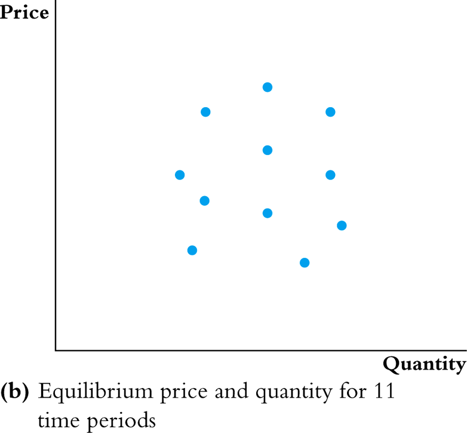
:::
:::

## The IV Intuition

::: {.columns}
::: {.column width="55%"}
If we can **hold demand fixed** and only observe supply shifting:

- The equilibrium points trace out the [demand curve]{.kw}
- The [instrument]{.kw} shifts supply without directly affecting demand --- it moves $X$ without directly affecting $Y$
:::
::: {.column width="45%"}
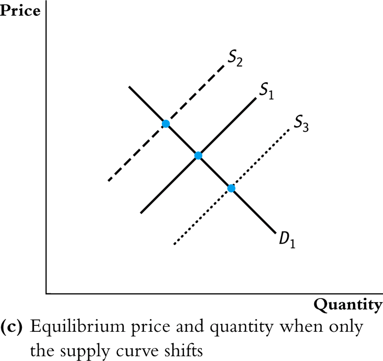
:::
:::

## Why Simultaneous Causality Is Especially Problematic

$$sales_i = 164.4 - 0.38 \cdot price_i + u_i$$

- Simultaneous causality is especially problematic because $X_i$ will generally be correlated with **all** omitted variables in $u_i$
- Hard to remove OVB by measuring the omitted variables
- Would need to measure *every single* omitted variable

. . .

Simultaneous causality would *disappear* if we could **randomly assign** prices to the different states

- In that experiment, there would be no correlation between *price* and $u$
- IV provides a way to mimic this

# The IV Solution: Formal Definitions

## Instrumental Variables: Three Assumptions {.smaller}

We introduced these conditions visually using DAGs. Now let's state them formally.

An [instrumental variable]{.kw} is an additional variable $Z_i$ that satisfies three assumptions:

. . .

1. $Z_i$ [is correlated]{.alert} with $X_i$
   - $\text{Corr}(Z, X) \neq 0$
   - $Z$ is a [powerful]{.kw} or [relevant]{.kw} instrument

. . .

2. $Z_i$ [is not correlated]{.alert} with the omitted variable, $u_i$
   - $\text{Corr}(Z, u) = 0$
   - $Z$ is an [exogenous]{.kw} instrument

. . .

3. $Z_i$ [does not]{.alert} *directly affect* (cause) $Y_i$
   - It can only affect $Y_i$ through its effect on $X_i$
   - $Z$ is an [excluded]{.kw} instrument
   - $Z_i$ does not enter the equation $Y_i = \beta_0 + \beta_1 X_i + u_i$

. . .

::: {.callout-note}
## Two vs. Three Assumptions
Some textbooks combine (2) and (3) into a single [validity]{.kw} or [exogeneity]{.kw} condition: $\text{Corr}(Z, u) = 0$. Others (including SW) separate them: [exogeneity]{.kw} (Z uncorrelated with $u$) and [exclusion]{.kw} (Z affects Y only through X). The practical question is the same either way: *can Z affect Y through any channel other than X?*
:::

## The Wald Estimator {.smaller}

With a [binary instrument]{.kw} $Z_i \in \{0, 1\}$, there is a simple way to see how IV works:

. . .

**First stage**: How does $Z$ move $X$?

$$\text{First stage} = E[X_i \mid Z_i = 1] - E[X_i \mid Z_i = 0]$$

**Reduced form**: How does $Z$ move $Y$?

$$\text{Reduced form} = E[Y_i \mid Z_i = 1] - E[Y_i \mid Z_i = 0]$$

. . .

$$\boxed{\hat{\beta}_1^{Wald} = \frac{\text{Reduced form}}{\text{First stage}}}$$

. . .

::: {.callout-note}
## Intuition
The reduced form tells us how the instrument changes the outcome. The first stage tells us how the instrument changes treatment. Their ratio tells us the effect of treatment [induced by the instrument]{.kw}.
:::

## Identification {.smaller}

Start with the population model:

$$Y = \beta_0 + \beta_1 X + u$$

. . .

Take the covariance of both sides with $Z$:

$$\text{Cov}(Y, Z) = \text{Cov}(\beta_0 + \beta_1 X + u, Z)$$
$$= \text{Cov}(\beta_0, Z) + \text{Cov}(\beta_1 X, Z) + \text{Cov}(u, Z)$$
$$= 0 + \beta_1 \text{Cov}(X, Z) + 0 \quad \text{by } \text{Cov}(u, Z) = 0$$

. . .

Solving for $\beta_1$:

$$\boxed{\beta_1 = \frac{\text{Cov}(Y, Z)}{\text{Cov}(X, Z)}}$$

## Which Assumptions Did We Use? {.smaller}

$$\beta_1 = \frac{\text{Cov}(Y, Z)}{\text{Cov}(X, Z)}$$

- $\text{Cov}(Z_i, u_i) = 0$ --- explicitly used in the derivation
- $\text{Cov}(X_i, Z_i) \neq 0$ --- used to divide by $\text{Cov}(X, Z)$; can't divide by zero!
- $Z_i$ does not affect $Y_i$ directly --- used to write the population model as $Y_i = \beta_0 + \beta_1 X_i + u_i$

. . .

::: {.callout-important}
## Key Feature of IV
Notice we **never** assumed $\text{Cov}(X_i, u_i) = 0$. IV explicitly allows for endogeneity --- that's the whole point!
:::

## Intuition for the IV Formula {.smaller}

$$\beta_1 = \frac{\text{Cov}(Y, Z)}{\text{Cov}(X, Z)}$$

- **Goal**: estimate $\beta_1$, how $X$ affects $Y$
- **Problem**: We think $X$ is correlated with $u$
- **Solution**: Don't compare $Y$ (which contains $u$) and $X$ directly
  - $\text{Cov}(X, Y)$ is explicitly *not* in our formula

. . .

- Instead, see how $Y$ moves with a third variable $Z$, and how $X$ moves with $Z$
- $Z$ is exogenous: uncorrelated with $u$; $Z$ also does not affect $Y$ directly
- If $Y$ and $X$ are both correlated with $Z$, the only explanation under our assumptions is that $X$ causes $Y$ according to $\beta_1$

## Applying the Formula: Distance to College {.smaller}

Back to our wages/schooling example. Instrument: distance from childhood home to nearest college.

$$\beta_1 = \frac{\text{Cov}(\log \text{wage}, \text{distance})}{\text{Cov}(\text{schooling}, \text{distance})}$$

- Denominator is positive (closer to college → more schooling)
- Numerator is positive if people near a college earn higher wages as adults
- Note: *not* because the distance causes the higher wage

. . .

::: {.callout-tip}
## Key Feature
$\text{Cov}(X, Y)$ does not appear in the formula --- we never directly compare someone's wage to their schooling. Instead, we use [only the variation in schooling driven by distance]{.kw}.
:::

# Two-Stage Least Squares

## The 2SLS Estimator

For a dataset with $n$ observations, replace population covariances with sample covariances:

$$\hat{\beta}_1^{2SLS} = \frac{\widehat{\text{Cov}}(Y, Z)}{\widehat{\text{Cov}}(X, Z)} = \frac{\frac{1}{n}\sum_{i=1}^{n}(Y_i - \bar{Y})(Z_i - \bar{Z})}{\frac{1}{n}\sum_{i=1}^{n}(X_i - \bar{X})(Z_i - \bar{Z})}$$

. . .

$$\hat{\beta}_0^{2SLS} = \bar{Y} - \hat{\beta}_1^{2SLS}\bar{X}$$

Called [two-stage least squares]{.kw} --- why will become apparent shortly.

## What Are the Two Stages? {.smaller}

**Stage 1**: Regress $X$ on $Z$ (the "first stage")

$$X_i = \pi_0 + \pi_1 Z_i + v_i$$

Form the predicted values:

$$\hat{X}_i = \hat{\pi}_0 + \hat{\pi}_1 Z_i$$

. . .

Note: $X_i = \color{green}{\hat{X}_i} + \color{red}{\hat{v}_i}$

. . .

**Stage 2**: Regress $Y$ on $\hat{X}$ (the "second stage")

$$Y_i = \beta_0 + \beta_1 \hat{X}_i + u_i$$

## Intuition: Why 2SLS Works {.smaller}

- **First stage** regresses $X$ on $Z$
  - Forms a "best guess" of $X$ using only data on $Z$
- The predicted $\hat{X}$ is **not** correlated with omitted variables in the second stage
  - If we predict price using sales tax, predicted prices can't be correlated with unmeasured factors that affect demand
  - We assumed exogeneity: sales tax is uncorrelated with omitted variables

. . .

- **Second stage** regresses $Y$ on $\hat{X}$
  - $\hat{X}$ is "cleansed" of any correlation with omitted variables
  - No more OVB or simultaneous causality bias

. . .

::: {.callout-important}
## Key Insight
The instrument isolates the variation in $X$ that is exogenous. 2SLS uses only this "clean" variation to estimate $\beta_1$.
:::

## The Local Average Treatment Effect {.smaller}

IV uses only the variation in $X$ driven by the instrument --- that's the whole point.

. . .

But this also means we can only observe the effect among people for whom the instrument [actually affects their treatment]{.kw}.

. . .

- Suppose a treatment improves *your* outcome by 2, but *my* outcome by only 1
- And the instrument strongly affects whether *you* get treatment, but barely affects *me*
- Then the IV estimate will be much closer to [2]{.kw} than to 1

. . .

::: {.callout-note}
## Local Average Treatment Effect (LATE)
The IV estimate is [local]{.alert} to the people whose treatment status is changed by the instrument, weighted by how much the instrument affects them. It is **not** the average effect for all units, or even for all treated units.
:::

## Better LATE Than Never? {.smaller}

**Implication**: The IV estimate may not represent the average effect for everyone --- or even for those actually treated.

. . .

- Compared to a randomized experiment, IV may be **less informative** about what would happen if treatment were expanded to a broader population

. . .

- But IV still provides a [valid causal estimate]{.kw} for the subgroup whose behavior is changed by the instrument
- When exogenous variation is limited, LATE may be the best causal estimate available

. . .

::: {.callout-tip}
## Practical Implication
When interpreting IV results, ask: *For whom does the instrument induce treatment?* The IV estimate applies to that group --- not necessarily to all units in the sample.
:::

# Cigarette Demand: IV in Practice

## The Instrument: Sales Tax

$$sales_i = \beta_0 + \beta_1 price_i + u_i$$

. . .

- Instrument for *price* of cigarettes? Need a $Z_i$ that is:
  - [Powerful]{.kw}: Correlated with price
  - [Exogenous]{.kw}: Uncorrelated with $u_i$ (unobserved demand factors)
  - [Excluded]{.kw}: Does not directly impact cigarette demand

. . .

- **Sales tax** in state $i$?
  - **Powerful**: Sales tax should be positively correlated with price (price measured inclusive of taxes)
  - **Exogenous**: Plausible, but contestable: states with stronger anti-smoking preferences may both set higher taxes and have lower cigarette demand
  - **Excluded**: Plausible, but contestable: the tax affects demand primarily through price, not through other channels

## 2SLS in Stata {.smaller}

Stata's `ivregress` command handles both stages automatically:

```stata
ivregress 2sls packpc (avgprs=tax), robust
```

. . .

::: {.callout-note}
## `ivregress 2sls Y (X=Z), robust`

- $Y$ = dependent variable (first after `2sls`)
- $X$ = endogenous regressor (in parentheses before `=`)
- $Z$ = excluded instrument (after `=`)
- `robust` = heteroskedasticity-robust standard errors
:::

## Stata: 2SLS Results {.smaller}

```stata
. ivregress 2sls packpc (avgprs=tax), robust

Instrumental variables (2SLS) regression       Number of obs   =         96
                                                Wald chi2(1)    =      88.46
                                                Prob > chi2     =     0.0000
                                                R-squared       =     0.4219
                                                Root MSE        =     19.567

------------------------------------------------------------------------------
             |               Robust
      packpc | Coefficient  std. err.      z    P>|z|     [95% conf. interval]
-------------+----------------------------------------------------------------
      avgprs |  -.4208748   .0447474    -9.41   0.000    -.5085781   -.3331715
       _cons |   169.556    7.516482    22.56   0.000     154.824     184.2881
------------------------------------------------------------------------------
Instrumented:  avgprs
Instruments:   tax
```

2SLS estimates that a 1-unit increase in price [leads to]{.kw} a decrease of 0.42 packs per capita.

## Viewing Both Stages with `first` {.smaller}

`ivregress 2sls packpc (avgprs=tax), robust first`

The `first` option displays the first-stage regression alongside the second stage.

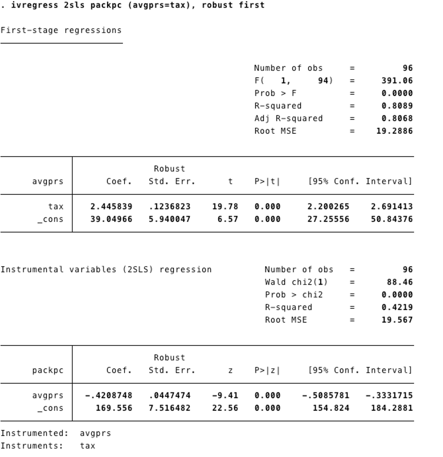{fig-align="center"}

## Reporting the First Stage {.smaller}

- First stage shows how $X$ and $Z$ are related
- It provides a **statistical test** of the relevance assumption: $\text{Corr}(X, Z) \neq 0$

. . .

::: {.callout-important}
## Rule of Thumb: F > 10
A common rule of thumb is that the first-stage F-statistic should be **greater than 10**. If so, instruments are likely [powerful]{.kw} (relevant). This threshold is a guide, not a bright line.
:::

# Checking Instrument Validity

## Weak Instruments {.smaller}

What if the first-stage F-test is less than 10?

- May have a **weak instrument**
- Sample covariance of $X$ and $Z$ may be close to 0

. . .

$$\hat{\beta}_1^{2SLS} = \frac{\widehat{\text{Cov}}(Y, Z)}{\widehat{\text{Cov}}(X, Z)}$$

- Intuition: dividing by something close to zero **blows up** your estimate
- Large standard errors and unreliable point estimates

. . .

::: {.callout-warning}
## Consequences of Weak Instruments
If the first-stage F-statistic is less than 10, the 2SLS estimates may be biased and confidence intervals may have incorrect coverage. Do not trust the results.
:::

## Which Assumptions Can Be Tested? {.smaller}

| Assumption | Testable? | How? |
|---|---|---|
| **Relevance** ($\text{Corr}(Z, X) \neq 0$) | Yes | First-stage F-test (rule of thumb: > 10) |
| **Exogeneity** ($\text{Corr}(Z, u) = 0$) | No | Must argue based on institutional knowledge |
| **Exclusion** ($Z$ doesn't directly cause $Y$) | No | Must argue based on theory |

::: {.callout-important}
## Exogeneity and Exclusion Cannot Be Tested
You lack data on the omitted variable, so you cannot test whether $Z$ is correlated with it. **Both** exogeneity *and* exclusion must be **defended with reasoning** --- relevance is the only one with a formal test.
:::

## Knowledge Check: Instrument Validity

::: {.callout-tip}
## Think About It
For the cigarette example, why might someone challenge the exogeneity of sales tax as an instrument? Could states with stronger anti-smoking attitudes set both higher taxes *and* have lower demand?
:::

# IV with Multiple Regressors

## Adding Exogenous Controls {.smaller}

$$sales_i = \beta_0 + \beta_1 price_i + \beta_2 income_i + u_i$$

- Income per person at the state level may affect cigarette sales
- Income is **not** determined simultaneously with cigarette demand
  - We assume income is uncorrelated with the composite error $u$

. . .

- 2SLS can handle variables **not treated as endogenous**
- Income enters **both** stages:
  - First stage: helps predict price
  - Second stage: controls for income's direct effect on sales

. . .

`ivregress 2sls packpc (avgprs=tax) incomepop, robust first`

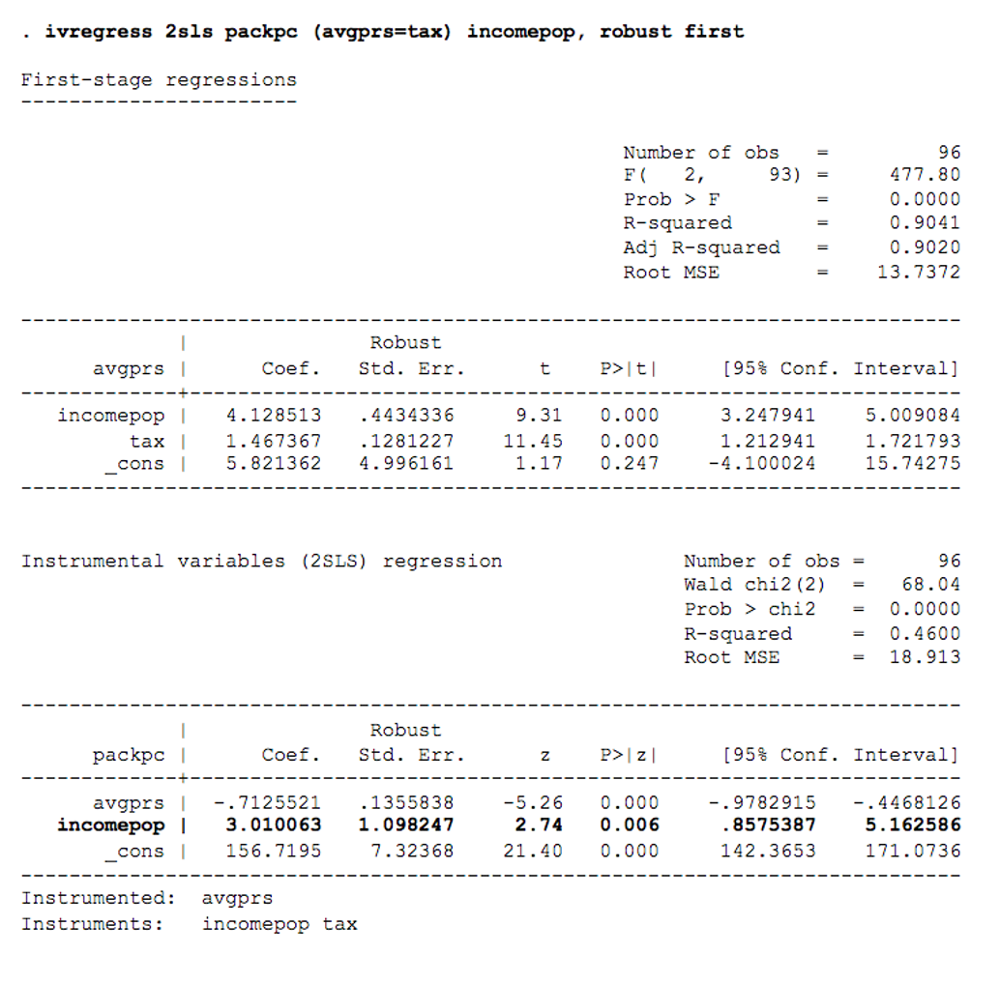{fig-align="center"}

## Need an *Excluded* Instrument {.smaller}

- We need at least one instrument for **each** regressor treated as endogenous in the outcome equation
- Even if we have income as a regressor, we still need `tax` as the excluded instrument
- Stata will give you an error message if there is no excluded instrument

. . .

::: {.callout-note}
## Terminology
- **Included instruments**: Exogenous regressors (like income) that appear in both stages
- **Excluded instruments**: Variables (like sales tax) that appear in the first stage but *not* the second stage
- The "excluded" instrument is what gives IV its identifying power
:::

# Panel Data, Fixed Effects, and IV

## Combining IV with Panel Data {.smaller}

$$sales_{it} = \alpha_i + \lambda_t + \beta_1 price_{it} + \beta_2 income_{it} + \delta V_i + \omega_{it}$$

**Instrument for *price* is *sales tax* (`taxs`)** --- the panel-data sales-tax variable; distinct from the per-pack excise `tax` used earlier.

. . .

- Panel data with fixed effects **and** instrumental variables; data from 1985 & 1995
- **State fixed effects** ($\alpha_i$): Control for time-invariant omitted factors (e.g., a state's attitude towards smoking)
- **Time fixed effects** ($\lambda_t$): Control for factors affecting all states in one year (e.g., national anti-smoking campaigns)
- **Instrument** (sales tax): Addresses simultaneous causality between demand factors and price
- Income is assumed exogenous

. . .

```stata
xtivreg packpc (avgprs = taxs) incomepop y1995, fe vce(cluster state)
```

## Comparing All Specifications {.smaller}

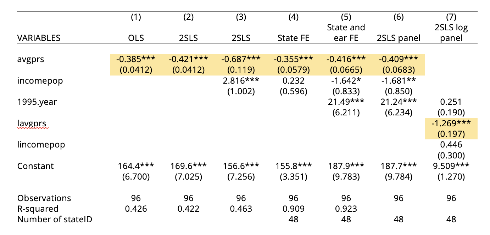{width=95% fig-align="center"}

. . .

::: {.callout-important}
## Best Elasticity Estimate
Column 7 adds logs so $\beta_1$ is an **elasticity**: when price rises 1%, sales fall **1.3%**. The CI of $(-1.53, -1.00)$ lies entirely below $-1$, so we can reject that demand is inelastic.
:::

. . .

::: {.callout-tip}
## What Changes Across Specifications?
Adding state + year FEs and an IV for price (sales tax) moves the coefficient from OLS's biased estimate toward a credible causal effect.
:::

# Applied Example: Returns to Schooling Revisited

## A Different Instrument for the Same Problem {.smaller}

We've been using wages/schooling throughout. We used *distance to college* as one instrument. Here's another famous approach to the same question:

## Instrument: Quarter of Birth (Angrist and Krueger, 1991) {.smaller}

- Many states do not let you drop out of school until age 16 (some places 17)
- High school students turn 16 at different times during the year

. . .

- Children born **earlier** in the year can drop out **earlier**
- So, children born earlier in the year get **less** total schooling

. . .

::: {.callout-tip}
## Check the Three Assumptions
1. **Relevant?** Yes --- quarter of birth is correlated with schooling attainment through compulsory schooling laws
2. **Exogenous?** Debatable --- is quarter of birth correlated with innate ability or other wage determinants? (Bound, Jaeger, and Baker, 1995)
3. **Excludable?** Debatable --- does birth quarter directly affect wages, e.g., through age-at-hire effects?
:::

. . .

This instrument has been extensively debated --- it illustrates how the assumptions can be **challenged** even when the research design seems clever.

## AK (1991): First Stage {.smaller}

Does quarter of birth actually predict education?

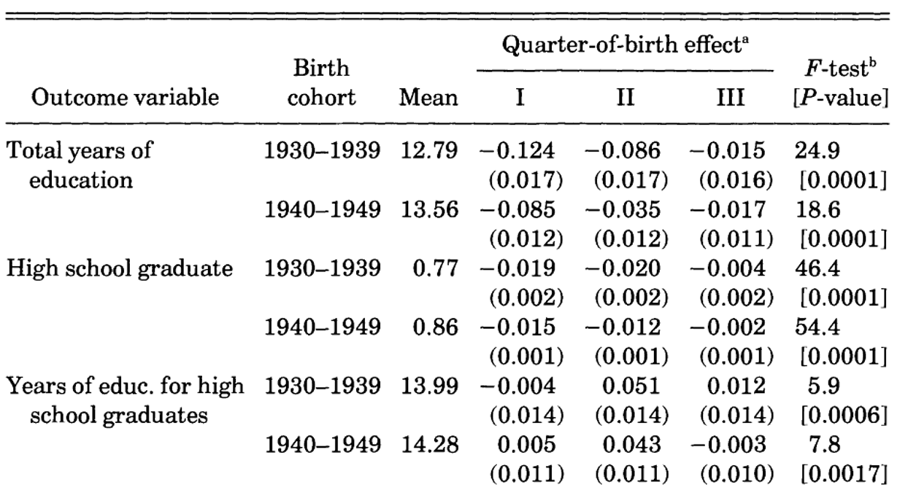{width=85% fig-align="center"}

Born in Q1 → significantly **less** education. F-tests are strong for total years.

## AK (1991): The Earnings Pattern {.smaller}

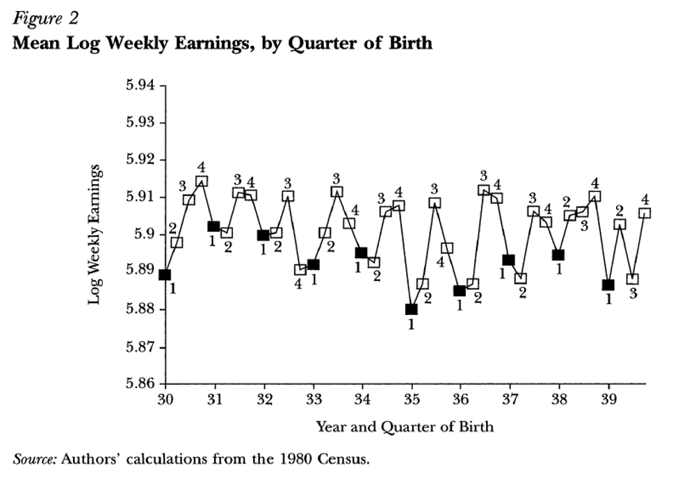{width=70% fig-align="center"}

Mean log weekly earnings by quarter of birth (1980 Census). The sawtooth pattern mirrors the education pattern --- Q1 births earn less.

## AK (1991): OLS vs. TSLS Estimates {.smaller}

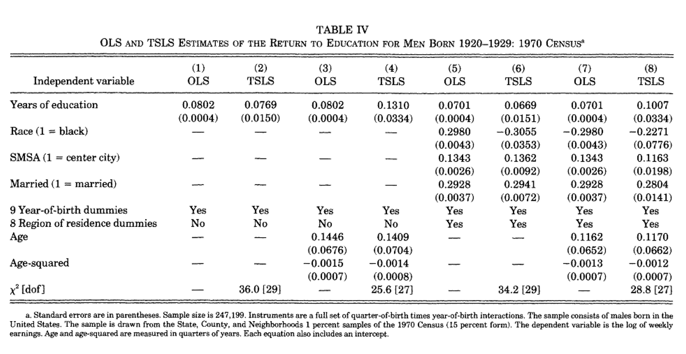{width=85% fig-align="center"}

OLS and TSLS estimates of returns to education, men born 1920--1929 (1970 Census, $n = 247{,}199$). Instruments: quarter-of-birth × year-of-birth interactions.

. . .

::: {.callout-note}
## Puzzle: IV > OLS?
If ability bias is the main problem, we'd expect OLS to *over*estimate the return to schooling --- so IV should be *smaller* than OLS. But here IV is **larger**. Two possible reasons:

- **Measurement error** in self-reported years of education attenuates OLS toward zero; IV corrects it
- **LATE $\neq$ ATE**: compliers here are marginal dropouts, who may have *higher* returns to each extra year than the average student

Also note: IV standard errors are much larger than OLS --- we're using less variation, so estimates are noisier.
:::

## Bound, Jaeger, and Baker (1995): Two Critiques {.smaller}

Bound, Jaeger, and Baker (1995) raised two distinct problems with the quarter-of-birth instrument:

. . .

**Problem 1 — Instrument may not be exogenous:** Quarter of birth is empirically correlated with many outcomes beyond schooling:

- School attendance, behavioral difficulties, mental health referrals
- Performance in reading, writing, and arithmetic
- IQ scores and family incomes

If quarter of birth is correlated with ability or other determinants of wages, $\text{Cov}(Z, u) \neq 0$ --- the exogeneity assumption fails.

. . .

**Problem 2 — Weak instruments:** With proper age controls, the first-stage F-statistic falls to **1.6** --- far below the rule-of-thumb threshold of 10.

## Bound, Jaeger, and Baker (1995): The Evidence {.smaller}

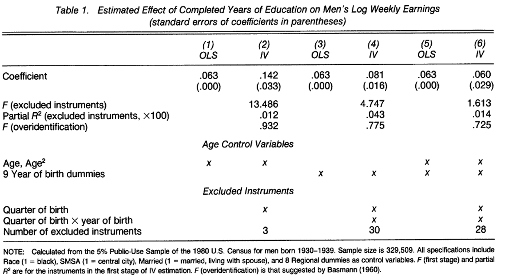{width=85% fig-align="center"}

::: {.callout-important}
## Combined Effect
A [weak instrument]{.alert} combined with even a small $\text{Cov}(Z, u)$ can cause the IV estimate to look similar to [OLS]{.alert}. The bias "fix" may introduce new bias rather than eliminating the original one.
:::

# IV Recipe Card

## IV Estimation: Step by Step {.smaller}

::: {.callout-note}
## Recipe Card: Instrumental Variables

**1. Identify the endogeneity problem**

- Why do you think $\text{Corr}(X, u) \neq 0$?
- OVB, simultaneous causality, or measurement error?

**2. Propose an instrument $Z$ and argue it is valid**

- Powerful: $\text{Corr}(Z, X) \neq 0$ (testable)
- Exogenous: $\text{Corr}(Z, u) = 0$ (not testable --- must argue)
- Excluded: $Z$ does not directly cause $Y$ (not testable --- must argue)

**3. Estimate via 2SLS**

- `ivregress 2sls Y (X=Z) controls, robust`

**4. Report and check**

- Report first-stage F-stat (rule of thumb: > 10)
- Discuss threats to exogeneity and exclusion
- Compare IV estimates to OLS --- if they differ, explain why
:::

## Common Pitfalls {.smaller}

::: {.columns}
::: {.column width="50%"}
**Mistakes to avoid**

- Using a **weak instrument** (F < 10)
- Failing to argue **exogeneity**
- Forgetting to report the **first stage**
- Using manual 2SLS standard errors
- Treating IV as a "magic fix" for endogeneity

:::
::: {.column width="50%"}
**Good IV practice**

- Provide institutional justification for the instrument
- Report the first-stage F-statistic
- Use `ivregress` (not manual two-step)
- Discuss threats to exclusion
- Compare IV to OLS and explain differences
:::
:::

## Key Takeaways {.smaller}

1. **Endogeneity** ($E(u|X) \neq 0$) makes OLS biased and inconsistent
2. IV addresses this by finding a variable $Z$ that:
   - Affects $X$ (powerful)
   - Is uncorrelated with $u$ (exogenous)
   - Does not directly affect $Y$ (excluded)
3. **2SLS** isolates the exogenous variation in $X$ using $Z$
4. **First-stage F > 10** is a common rule-of-thumb diagnostic for instrument strength
5. **Exogeneity cannot be tested** --- it must be argued
6. IV can be combined with **panel data** and fixed effects
7. Always use `ivregress` or `xtivreg` --- never manual two-step

## Final Knowledge Check

::: {.callout-tip}
Suppose a researcher wants to estimate the effect of class size on student test scores. They propose using **school budget per pupil** as an instrument for class size. Evaluate: Is this instrument likely to be powerful? Exogenous? Excludable? What might be wrong?
:::

# Appendix: Additional Examples

## Effect of Studying on Grades {.smaller}

What is the effect on grades of studying an additional hour per day?

- $Y$ = GPA
- $X$ = study time (hours per day)

. . .

*Would you expect the OLS estimator of $\beta_1$ to be unbiased? Why or why not?*

. . .

Stinebrickner and Stinebrickner (2008), "The Causal Effect of Studying on Academic Performance," *The B.E. Journal of Economic Analysis & Policy*

- $n = 210$ freshmen at Berea College (Kentucky) in 2001
- $Y$ = first-semester GPA
- $X$ = average study hours per day (time use survey)
- Roommates were **randomly assigned**
- $Z$ = 1 if roommate brought a video game, = 0 otherwise

## Is the Video Game Instrument Valid? {.smaller}

Do you think $Z_i$ (whether a roommate brought a video game) is a valid instrument?

. . .

1. Is the instrument [powerful]{.kw}?
   - If your roommate brought a video game, you might study less
   - First stage: video game treatment reduces study hours by 0.67 hours/day (significant)

. . .

2. Is the instrument [exogenous]{.kw}?
   - Roommates were **randomly assigned** --- so $Z$ is uncorrelated with unobserved student ability
   - Random assignment makes this a strong argument

. . .

3. Is the instrument [excludable]{.kw}?
   - Does having a roommate with a video game directly affect your GPA, other than through study time?
   - Plausible: the video game mainly affects grades by reducing study hours

. . .

## Stinebrickner and Stinebrickner (2008): Results {.smaller}

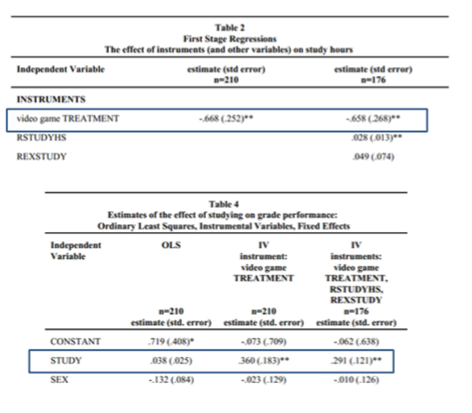{width=85% fig-align="center"}

OLS coefficient on study = 0.038; IV coefficient = **0.36** (much larger). Why? [Selection bias]{.alert} --- students who study more tend to be [weaker]{.alert} students compensating with extra effort ([negative selection]{.kw}). IV corrects this by using only the variation in study time driven by the random video-game assignment.
