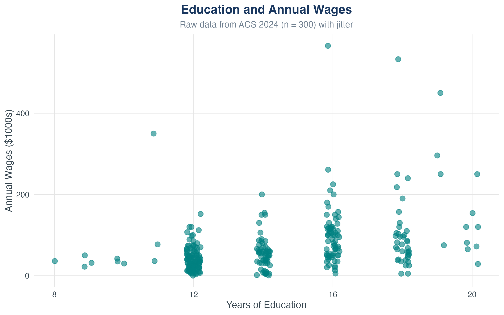
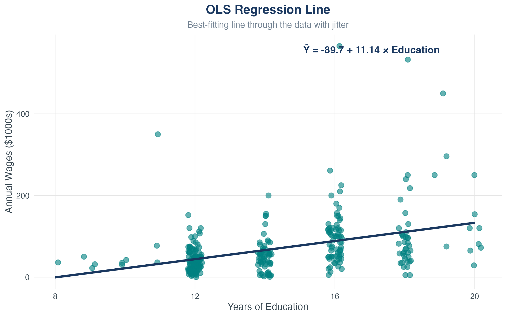
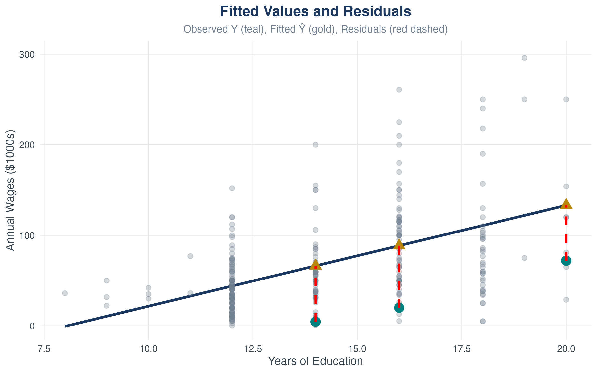
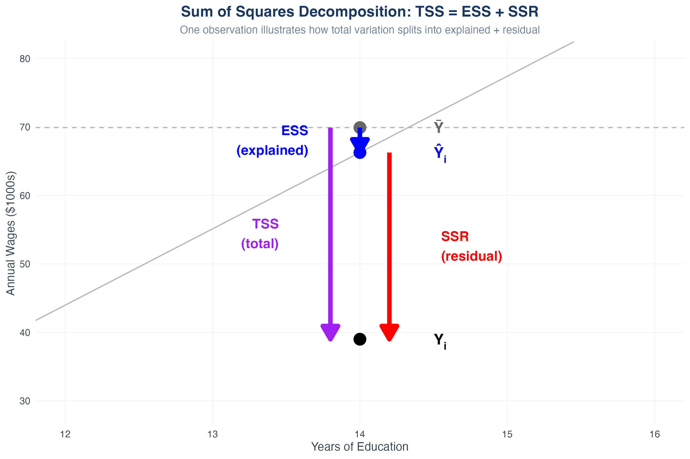
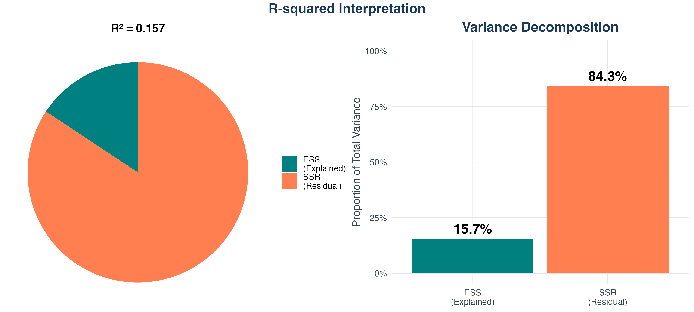
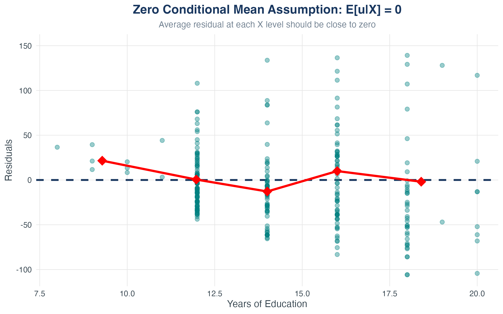
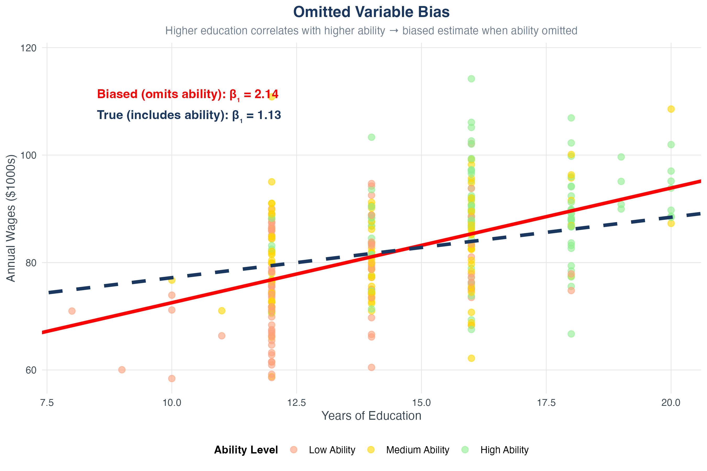
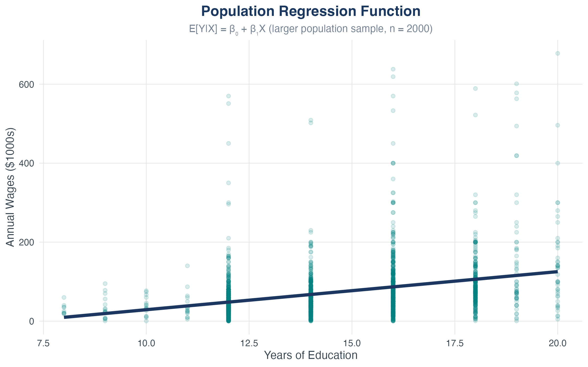
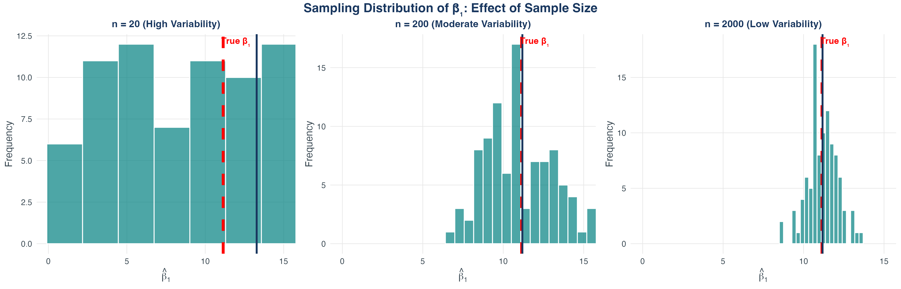
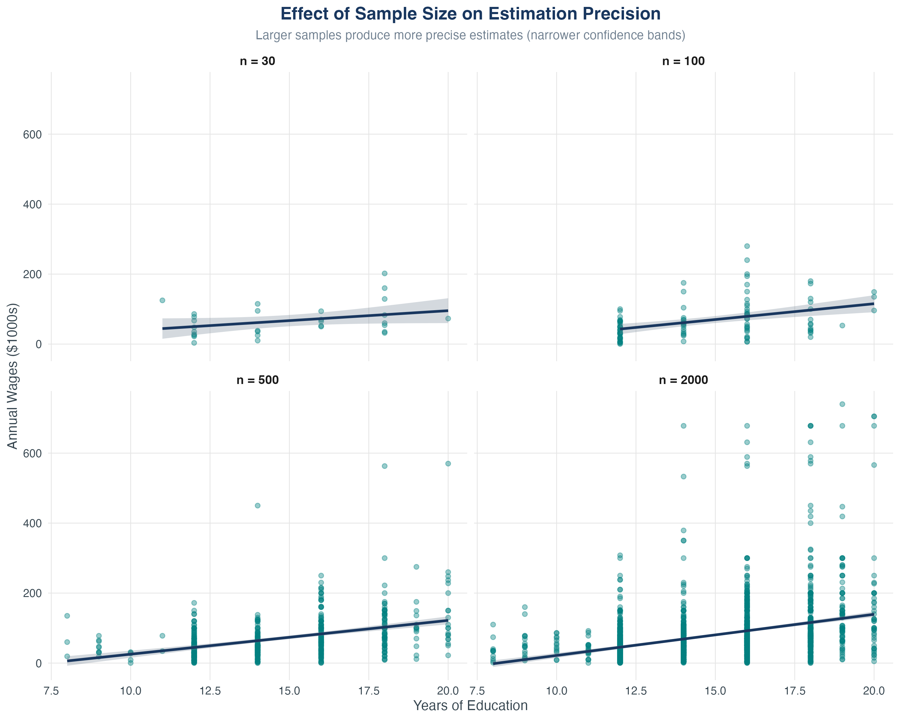

## Learning Roadmap {.scrollable}

::: {.callout-important}
## The Central Question
How do we move from observing [relationships]{.alert} in data to making [predictions]{.alert} and testing [causal claims]{.alert}?
:::

**By the end of this chapter, you will be able to:**

- Set up and estimate a simple linear regression model
- Interpret slopes and intercepts with precision
- Calculate and understand fitted values and residuals
- Assess model quality using R², TSS, ESS, SSR, and SER
- State the key assumptions behind OLS estimation
- Implement everything in Stata

## Our Journey {.smaller .scrollable}

1. [The linear regression model](#the-linear-regression-model)
2. [Estimating coefficients: ordinary least squares](#estimating-coefficients-ordinary-least-squares)
3. [Measuring how well the model fits](#measuring-how-well-the-model-fits)
4. [Assumptions for causal interpretation](#assumptions-for-causal-interpretation)
5. [Sampling distributions and uncertainty](#sampling-distributions-and-uncertainty)
6. [Common misconceptions and clarifications](#common-misconceptions-and-clarifications)
7. [Implementing OLS in Stata](#implementing-ols-in-stata)
8. [Bringing it all together](#bringing-it-all-together)

# The Linear Regression Model

## Motivating Question {.smaller}

::: {.callout-note}
## Returns to education
What are the economic returns to education?
:::

. . .

**Why this matters:**

- We observe that more educated people tend to earn more

. . .

- Is this just correlation, or something more?

. . .

- How much more do we expect someone with 16 years of education to earn vs. someone with 12 years?

. . .

- Can we [quantify]{.alert} the relationship systematically?

. . .

**Our goal:** Move from vague observations to a [**prediction rule**]{style="color: #19375F;"} we can compute from data.

## Data Source

**Example data:** Education and Annual Wages

**Source:** American Community Survey (ACS) 2024
**Sample:** 300 observations

**Variables:**
**Education:** Years of schooling (8-20 years)
**Wages:** Annual earnings in thousands of 2024 dollars

*Note: Based on realistic patterns from ACS microdata*

## First Look at the Data {.smaller}

{width=60% fig-align="center"}

**What do you see?**

- Each point is one person's (education, wages) pair
- General upward trend (positive relationship)
- Lots of scatter (other factors matter too!)

## From Picture to Model {.smaller}

**Three tools for describing relationships:**

1. [**Scatter plots**]{style="color: #19375F;"} give us a first look

. . .

2. [**Correlation**]{style="color: #19375F;"} tells us direction and strength

. . .

3. [**Linear regression**]{style="color: #19375F;"} gives us a mathematical summary we can use for prediction

. . .

::: {.callout-important}
## Key Insight
Regression transforms a cloud of points into an equation. That equation becomes a [model]{.alert} we can interrogate, test, and use.
:::

## What Regression Analysis Does

**Regression helps us:**

- [**Predict**]{style="color: #19375F;"}: Given someone's education, what wages would we expect?

. . .

- [**Explain**]{style="color: #19375F;"}: How does a one-year change in education map to wage changes?

. . .

- [**Control**]{style="color: #19375F;"}: What's the education-wages relationship *holding other factors fixed*?

. . .

**Vocabulary:**

- [**Dependent variable**]{style="color: #19375F;"} ($Y$): the outcome we want to explain (wages)
- [**Independent variable**]{style="color: #19375F;"} ($X$): the driver we use to explain it (education)

## The Population Model

**In the population, the true relationship is:**
$$
Y = \beta_0 + \beta_1 X + u
$$

. . .

**Components:**

- $\beta_0$: [**intercept**]{style="color: #19375F;"} — baseline level of $Y$ when $X = 0$

. . .

- $\beta_1$: [**slope**]{style="color: #19375F;"} — change in $Y$ from a one-unit increase in $X$

. . .

- $u$: [**error term**]{style="color: #19375F;"} — all other influences on $Y$ not captured by $X$

. . .

**$\blacktriangleright$** This is a *model* — a simplified representation of reality. Our job: estimate $\beta_0$ and $\beta_1$ from data.

## Understanding the Error Term {.smaller}

$$
\text{Wages} = \beta_0 + \beta_1 \cdot \text{Education} + u
$$

**What's in $u$?**

- Ability and talent
- Work experience
- Gender
- Family background
- Pure luck
- Measurement error

. . .

::: {.callout-warning}
## Critical Point
We can't observe $u$, but its properties determine whether we can interpret $\beta_1$ [causally]{.alert}. More on this later.
:::

## Ceteris Paribus: Holding Other Things Fixed

*Ceteris paribus* = "other things equal"

. . .

$$
Y = \beta_0 + \beta_1 X + u
$$

. . .

**Taking changes:**
$$
\Delta Y = \beta_1 \Delta X + \Delta u
$$

. . .

**Holding $u$ fixed means $\Delta u = 0$:**
$$
\Delta Y = \beta_1 \Delta X
$$

. . .

::: {.callout-note}
## Slope Interpretation
$\beta_1$ is the change in $Y$ associated with a one-unit change in $X$, [holding all other factors (captured in $u$) fixed]{.alert}.
:::

## The Regression Line in Action {.smaller}

{width=60% fig-align="center"}

**The line is:** $\hat{Y} = \hat{\beta}_0 + \hat{\beta}_1 X$

- Best linear summary of the scatter
- Every vertical deviation from the line is a residual

# Estimating Coefficients: Ordinary Least Squares

## From Population to Sample

**The challenge:**

- In the population: $Y_i = \beta_0 + \beta_1 X_i + u_i$

. . .

- We observe $(X_i, Y_i)$ for $i = 1, \ldots, n$

. . .

- We do **not** observe $u_i$

. . .

- We must *estimate* $\beta_0$ and $\beta_1$ from the sample

. . .

**Notation:**

- $\hat{\beta}_0$, $\hat{\beta}_1$ = our estimates (the "hats" indicate estimates)
- Goal: Make these estimates as close as possible to the true $\beta_0$, $\beta_1$

## The OLS Criterion {.smaller}

**Idea:** Choose $\hat{\beta}_0$ and $\hat{\beta}_1$ to make prediction errors as small as possible.

. . .

**For each observation, the prediction error is:**
$$
Y_i - (\beta_0 + \beta_1 X_i)
$$

. . .

**OLS minimizes the sum of squared errors:**
$$
\min_{\beta_0, \beta_1} \sum_{i=1}^{n} \left[ Y_i - (\beta_0 + \beta_1 X_i) \right]^2
$$

. . .

**Why square?**

- Positive and negative errors don't cancel out
- Penalizes large mistakes more than small ones
- Leads to a closed-form solution (calculus magic!)

## Deriving the OLS Estimators [Optional] {.smaller}

::: {.callout-tip}
## For Math Lovers
This derivation uses calculus to show where the OLS formulas come from. Feel free to skip if you prefer!
:::

**Setup:** Minimize the sum of squared residuals
$$
S(\beta_0, \beta_1) = \sum_{i=1}^{n} \left[ Y_i - (\beta_0 + \beta_1 X_i) \right]^2
$$

. . .

**Step 1: Take first-order conditions (FOCs)**
$$
\begin{aligned}
\frac{\partial S}{\partial \beta_0} &= -2 \sum_{i=1}^{n} \left[ Y_i - (\beta_0 + \beta_1 X_i) \right] = 0 \\[0.3em]
\frac{\partial S}{\partial \beta_1} &= -2 \sum_{i=1}^{n} X_i \left[ Y_i - (\beta_0 + \beta_1 X_i) \right] = 0
\end{aligned}
$$

. . .

**Step 2: Solve the first equation for $\hat{\beta}_0$**
$$
\begin{aligned}
\sum Y_i &= n\hat{\beta}_0 + \hat{\beta}_1 \sum X_i \\
\hat{\beta}_0 &= \frac{1}{n}\sum Y_i - \hat{\beta}_1 \frac{1}{n}\sum X_i = \bar{Y} - \hat{\beta}_1 \bar{X}
\end{aligned}
$$

## Deriving the OLS Estimators (continued) {.smaller}

**Step 3: Substitute $\hat{\beta}_0$ into the second FOC**
$$
\begin{aligned}
\sum X_i Y_i &= \hat{\beta}_0 \sum X_i + \hat{\beta}_1 \sum X_i^2 \\
\sum X_i Y_i &= (\bar{Y} - \hat{\beta}_1 \bar{X}) \sum X_i + \hat{\beta}_1 \sum X_i^2 \\
\sum X_i Y_i &= \bar{Y} n\bar{X} - \hat{\beta}_1 n\bar{X}^2 + \hat{\beta}_1 \sum X_i^2
\end{aligned}
$$

. . .

**Step 4: Solve for $\hat{\beta}_1$**
$$
\begin{aligned}
\hat{\beta}_1 \left( \sum X_i^2 - n\bar{X}^2 \right) &= \sum X_i Y_i - n\bar{X}\bar{Y} \\[0.3em]
\hat{\beta}_1 &= \frac{\sum X_i Y_i - n\bar{X}\bar{Y}}{\sum X_i^2 - n\bar{X}^2} = \frac{\sum(X_i - \bar{X})(Y_i - \bar{Y})}{\sum(X_i - \bar{X})^2}
\end{aligned}
$$

. . .

**Result:** This is the formula for $\hat{\beta}_1$ in "The OLS Formulas" slide!

## The OLS Formulas

**Solution from calculus (see previous slides for derivation):**

. . .

$$
\begin{aligned}
\hat{\beta}_1 &= \frac{\sum_{i=1}^{n}(X_i - \bar{X})(Y_i - \bar{Y})}{\sum_{i=1}^{n}(X_i - \bar{X})^2} = \frac{\text{Cov}(X,Y)}{\text{Var}(X)} \\[0.5em]
\hat{\beta}_0 &= \bar{Y} - \hat{\beta}_1 \bar{X}
\end{aligned}
$$

. . .

**Intuition:**

- $\hat{\beta}_1$ depends on how $X$ and $Y$ covary

. . .

- Need variation in $X$ to estimate $\beta_1$ (if all $X_i$ are the same, we can't learn about the slope!)

. . .

- The line always passes through $(\bar{X}, \bar{Y})$

## Fitted Values and Residuals

**Once we have $\hat{\beta}_0$ and $\hat{\beta}_1$:**

. . .

::: {.callout-note}
## Fitted Value
$$
\hat{Y}_i = \hat{\beta}_0 + \hat{\beta}_1 X_i
$$
This is the model's prediction for observation $i$.
:::

. . .

::: {.callout-note}
## Residual
$$
\hat{u}_i = Y_i - \hat{Y}_i
$$
This is the prediction error for observation $i$.
:::

. . .

**$\blacktriangleright$ Key property:** $\sum_{i=1}^{n} \hat{u}_i = 0$ (residuals always sum to zero)

## Visualizing Residuals {.smaller}

{width=70% fig-align="center"}

- Gold lines: residuals (vertical distance from point to line)
- OLS chooses the line that makes these distances smallest overall (in squared terms)

## Stata: Running OLS Regression {.smaller}

**Basic command:**

```stata
regress wages education
```

**Output includes:**

- Coefficient estimates: $\hat{\beta}_0$ (\_cons) and $\hat{\beta}_1$ (education)
- Standard errors (for inference - we'll cover this later)
- R² (measure of fit)
- Number of observations

**Generate fitted values and residuals:**

```stata
predict wages_fitted, xb
predict residual, residuals
```

## Reading Stata Regression Output {.smaller}

**Understanding the table:**

```stata
      Source |       SS           df       MS      Number of obs   =       300
-------------+----------------------------------   F(1, 298)       =     54.60
       Model |   298054         1      298054      Prob > F        =    0.0000
    Residual |  1626752       298     5459.23     R-squared       =    0.155
-------------+----------------------------------   Adj R-squared   =    0.152
       Total |  1924806       299     6436.81     Root MSE        =    73.883

------------------------------------------------------------------------------
       wages |      Coef.   Std. Err.      t    P>|t|     [95% Conf. Interval]
-------------+----------------------------------------------------------------
   education |   13.022      1.762      7.39   0.000      9.552      16.492
       _cons | -114.740     25.633     -4.48   0.000   -165.187    -64.292
------------------------------------------------------------------------------
```

- [Coef.]{.alert} column: $\hat{\beta}_1 = 13.02$, $\hat{\beta}_0 = -114.7$
- [R-squared]{.alert}: 0.155 (model explains 15.5% of variation)
- [Root MSE]{.alert}: Standard error of regression (SER) = 73.88
- [Std. Err.]{.alert}: We'll use this for hypothesis tests (next chapter!)

## Interpreting the Output {.smaller}

**Example results:**
$$
\widehat{\text{Wages}} = -114.7 + 13.02 \cdot \text{Education}, \quad N = 300
$$

. . .

**Interpretations:**

- [**Slope (13.02)**]{style="color: #19375F;"}: Each additional year of education is associated with approximately $13,020 more in annual wages
- [**Intercept (-114.7)**]{style="color: #19375F;"}: Predicted wages when education = 0 (not meaningful here!)
- [**Predictions**]{style="color: #19375F;"}:
  - Person with 16 years of education: $\hat{Y} = -114.7 + 13.02(16) = 93.6$k
  - Person with 12 years of education: $\hat{Y} = -114.7 + 13.02(12) = 41.5$k
- [**Residual example**]{style="color: #19375F;"}: If someone with 12 years of education earns $35k, their residual is $40 - 41.5 = -6.5$k

# Measuring How Well the Model Fits

## Decomposing Variation {.smaller}

**For any observation:**
$$
Y_i = \hat{Y}_i + \hat{u}_i
$$

. . .

**We can split total variation into two parts:**

$$
\underbrace{Y_i - \bar{Y}}_{\text{Total deviation}} = \underbrace{\hat{Y}_i - \bar{Y}}_{\text{Explained deviation}} + \underbrace{\hat{u}_i}_{\text{Unexplained deviation}}
$$

. . .

**Squaring and summing across all observations:**

$$
\underbrace{\sum_{i=1}^{n}(Y_i - \bar{Y})^2}_{\text{TSS}} = \underbrace{\sum_{i=1}^{n}(\hat{Y}_i - \bar{Y})^2}_{\text{ESS}} + \underbrace{\sum_{i=1}^{n}\hat{u}_i^2}_{\text{SSR}}
$$

## The Sum of Squares Trinity {.smaller}

::: {.callout-note}
## Total Sum of Squares (TSS)
$$
TSS = \sum_{i=1}^{n}(Y_i - \bar{Y})^2
$$
Measures total variation in $Y$ around its mean.
:::

. . .

::: {.callout-note}
## Explained Sum of Squares (ESS)
$$
ESS = \sum_{i=1}^{n}(\hat{Y}_i - \bar{Y})^2
$$
Variation in $Y$ explained by the model (variation in fitted values).
:::

. . .

::: {.callout-note}
## Sum of Squared Residuals (SSR)
$$
SSR = \sum_{i=1}^{n}\hat{u}_i^2
$$
Variation in $Y$ **not** explained by the model (variation in residuals).
:::

## Why Does TSS = ESS + SSR? (The Algebra) {.smaller}

**Start with the decomposition:**
$$
Y_i - \bar{Y} = (\hat{Y}_i - \bar{Y}) + (Y_i - \hat{Y}_i)
$$

. . .

**Square both sides:**
$$
(Y_i - \bar{Y})^2 = [(\hat{Y}_i - \bar{Y}) + (Y_i - \hat{Y}_i)]^2
$$

. . .

**Expand:**
$$
(Y_i - \bar{Y})^2 = (\hat{Y}_i - \bar{Y})^2 + (Y_i - \hat{Y}_i)^2 + 2(\hat{Y}_i - \bar{Y})(Y_i - \hat{Y}_i)
$$

. . .

**Sum over all $i$:**
$$
\sum_{i=1}^n (Y_i - \bar{Y})^2 = \sum_{i=1}^n (\hat{Y}_i - \bar{Y})^2 + \sum_{i=1}^n (Y_i - \hat{Y}_i)^2 + 2\sum_{i=1}^n (\hat{Y}_i - \bar{Y})(Y_i - \hat{Y}_i)
$$

. . .

**The cross-product term equals ZERO!** (by properties of OLS)
$$
TSS = ESS + SSR
$$

## Visualizing the Decomposition {.smaller}

{width=75% fig-align="center"}

- Gray: Total deviation from mean (TSS)
- Blue: Explained by model (ESS)
- Gold: Unexplained residuals (SSR)

## R-Squared: The Fraction Explained {.smaller}

::: {.callout-note}
## $R^2$ (R-squared)
$$
R^2 = \frac{ESS}{TSS} = 1 - \frac{SSR}{TSS}
$$
:::

. . .

**Properties:**

- $0 \leq R^2 \leq 1$

. . .

- $R^2 = 0$: The model explains none of the variation (horizontal line at $\bar{Y}$)

. . .

- $R^2 = 1$: The model explains all variation (perfect fit, all points on the line)

. . .

- Typical values: $R^2 = 0.10$ to $0.30$ in social sciences (many factors matter!)

. . .

::: {.callout-warning}
## Critical Warning
A high $R^2$ does **not** mean:

- The relationship is causal
- The model is correctly specified
- You have the "right" model
:::

## R-Squared Visualization {.smaller}

{width=70% fig-align="center"}

## Standard Error of the Regression (SER) {.smaller}

**How big are the typical residuals?**

. . .

::: {.callout-note}
## Standard Error of Regression
$$
SER = \sqrt{\frac{SSR}{n-2}} = \sqrt{\frac{\sum_{i=1}^{n}\hat{u}_i^2}{n-2}}
$$
Also called the "root mean squared error" (RMSE).
:::

. . .

**Interpretation:**

- Measures typical size of prediction errors

. . .

- In original units of $Y$ (unlike $R^2$ which is unitless)

. . .

- Lower SER = better fit

. . .

- Divide by $n-2$ (not $n$) because we estimated 2 parameters

. . .

**Example:** If SER = 7.9 in our education-wages regression, typical prediction error is about $7,900.

# Assumptions for Causal Interpretation

## A Cautionary Tale: High R² $\neq$ Causality {.smaller}

::: {.callout-warning}
## Provocative Example
Suppose we regress **drowning deaths** on **ice cream sales**:
$$
\widehat{\text{Drownings}} = 2.1 + 0.003 \cdot \text{Ice Cream Sales}
$$

R² = 0.89 (very high fit!)
:::

. . .

**Does ice cream *cause* drowning?**

. . .

**$\blacktriangleright$ No!** Both are caused by a third factor: [**summer weather**]{style="color: #19375F;"}

- Hot days $\Rightarrow$ more ice cream sales
- Hot days $\Rightarrow$ more swimming $\Rightarrow$ more drownings

. . .

**The lesson:** A model can fit the data well (high R²) but still fail to identify a causal effect. This is why we need [assumptions]{.alert}.

## Why Assumptions Matter

::: {.callout-important}
## The Fundamental Question
We've estimated $\hat{\beta}_1$, but does it estimate the [causal effect]{.alert} of $X$ on $Y$, or just an association?
:::

. . .

**To interpret $\beta_1$ causally, we need assumptions.**

. . .

**Three key assumptions for unbiased OLS:**

1. [**Zero conditional mean**]{style="color: #19375F;"}: $E[u | X] = 0$

. . .

2. [**i.i.d. sampling**]{style="color: #19375F;"}: $(X_i, Y_i)$ are independent and identically distributed

. . .

3. [**Finite fourth moments**]{style="color: #19375F;"}: Large outliers are unlikely

## Assumption 1: Zero Conditional Mean {.smaller}

::: {.callout-note}
## Zero Conditional Mean
$$
E[u | X] = 0 \quad \text{for all values of } X
$$
The expected value of the error term is zero, [regardless of $X$]{.alert}.
:::

. . .

**What this means:**

- On average, $u$ is unrelated to $X$

. . .

- Knowing $X$ doesn't help you predict $u$

. . .

- All the systematic relationship between $X$ and $Y$ is captured by $\beta_0 + \beta_1 X$

. . .

::: {.callout-warning}
## This is the KEY assumption
If $E[u|X] \neq 0$, then $\hat{\beta}_1$ is [biased]{.alert} — it systematically estimates the wrong thing. This is called [**omitted variable bias**]{style="color: #19375F;"}.
:::

## Visualizing Zero Conditional Mean {.smaller}

{width=65% fig-align="center"}

**What this shows:**

- Residuals (teal points) are evenly scattered above and below zero
- Red diamonds show the **average residual** at each education level: $E[u|X]$
- Notice: All red diamonds hover near zero — the assumption holds!
- If the red line curved up or down, we'd have a problem (omitted variable bias)

## When Does Zero Conditional Mean Fail? {.smaller}

**Example: Education and wages**
$$
\text{Wage} = \beta_0 + \beta_1 \cdot \text{Education} + u
$$

. . .

**What's in $u$?**

- Ability, motivation, family background, connections

. . .

**Problem:**

- High-ability people tend to get more education

. . .

- So $E[u | \text{Education = high}]$ > $E[u | \text{Education = low}]$

. . .

- Violates zero conditional mean!

. . .

- Result: $\hat{\beta}_1$ overestimates the causal effect of education (it picks up both education *and* ability)

## Omitted Variable Bias (OVB) {.smaller}

{width=85% fig-align="center"}

- **Dashed blue line:** true model (education + ability)
- **Solid red line:** biased model (omits ability)
- The gap between slopes is the **omitted variable bias**

## Building Intuition: Mean Independence

**A weaker condition than zero conditional mean:**

::: {.callout-note}
## Mean Independence
$$
E[u | X] = E[u] \quad \text{for all } X
$$
The mean of $u$ is the same at every value of $X$.
:::

. . .

**Combine this with the normalization $E[u] = 0$:**
$$
E[u | X] = 0
$$

. . .

**$\blacktriangleright$** This is our workhorse assumption. It implies the [**population regression function**]{style="color: #19375F;"} is linear: $E[Y|X] = \beta_0 + \beta_1 X$

## Population Regression Function (PRF) {.smaller}

{width=70% fig-align="center"}

- The line shows $E[Y|X] = \beta_0 + \beta_1 X$
- Individual outcomes scatter around the conditional mean
- Zero conditional mean ensures this is a *line* (not a curve)

## Assumption 2: i.i.d. Sampling {.smaller}

::: {.callout-note}
## Independent and Identically Distributed (i.i.d.)
The observations $(X_i, Y_i)$ are:

- [**Independent**]{style="color: #19375F;"}: One observation doesn't affect another
- [**Identically distributed**]{style="color: #19375F;"}: All drawn from the same population
:::

. . .

**Why this matters:**

- Ensures our sample is representative

. . .

- Rules out things like: time series (where today depends on yesterday), clustering (where observations within groups are related)

. . .

- Allows us to apply the Law of Large Numbers and Central Limit Theorem

. . .

**When violated:**

- Standard errors are wrong (we'll cover this in later chapters)

## Assumption 3: No Extreme Outliers

::: {.callout-note}
## Finite Fourth Moments
$E[X^4] < \infty$ and $E[Y^4] < \infty$
:::

. . .

**In plain English:**

- Extremely large values of $X$ and $Y$ are unlikely

. . .

- Ensures our estimators have well-defined variances

. . .

- Almost always satisfied in practice with real data

. . .

**Practical implication:**

- Watch out for extreme outliers that can distort the regression line
- Use scatter plots and diagnostic tools to spot them

# Sampling Distributions and Uncertainty

## $\hat{\beta}_1$ is a Random Variable

**Key insight:** Our estimates $\hat{\beta}_0$ and $\hat{\beta}_1$ depend on the sample.

. . .

- Different samples $\Rightarrow$ different estimates

. . .

- If we drew a new sample, we'd get a different $\hat{\beta}_1$

. . .

- This creates a [**sampling distribution**]{style="color: #19375F;"}

. . .

**Under the three assumptions:**

- $\hat{\beta}_1$ is [unbiased]{.alert}: $E[\hat{\beta}_1] = \beta_1$

. . .

- $\hat{\beta}_1$ is [consistent]{.alert}: As $n \to \infty$, $\hat{\beta}_1 \to \beta_1$

. . .

- By the CLT, $\hat{\beta}_1$ is approximately normal for large $n$

## Sampling Distribution Visualization {.smaller}

{width=70% fig-align="center"}

- 1,000 different samples, each with $n = 300$
- Each sample gives a different $\hat{\beta}_1$
- Mean of estimates equals true $\beta_1$ (unbiased!)
- Larger $n$ $\Rightarrow$ tighter distribution (more precise)

## Effect of Sample Size on Precision {.smaller}

{width=60% height=auto fig-align="center"}

**Key takeaway:** Larger samples give more precise estimates (tighter confidence bands).

## What Determines the Variance of $\hat{\beta}_1$? {.smaller}

**The variance of $\hat{\beta}_1$ is:**
$$
\text{Var}(\hat{\beta}_1) = \frac{\sigma^2_u}{n \cdot \text{Var}(X)}
$$

. . .

**Interpretation:**

- [**Larger $n$**]{style="color: #19375F;"}: More data $\Rightarrow$ smaller variance (more precise)

. . .

- [**Larger $\text{Var}(X)$**]{style="color: #19375F;"}: More spread in $X$ $\Rightarrow$ smaller variance (easier to detect slope)

. . .

- [**Larger $\sigma^2_u$**]{style="color: #19375F;"}: Noisier errors $\Rightarrow$ larger variance (harder to estimate)

. . .

**$\blacktriangleright$** We'll use this in the next chapter for hypothesis testing and confidence intervals.

# Common Misconceptions and Clarifications

## Misconception #1: "Correlation = Causation"

::: {.callout-warning}
## Wrong Thinking
"Education and wages are correlated, so education *causes* higher wages."
:::

. . .

::: {.callout-tip}
## Correct Thinking
Regression shows **association**, not necessarily causation.

- Could be reverse causality (higher earners invest more in education)

. . .

- Could be omitted variable bias (ability affects both)

. . .

- Need experimental or quasi-experimental design for causal claims
:::

. . .

**Key point:** OLS estimates the [conditional expectation]{.alert} E[Y|X], not a causal effect.

## Misconception #2: "High R² = Good Model"

::: {.callout-warning}
## Misconception
"R² = 0.30 is low, so this is a bad model."
:::

. . .

::: {.callout-tip}
## Clarification
R² depends on the context!

- In physics: R² > 0.95 is common (physical laws are precise)

. . .

- In social sciences: R² = 0.30 can be excellent (human behavior is complex)

. . .

- R² measures *explained variance*, not *model validity*
:::

. . .

**Better questions:**

- Are coefficients statistically significant?
- Do they have the expected signs?
- Are residuals well-behaved?

## Misconception #3: "Intercept Must Be Meaningful"

::: {.callout-warning}
## Misconception
"$\beta_0$ = -114.7 means someone with zero education earns -$114,700? That's impossible!"
:::

. . .

::: {.callout-tip}
## Clarification
The intercept is often **not interpretable** in practice.

- It's the predicted Y when X = 0

. . .

- But X = 0 may be outside the range of data (no one has 0 years of education)

. . .

- It's an *extrapolation*, not an actual prediction
:::

. . .

**Key point:** The intercept ensures the regression line passes through $(\bar{X}, \bar{Y})$ - it's a technical parameter, not always economically meaningful.

## Misconception #4: "Residuals = Errors"

::: {.callout-warning}
## Misconception
"The residual $\hat{u}_i$ is the same as the true error $u_i$."
:::

. . .

::: {.callout-tip}
## Clarification
They are **different** (and we never observe $u_i$!):

- **Error** $u_i = Y_i - (\beta_0 + \beta_1 X_i)$ (population, unknown)

. . .

- **Residual** $\hat{u}_i = Y_i - (\hat{\beta}_0 + \hat{\beta}_1 X_i)$ (sample, observed)
:::

. . .

**Relationship:** Residuals *estimate* errors, but they're not identical.
$$
\hat{u}_i = u_i - (\hat{\beta}_0 - \beta_0) - (\hat{\beta}_1 - \beta_1)X_i
$$

## Misconception #5: "Adding X Always Helps"

::: {.callout-warning}
## Misconception
"More variables = better model, always."
:::

. . .

::: {.callout-tip}
## Clarification
Only add variables that **belong** in the model:

- Irrelevant variables increase standard errors (reduce precision)

. . .

- Can lead to multicollinearity problems

. . .

- Overfitting: model fits sample noise, not population relationship
:::

. . .

**Principle:** Use [theory]{.alert} to guide variable selection, not just R².

# Implementing OLS in Stata

## Complete Stata Workflow {.smaller}

**Full analysis in Stata:**

```stata
* Load data
import delimited "education_wages_data.csv", clear

* Summary statistics
summarize education wages

* Scatter plot
scatter wages education

* Correlation
correlate education wages

* Run OLS regression
regress wages education

* Generate fitted values and residuals
predict wages_fitted, xb
predict residual, residuals

* Check sum of residuals
summarize residual
```

## Calculating Fit Statistics in Stata (Part 1) {.smaller}

**Calculate TSS, ESS, and SSR manually:**

```stata
* After running: regress wages education
* Store basic stats from regression
scalar r2 = e(r2)
scalar ser = e(rmse)
scalar n = e(N)

* Calculate mean of Y
quietly sum wages
scalar y_bar = r(mean)

* Generate squared deviations
gen deviation_total = (wages - y_bar)^2
gen deviation_explained = (wages_fitted - y_bar)^2
gen deviation_residual = residual^2
```

**What we're doing:** Creating three variables to capture total, explained, and unexplained variation.

## Calculating Fit Statistics in Stata (Part 2) {.smaller}

**Sum up and verify the decomposition:**

```stata
* Sum the squared deviations
quietly sum deviation_total
scalar TSS = r(sum)

quietly sum deviation_explained
scalar ESS = r(sum)

quietly sum deviation_residual
scalar SSR = r(sum)

* Verify: TSS = ESS + SSR
display "TSS = " TSS
display "ESS = " ESS
display "SSR = " SSR
display "Check: TSS - (ESS + SSR) = " (TSS - (ESS + SSR))
```

**Interpretation:** The check should equal zero (or very close), confirming $TSS = ESS + SSR$.

## Diagnostic Plots in Stata {.smaller}

```stata
* Scatter with regression line
scatter wages education || lfit wages education, ///
    legend(off) title("OLS Regression Line")

* Residual plot
scatter residual wages_fitted, ///
    yline(0) ///
    title("Residual Plot") ///
    ytitle("Residuals") xtitle("Fitted Values")

* Histogram of residuals
histogram residual, normal ///
    title("Distribution of Residuals")
```

**Full walkthrough script:** `econ3500_ols_walkthrough.do`

# Bringing It All Together

## The Big Picture

::: {.callout-important}
## From Data to Inference
Today's journey:

1. [Observed]{.alert} relationships in scatter plots
2. [Quantified]{.alert} them with OLS regression
3. [Assessed]{.alert} fit with $R^2$, SER, and decomposition
4. [Understood]{.alert} what assumptions let us interpret $\beta_1$ causally
5. [Recognized]{.alert} $\hat{\beta}_1$ varies across samples (sampling distribution)
:::

**Next chapter:** Hypothesis testing and confidence intervals — how to make formal inferences about $\beta_1$.

## Key Takeaways

1. OLS gives the best linear fit by minimizing squared residuals
2. Slopes have precise interpretations: $\Delta Y$ per unit $\Delta X$, holding $u$ fixed
3. $R^2$ and SER measure fit, but don't prove causality
4. Zero conditional mean is THE critical assumption for causal interpretation
5. $\hat{\beta}_1$ has a sampling distribution — it's random, not fixed
6. Larger samples and more variation in $X$ give more precise estimates

## Practice & Resources

**Recommended practice:**

- Stock & Watson Chapter 4 exercises
- [Work through:]{.alert} `econ3500_ols_walkthrough.do`
- Try running regressions on the ACS data
- Practice interpreting coefficients out loud

**The Stata walkthrough includes:**

- Complete worked example with education-wages data
- Manual calculation of all fit statistics
- Diagnostic plots
- Real-world application with ACS wage data
- Practice problems with solutions

**Next session:** Hypothesis testing, $t$-statistics, and confidence intervals
