## Learning Objectives

By the end of this chapter, you will be able to:

- Create hypotheses about slope coefficients and test them using $\hat{\beta}_1$ and its standard error
- Correctly interpret the results of hypothesis tests
- Calculate confidence intervals for $\beta_1$
- Take [binary regressors]{style="color: #008080;"} in stride (and interpret them correctly)
- Understand the implications of [heteroskedasticity]{style="color: #008080;"} and correct your standard errors
- Know and apply the [Gauss–Markov]{style="color: #008080;"} theorem to understand the circumstances under which OLS is [BLUE]{style="color: #19375F;"}

## Where We Are Going

We want to learn about the slope of the population regression line. We have data from a sample, so there is sampling uncertainty.

- State the population object of interest
- Provide an estimator of this population object
- Derive the sampling distribution of the estimator (large-$n$ normal by the CLT)
- Find the standard error ($SE$) of the estimator
- Construct $t$-statistics and confidence intervals

# 5.1 Testing Hypotheses About One Regression Coefficient

## The challenge: Sampling uncertainty

Recall that $\hat\beta_1$ is a random variable with its own sampling distribution.

- We estimated the regression coefficient ($\hat{\beta_1}$) of education on wages.
- But this is just **one sample** from the population
- If we drew a different sample, we'd get a different $\hat{\beta_1}$
- **Question:** How confident can we be that the true $\beta_1 \neq 0$)?

## Review: The Sampling Distribution of $\hat{\beta}_1$

Recall: under the Least Squares Assumptions, for $n$ large, $\hat{\beta}_1$ is approximately distributed:

::: {.callout-note}
$$
\hat{\beta}_1 \sim N\left(\beta_1,\;\frac{\sigma_v^2}{n(\sigma_X^2)^2}\right),\quad \text{where } v_i=(X_i-\mu_X)u_i
$$
:::

*Note: We won’t compute variances by hand, but the intuition is useful.*

**Key insight:**

- Under 3 LS assumptions, $\hat\beta_1$ is centered at the true $\beta_1$ (unbiased)
- The spread (variance) depends on sample size $n$, variation in $X$, and error variance ($\sigma_v^2$)
- CLT $\Rightarrow$ $\hat\beta_1$ is approximately normal in large samples

## Hypothesis Testing: General Setup

::: {.callout-note}
## Null hypothesis and **two-sided** alternative:
$$
H_0: \beta_1 = \beta_{1,0}\quad \text{vs}\quad H_1: \beta_1 \neq \beta_{1,0}
$$
:::

-

::: {.callout-note}
## Null hypothesis and **one-sided** alternative:
$$
H_0: \beta_1 = \beta_{1,0}\quad \text{vs}\quad H_1: \beta_1 < \beta_{1,0}
$$
:::

*where $\beta_{1,0}$ is the hypothesized value of $\beta_1$ under the null (usually 0).*

## General Approach

::: {.callout-note}
## General formula for any hypothesis test:
$$
 t = \frac{\text{estimator} - \text{hypothesized value}}{SE(\text{estimator})}
$$
:::

- For testing $\mu$: $t = \frac{\bar{Y}-\mu_{Y,0}}{s_y/\sqrt{n}}$

::: {.callout-note}
## For testing $\beta_1$:
$$
 t = \frac{\hat{\beta}_1-\beta_{1,0}}{SE(\hat{\beta}_1)}
$$
:::

## Testing $H_0: \beta_{1,0}=0$

::: {.callout-note}
## Construct your $t$-statistic:

$$
 t = \frac{\hat{\beta}_1-\beta_{1,0}}{SE(\hat{\beta}_1)}
$$
:::

- Measures how many standard errors $\hat\beta_1$ is away from $\beta_{1,0}$
- If $|t|$ is large, $\hat\beta_1$ is far from $\beta_{1,0}$ $\Rightarrow$ evidence against $H_0$
- Under $H_0$, $t \sim N(0,1)$ in large samples (rule of thumb: $n>30$)

## Decision Rule: When to Reject $H_0$

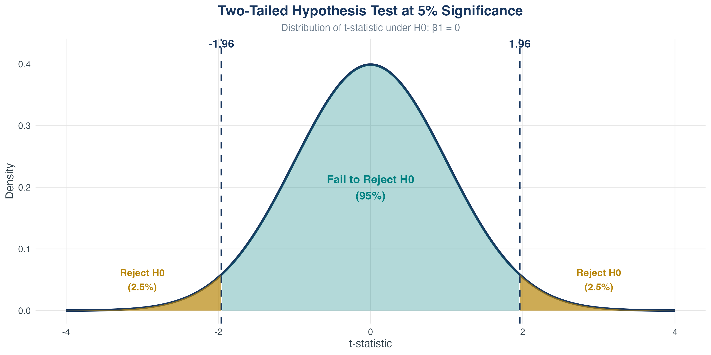{width=65% height=auto}

**Reject $H_0$ at significance level $\alpha$ if:**

- Two-tailed: $|t| > c_{\alpha/2}$
- One-tailed (upper): $t > c_{\alpha}$
- One-tailed (lower): $t < -c_{\alpha}$

- In practice, almost always two-tailed tests

**Common critical values:**

| Level | $\alpha$ | $c_{\alpha/2}$ |
|---|---:|---:|
| 1% | 0.01 | 2.58 |
| 5% | 0.05 | 1.96 |
| 10% | 0.10 | 1.645 |

## Choosing a Significance Level

- We fix $\alpha$ as the **significance level** (Type I error)
- $\alpha$ is the probability of falsely rejecting the null
- Typical choice: $\alpha=0.05$ (5% false positives)
- Is that too high? Why not make $\alpha$ super small?

## Choosing a Significance Level (Tradeoff)

- Smaller $\alpha$ makes it harder to reject $H_0$
- Fewer false positives, but more false negatives
- **Power** = $1-\beta$ (probability of rejecting a false null)
- Tradeoff between significance ($\alpha$) and power ($\beta$)

## Decision Rule: When to Reject $H_0$

{width=85%}

**Reject $H_0$ at significance level $\alpha$ if:**

- Two-tailed: $|t| > c_{\alpha/2}$
- One-tailed (upper): $t > c_{\alpha}$
- One-tailed (lower): $t < -c_{\alpha}$

## One-Tailed vs Two-Tailed Tests

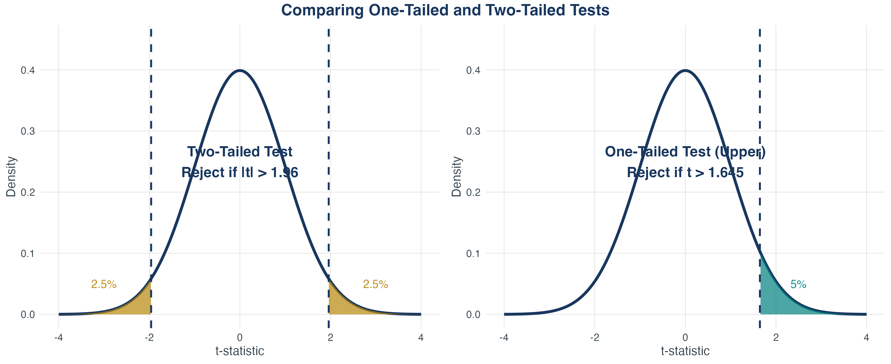{width=95%}

**Which to use?**

- Two-tailed: Most common in economics (test for any effect)
- One-tailed: When theory strongly predicts a direction

## Critical Values for Common Significance Levels

| **Significance level $\alpha$** | **Two-tailed $c_{\alpha/2}$** | **One-tailed $c_{\alpha}$** |
| --- | ---: | ---: |
| 10% | 1.645 | 1.28 |
| 5%  | 1.96  | 1.645 |
| 1%  | 2.58  | 2.33 |

**Rule of thumb:** For two-tailed tests at 5%, reject if $|t| > 2$.

## Knowledge Check: Calculate the $t$-Statistic

**Question**

You estimate $\hat\beta_1 = 3.5$ with $\operatorname{SE}(\hat\beta_1) = 1.2$.
Test $H_0: \beta_1 = 0$ vs $H_1: \beta_1 \neq 0$ at 5% level.

1. What is the $t$-statistic?
2. What is your decision?

. . .

::: {.callout-tip}
## Answer

1. {.fragment} $t = \dfrac{3.5 - 0}{1.2} = 2.92$
2. {.fragment} Critical value: $c_{\alpha/2} = 1.96$
3. {.fragment} Since $|2.92| > 1.96$, **reject $H_0$** at 5% level.
   {.fragment} Conclusion: strong evidence that $\beta_1 \neq 0$.
:::

## Type I and Type II Errors

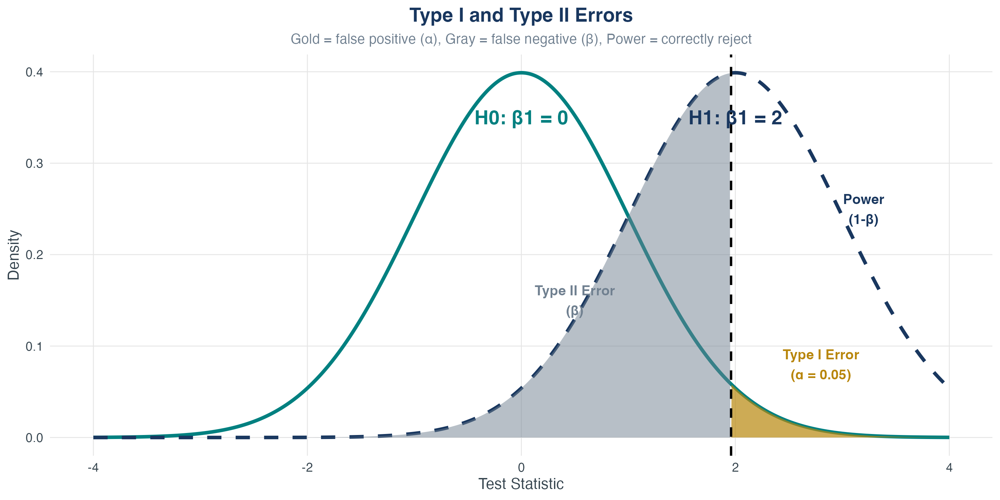{width=85%}

- **Type I error ($\alpha$)**: Reject $H_0$ when it's true (false positive)
- **Type II error ($\beta$)**: Fail to reject $H_0$ when it's false (false negative)
- **Power $(1-\beta)$**: Probability of correctly rejecting false $H_0$

## Knowledge Check: Type I and Type II Errors

Consider the following scenarios. For each, decide whether it is a **Type I error**, a **Type II error**, or **neither**:

1. A new medication does **not** actually help patients, but your study concludes that it **does**. What type of error (if any) has occurred?

. . .

2. The new medication **does** help patients, but your study fails to find evidence and concludes that it **doesn't work**. What type of error is this?

. . .

3. In a wage experiment, there is **no true effect** of a job training program on wages, but your study finds a statistically significant increase. What error (if any) is this?

. . .

4. There **is** a real positive effect of the training program on wages, but your study finds no statistically significant difference. What type of error is this?

. . .

::: {.callout-tip}
## Answers

1. **Type I error** (False positive: you concluded there was an effect when there wasn't)
2. **Type II error** (False negative: you missed a real effect)
3. **Type I error** (False positive: finding an effect that's not really there)
4. **Type II error** (False negative: failing to detect a real effect)

:::

## Choosing a Significance Level

**Why $\alpha = 0.05$ is conventional**

- We tolerate a 5% chance of false positives
- Balances Type I and Type II errors
- Widely accepted standard in social sciences

**The tradeoff**

- Smaller $\alpha$ $\Rightarrow$ fewer false positives, but **more** false negatives (lower power)
- Larger $\alpha$ $\Rightarrow$ more false positives, but **fewer** false negatives (higher power)
- You cannot minimize both at once.

We typically fix $\alpha$ and try to increase power by increasing $n$.

## Statistical Power

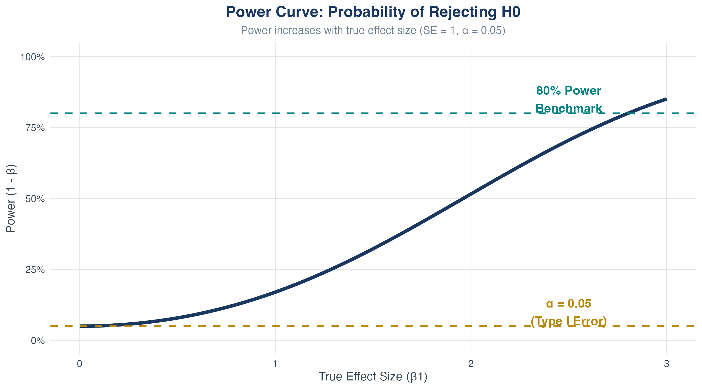{width=75%}

Power increases with:

- Larger true effect size $|\beta_1|$
- Larger sample size $n$
- Smaller error variance $\sigma^2_u$

## Understanding $p$-Values

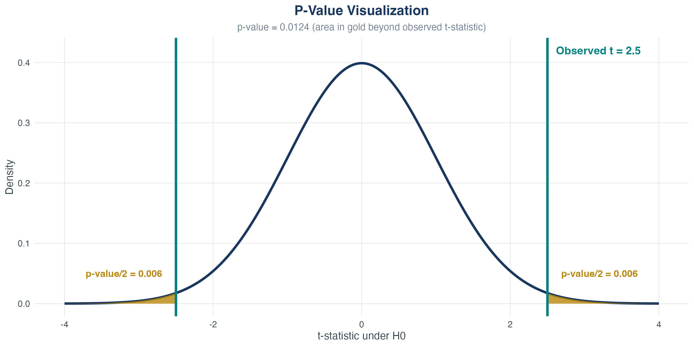{width=85%}

**$p$-value interpretation**

- Probability of observing a $t$-statistic this extreme (or more) if $H_0$ is true
- Smaller $p$-value $\Rightarrow$ stronger evidence against $H_0$
- Reject $H_0$ if $p\text{-value} < \alpha$

## Hypothesis Testing in Stata

**Testing $H_0: \beta_1 = 0$**

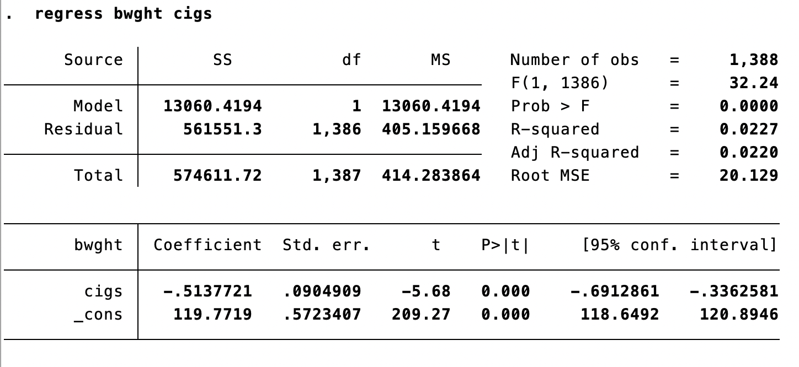{width=60%}

Stata output automatically shows:

- Coefficient estimate $\hat\beta_1$
- Standard error $\operatorname{SE}(\hat\beta_1)$
- $t$-statistic $t = \hat\beta_1 / \operatorname{SE}(\hat\beta_1)$
- $p$-value: probability of observing $|t|$ this large if $H_0$ is true

**Decision rule using $p$-value**

- Reject $H_0$ if $p$-value < $\alpha$
- Equivalent to checking if $|t| > c_{\alpha/2}$

## Testing $H_0: \beta_1 = a$ (Non-Zero Null)

**What if we want to test a different null value?**

Suppose we hypothesize that an extra year of education increases wage by exactly \$3/hour:

$$
H_0: \beta_1 = 3 \quad \text{vs} \quad H_1: \beta_1 \neq 3.
$$

Modified $t$-statistic:

$$
t = \frac{\hat\beta_1 - 3}{\operatorname{SE}(\hat\beta_1)}.
$$

**Example**

- If $\hat\beta_1 = 2.5$ and $\operatorname{SE}(\hat\beta_1) = 0.4$, then $t = (2.5 - 3)/0.4 = -1.25$
- Since $|-1.25| < 1.96$, **fail to reject** $H_0: \beta_1 = 3$
- Not enough evidence to say the effect differs from \$3

## Economic vs Statistical Significance

::: {.callout-warning}
## Critical distinction

**Statistical significance** $\neq$ **economic significance**.
:::

**Scenario 1: Statistically significant but economically trivial**

- $\hat\beta_1 = 0.05$, $\operatorname{SE}(\hat\beta_1) = 0.01$, $t = 5$ (highly significant!)
- An extra year of education increases wage by 5 cents/hour
- Technically significant, but economically negligible

**Scenario 2: Economically important but statistically insignificant**

- $\hat\beta_1 = 8$, $\operatorname{SE}(\hat\beta_1) = 10$, $t = 0.8$ (not significant)
- Small sample $\Rightarrow$ high uncertainty
- Effect could be large, but we can't be confident

**Takeaway:** Always examine both statistical significance **and** magnitude.

## Conducting a Hypothesis Test

Is mother’s education associated with birthweight?

. . .

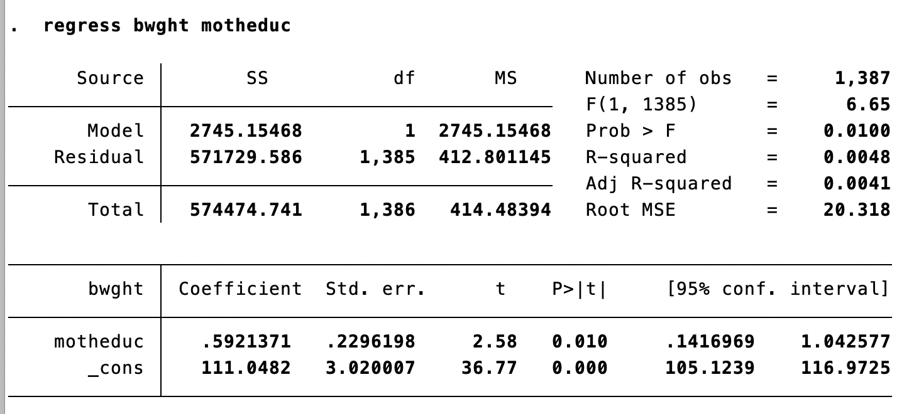{width=80%}

## Testing $H_0: \beta_1 = a$

$$H_0: \beta_1 = a$$
$$H_1: \beta_1 \neq a$$

::: {.callout-note}
## Adjust the $t$-statistic
$$
 t = \frac{\hat{\beta}_1 - a}{SE(\hat{\beta}_1)}
$$
:::

# 5.2 Confidence Intervals for $\beta_1$

## From Hypothesis Tests to Confidence Intervals

- **Hypothesis test:** Is $\beta_1$ equal to a specific value?
- **Confidence interval:** What is a **plausible range** for $\beta_1$?

::: {.callout-note}
## 95% Confidence Interval

A random interval that contains the true parameter 95% of the time in repeated samples.
:::

Two equivalent interpretations:

1. The set of all null values we **cannot reject** at 5% level
2. An interval constructed from the data that **covers the truth** 95% of the time

## Constructing a 95% Confidence Interval {.smaller}

Since for large samples,

$$
t = \frac{\hat\beta_1 - \beta_1}{\operatorname{SE}(\hat\beta_1)} \sim N(0,1)
$$

. . .

$$
P\left( -1.96 < \frac{\hat\beta_1 - \beta_1}{\operatorname{SE}(\hat\beta_1)} < 1.96 \right) = 0.95.
$$

. . .

Rearranging,

$$
P\left( \hat\beta_1 - 1.96\cdot \operatorname{SE}(\hat\beta_1) < \beta_1 < \hat\beta_1 + 1.96 \cdot \operatorname{SE}(\hat\beta_1) \right) = 0.95.
$$

::: {.callout-note}
## 95% Confidence Interval Formula

$$
\hat\beta_1 \pm 1.96 \cdot \operatorname{SE}(\hat\beta_1).
$$
:::

## Visualizing Confidence Intervals

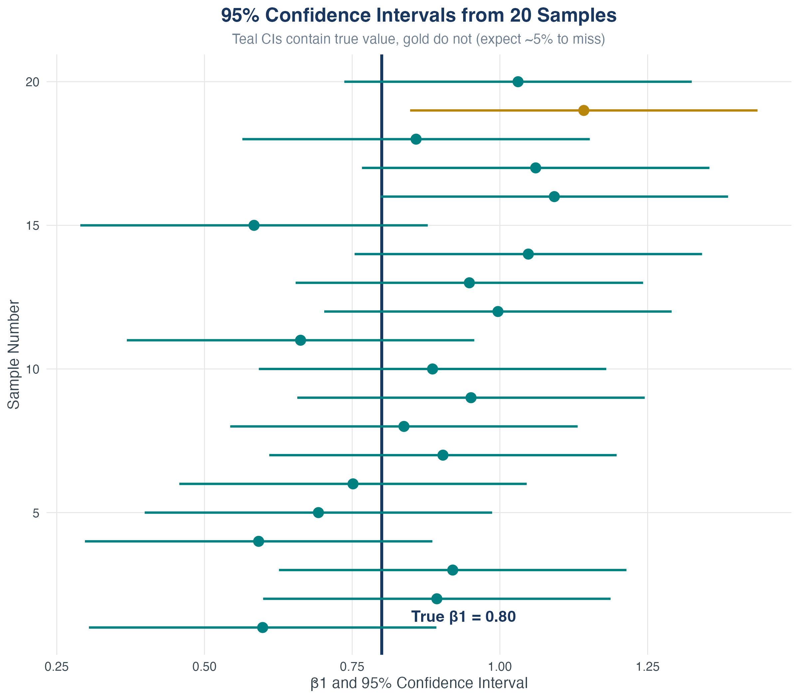{width=55%}

- Each horizontal line is a 95% CI from a different sample
- Teal intervals contain true $\beta_1$; gold ones miss
- In the long run, **95% of CIs** will contain the truth

## Confidence Intervals for Other Confidence Levels

**General formula**

$$
\hat\beta_1 \pm c_{\alpha/2} \cdot \operatorname{SE}(\hat\beta_1).
$$

**Common choices**

| **Confidence level** | **$\alpha$** | **Critical value $c_{\alpha/2}$** |
| --- | ---: | ---: |
| 90% | 0.10 | 1.645 |
| 95% | 0.05 | 1.96  |
| 99% | 0.01 | 2.58  |

**Tradeoff**

- Higher confidence $\Rightarrow$ wider interval (less precise)
- Lower confidence $\Rightarrow$ narrower interval (more precise but less reliable)

## Comparing Confidence Levels

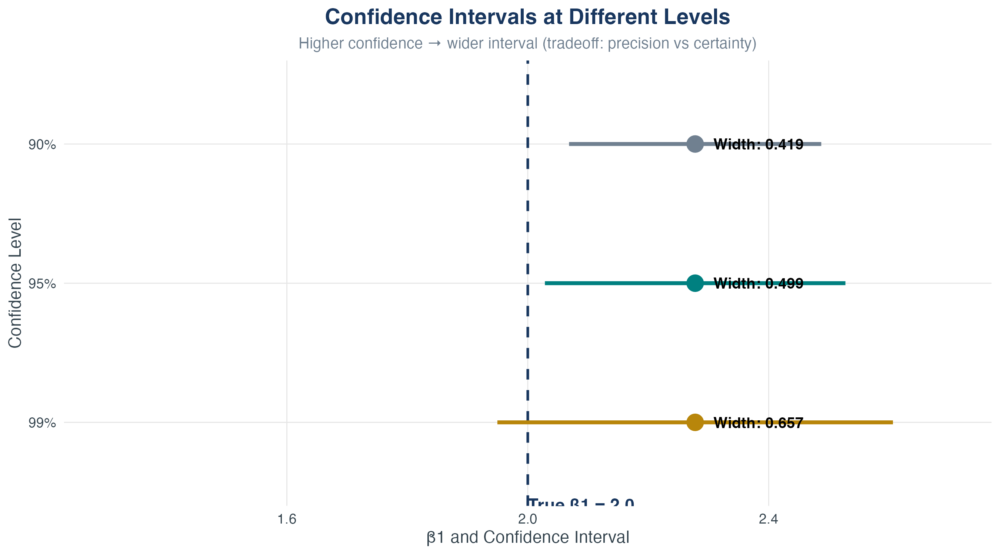{width=75%}

- Same estimate $\hat\beta_1$, but different interval widths
- 99% CI is widest (most conservative)
- 90% CI is narrowest (least conservative)

## How Sample Size Affects Precision

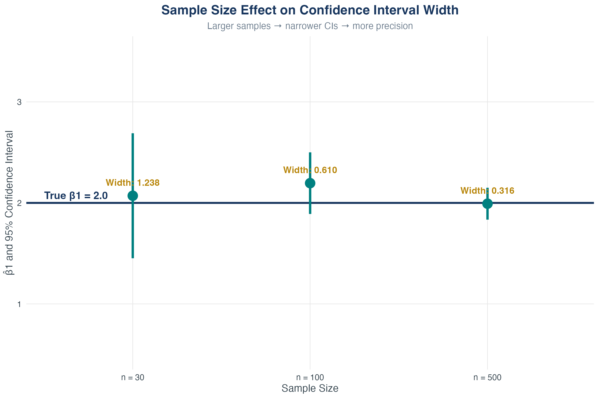{width=75%}

**Key insight:** SE shrinks as $n$ increases, making CIs narrower and inference more precise.

## Animated: Adding Data Shrinks the CI {.smaller}

::: {.r-stack}
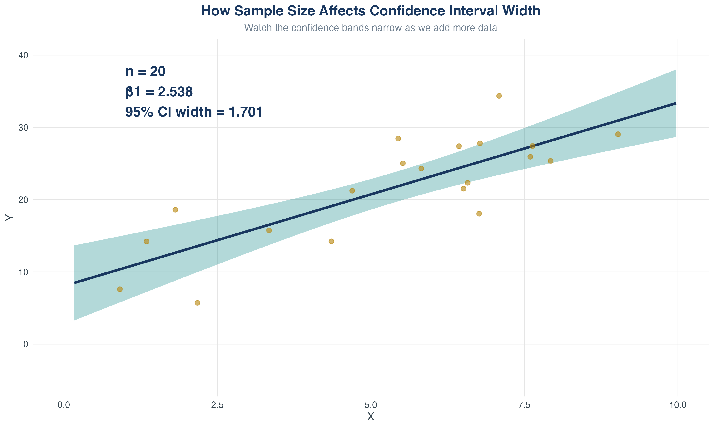{.fragment width=80%}

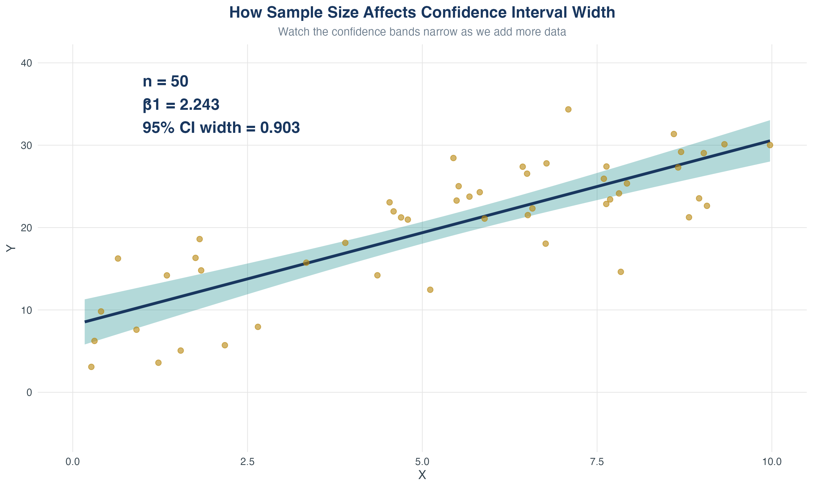{.fragment width=80%}

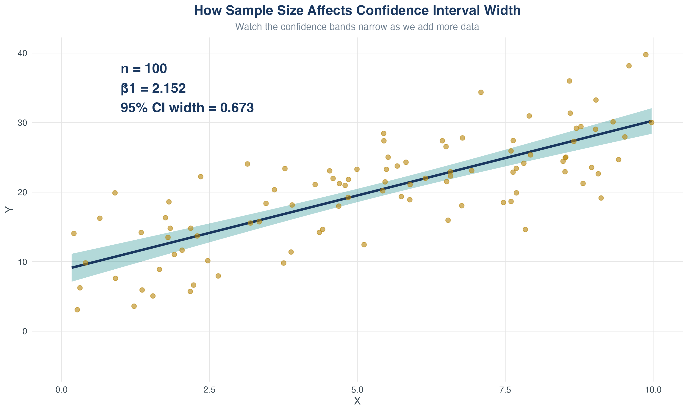{.fragment width=80%}

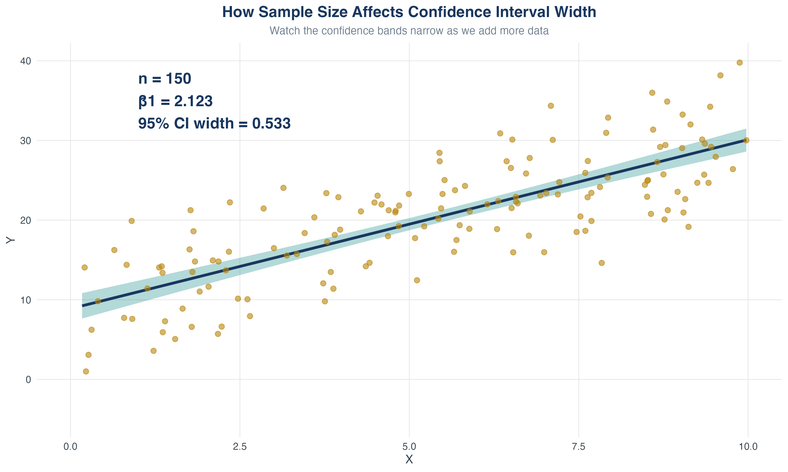{.fragment width=80%}

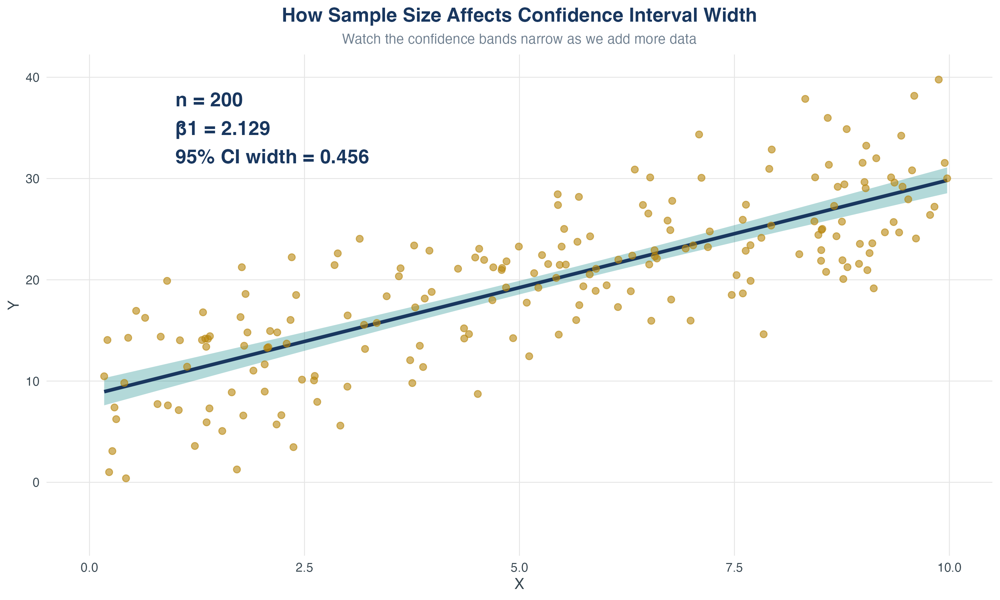{.fragment width=80%}
:::

**As sample size increases, the confidence interval shrinks.**

## Confidence Intervals in Stata

{width=80%}

**Interpretation**

- The 95% confidence interval for the effect of mother's education on birthweight is between 0.14 and 1.04 ounces.
- The interval does not contain 0 $\Rightarrow$ reject $H_0: \beta_1 = 0$ at 5% level.

## The Link Between CIs and Hypothesis Tests

**Key relationship**

- If $\beta_{1,0}$ is **inside** the 95% CI, we **fail to reject** $H_0: \beta_1 = \beta_{1,0}$ at 5% level.
- If $\beta_{1,0}$ is **outside** the 95% CI, we **reject** $H_0: \beta_1 = \beta_{1,0}$ at 5% level.

. . .

**Example**

- 95% CI: $[1.8, 6.6]$

. . .

- $H_0: \beta_1 = 0$
    - 0 not in CI $\Rightarrow$ reject

. . .

- $H_0: \beta_1 = 4$
    - 4 is in CI $\Rightarrow$ fail to reject

. . .

**Takeaway:** CIs provide more information than hypothesis tests—they show a range of plausible values.

# 5.3 Regression When $X$ Is Binary

## Regression When $X$ Is Binary
Often, our regressor takes only two values:

- $X = 1$ if small class, $X = 0$ if large class
- $X = 1$ if treated, $X = 0$ if control
- $X = 1$ if college degree, $X = 0$ if no degree
- $X = 1$ if female, $X = 0$ if male

These are called **binary variables**, **dummy variables**, or **indicator variables**.

**Terminology**

- $X = 1$: “treatment group” or “category of interest”
- $X = 0$: “control group” or “reference category”

*Gender is not binary, but it is recorded as binary in many datasets—data availability shapes our understanding of the world.*

## Interpreting a Binary $X$

Population model: $Y_i = \beta_0 + \beta_1 X_i + u_i$

When $X_i=0$:

. . .

 $Y_i = \beta_0 + \beta_1 * 0+ u_i$

. . .

$Y_i = \beta_0 + u_i$

. . .

$E[Y_i\mid X_i=0]=E[\beta_0 + u_i]=E[\beta_0] + E[u_i]= \beta_0$

. . .

When $X_i=1$:

. . .

$Y_i = \beta_0 + \beta_1 + u_i$

. . .

 $Y_i = \beta_0 + \beta_1 * 1+ u_i$

. . .

 $Y_i = \beta_0 + \beta_1 + u_i$

. . .

 $E[Y_i\mid X_i=1]=E[\beta_0 + \beta_1 + u_i]=E[\beta_0] + E[\beta_1] + E[u_i]= \beta_0 + \beta_1$

## Interpreting a Binary $X$

Therefore:

::: {.callout-note}
$$
\beta_1 = E(Y_i\mid X_i=1) - E(Y_i\mid X_i=0)
$$
:::

So $\beta_1$ is the population difference in group means.

## Interpreting a Binary $X$: Stata Output {.smaller}

Is sex associated with birthweight?

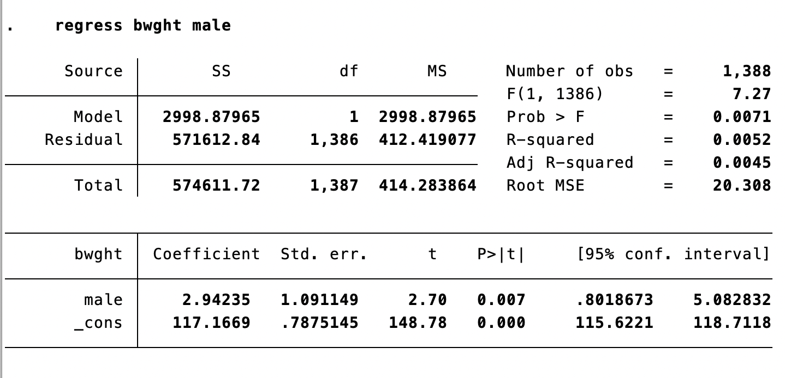{width=80%}

## Interpreting a Binary $X$ (Example)

Is sex associated with birthweight?

$$\hat{bwght} = 117.17 + 2.94\,male$$

. . .

- Average birthweight of female babies: $E[bwght\mid male=0] = 117.17$ ounces

. . .

- Average birthweight of male babies: $E[bwght\mid male=1] = 117.17 + 2.94 = 120.11$ ounces

# 5.4 Heteroskedasticity and Homoskedasticity

## Heteroskedasticity and Homoskedasticity

1. What do the terms mean?
2. Consequences of heteroskedasticity
3. Implications for computing standard errors

If $var(u\mid X=x)$ is constant, $u$ is **homoskedastic**.

Otherwise, $u$ is **heteroskedastic**.

## Homoskedasticity in a Picture

{width=60%}

. . .

- The variance of $u$ is constant

. . .

- The variance of $u$ does not depend on $X$

## Heteroskedasticity in a Picture

{width=60%}

. . .

- The variance of $u$ is not constant

. . .

- The variance of $u$ **does** depend on $X$

## Does Heteroskedasticity Affect $\hat{\beta}_1$?

Recall the least squares assumptions:

1. $E(u\mid X=x)=0$
2. $(X_i,Y_i)$ are i.i.d.
3. Large outliers are rare

Heteroskedasticity concerns $var(u\mid X=x)$.

Because we did **not** assume homoskedasticity, we have implicitly allowed heteroskedasticity.

## So Who Cares?

Heteroskedasticity does **not** affect point estimates of $\beta_1$.

But it **does** affect your standard errors.

Homoskedastic-only standard errors are unbiased only under homoskedasticity. We adjust using **heteroskedasticity-robust** standard errors.

## Heteroskedasticity-Robust Standard Errors (Stata)
{width=80%}

## Heteroskedasticity-Robust Standard Errors (Stata)
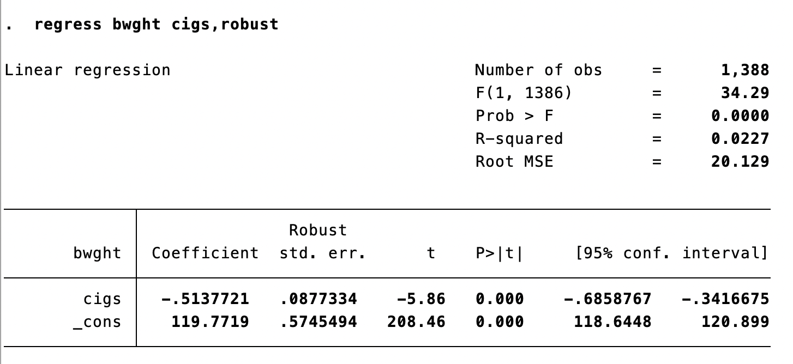{width=80%}

<!--
## Heteroskedasticity: The Bottom Line

- If errors are homoskedastic or heteroskedastic **and** you use robust SEs, you’re OK
- If errors are heteroskedastic and you use homoskedastic-only SEs, your SEs are wrong
  - Could be too big or too small
- The two formulas coincide (large $n$) only under homoskedasticity
- So: **always use heteroskedasticity-robust SEs** -->

## Comparing Homoskedastic and Robust SEs

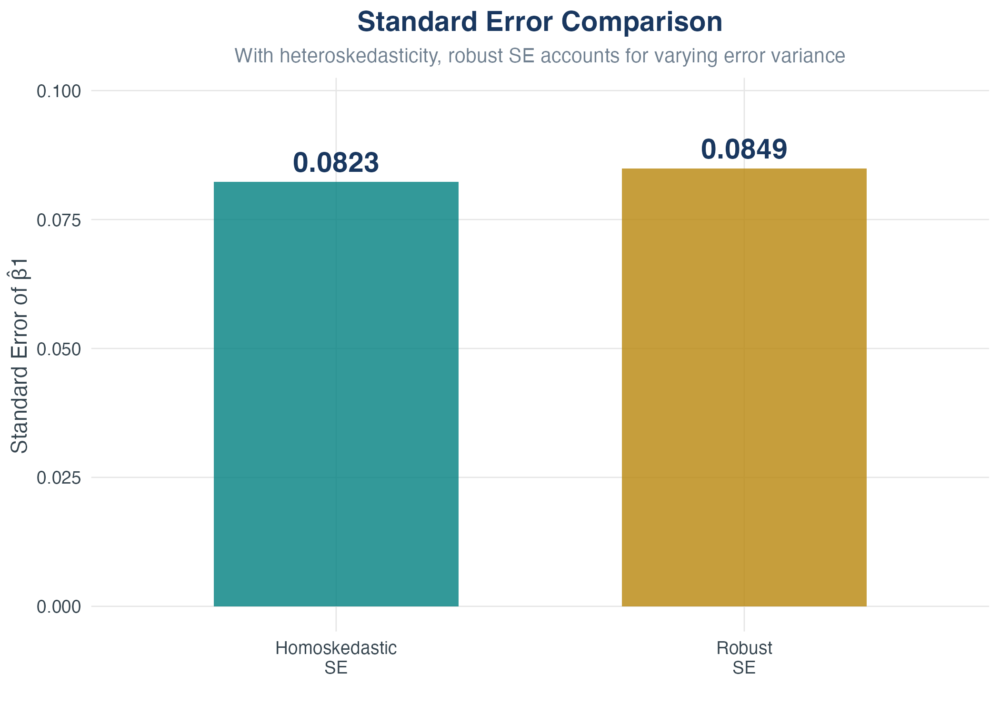{width=60%}

- In this example with heteroskedasticity, robust SE is larger
- But this isn't always the case – it can go either way
- **Always use robust SEs as a precaution**

## Heteroskedasticity: The Bottom Line

| **Situation**                     | **Homoskedastic SE** | **Robust SE** |
| --------------------------------- | -------------------- | ------------- |
| Errors are homoskedastic         | Correct              | Correct       |
| Errors are heteroskedastic       | Wrong                | Correct       |

::: {.callout-important}
## Always use robust standard errors.

No downside if errors are homoskedastic, protects you if they're not.
:::

# 5.5 Gauss–Markov Theorem

## The Extended Least Squares Assumptions

Consider our three LS assumptions (needed for unbiasedness):

1. $E(u\mid X=x)=0$
2. $(X_i,Y_i)$ are i.i.d.
3. Large outliers are rare

Plus one more:

4. $u$ is **homoskedastic**

## Gauss–Markov Theorem

Under these four extended LS assumptions, $\hat{\beta}_1$ has the smallest variance among **all linear estimators**.

. . .

This is the **Gauss–Markov Theorem**.

. . .

Under GM, OLS estimators are **BLUE**:

- Best
- Linear
- Unbiased
- Estimators

## OLS Limitations

- Homoskedasticity often doesn’t hold
- GM is only for **linear** estimators (a small subset)
- If we know the form of heteroskedasticity, we can use **weighted least squares**
- With many outliers, **least absolute deviations (LAD)** can be more efficient

*In most applied regression analysis, we use OLS—so that is what we will do, too.*

## Conclusion

**Key ideas to remember:**

- Hypothesis tests and confidence intervals for $\beta_1$
- Interpreting binary regressors
- Why heteroskedasticity matters for standard errors
- The Gauss–Markov conditions and what BLUE means
