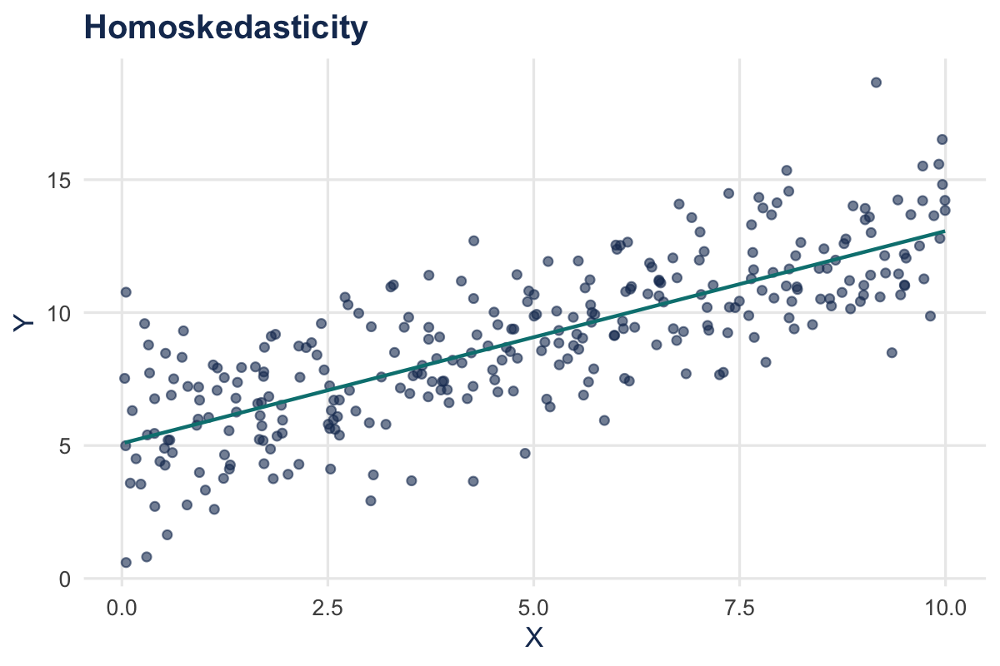
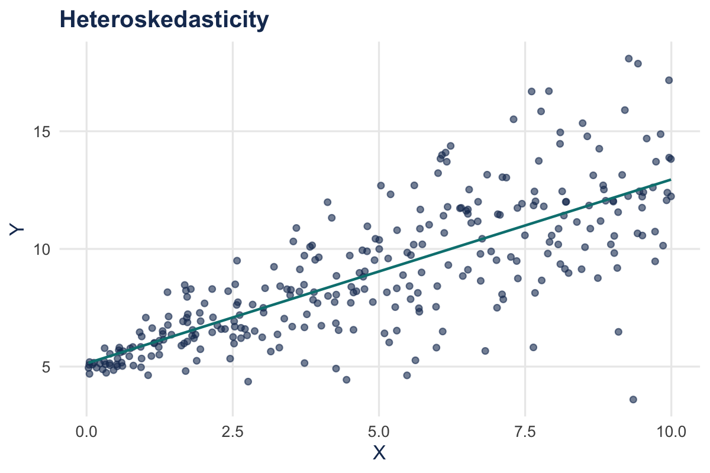

## Learning Objectives

By the end of this chapter, you will be able to:

- Create hypotheses about slope coefficients and test them using $\hat{\beta}_1$ and its standard error
- Correctly interpret the results of hypothesis tests
- Calculate confidence intervals for $\beta_1$
- Take [binary regressors]{style="color: #008080;"} in stride (and interpret them correctly)
- Understand the implications of [heteroskedasticity]{style="color: #008080;"} and correct your standard errors
- Know and apply the [Gauss–Markov]{style="color: #008080;"} theorem to understand the circumstances under which OLS is [BLUE]{style="color: #19375F;"}

## Where We Are Going

We want to learn about the slope of the population regression line. We have data from a sample, so there is sampling uncertainty.

- State the population object of interest
- Provide an estimator of this population object
- Derive the sampling distribution of the estimator (large-$n$ normal by the CLT)
- Find the standard error ($SE$) of the estimator
- Construct $t$-statistics and confidence intervals

# 5.1 Testing Hypotheses About One Regression Coefficient

## The Sampling Distribution of $\hat{\beta}_1$

Under the Least Squares Assumptions, for $n$ large, $\hat{\beta}_1$ is approximately distributed:

::: {.callout-note}
$$
\hat{\beta}_1 \sim N\left(\beta_1,\;\frac{\sigma_v^2}{n(\sigma_X^2)^2}\right),\quad \text{where } v_i=(X_i-\mu_X)u_i
$$
:::

*Note: We won’t compute variances by hand, but the intuition is useful.*

## Hypothesis Testing: General Setup

- Null hypothesis and **two-sided** alternative:

::: {.callout-note}
$$
H_0: \beta_1 = \beta_{1,0}\quad \text{vs}\quad H_1: \beta_1 \neq \beta_{1,0}
$$
:::

- Null hypothesis and **one-sided** alternative:

::: {.callout-note}
$$
H_0: \beta_1 = \beta_{1,0}\quad \text{vs}\quad H_1: \beta_1 < \beta_{1,0}
$$
:::

*where $\beta_{1,0}$ is the hypothesized value of $\beta_1$ under the null.*

## General Approach

- In general:

::: {.callout-note}
$$
 t = \frac{\text{estimator} - \text{hypothesized value}}{SE(\text{estimator})}
$$
:::

- For testing $\bar{Y}$: $t = \frac{\bar{Y}-\mu_{Y,0}}{s_y/\sqrt{n}}$
- For testing $\beta_1$:

::: {.callout-note}
$$
 t = \frac{\hat{\beta}_1-\beta_{1,0}}{SE(\hat{\beta}_1)}
$$
:::

## Testing $H_0: \beta_{1,0}=0$

- Construct your $t$-statistic:

::: {.callout-note}
$$
 t = \frac{\hat{\beta}_1-\beta_{1,0}}{SE(\hat{\beta}_1)}
$$
:::

- Reject at level $\alpha$ if $|t| > c_{\alpha/2}$
- In practice, almost always two-tailed tests
- Relies on large-$n$ normal approximation (rule of thumb: $n>30$)

**Common critical values:**

| Level | $\alpha$ | $c_{\alpha/2}$ |
|---|---:|---:|
| 1% | 0.01 | 2.58 |
| 5% | 0.05 | 1.96 |
| 10% | 0.10 | 1.645 |

## Choosing a Significance Level

- We fix $\alpha$ as the **significance level** (Type I error)
- $\alpha$ is the probability of falsely rejecting the null
- Typical choice: $\alpha=0.05$ (5% false positives)
- Is that too high? Why not make $\alpha$ super small?

## Choosing a Significance Level (Tradeoff)

- Smaller $\alpha$ makes it harder to reject $H_0$
- Fewer false positives, but more false negatives
- **Power** = $1-\beta$ (probability of rejecting a false null)
- Tradeoff between significance ($\alpha$) and power ($\beta$)

## Conducting a Hypothesis Test {.smaller}

Is mother’s education associated with birthweight?

<div class=\"stata-log\">\n<pre><code class=\"language-stata\"></code></pre>\n</div>

## Testing $H_0: \beta_1 = a$

- More general hypotheses:
  - $H_0: \beta_1 = a$
  - Adjust the $t$-statistic

::: {.callout-note}
$$
 t = \frac{\hat{\beta}_1 - a}{SE(\hat{\beta}_1)}
$$
:::

## Economic vs. Statistical Significance

- If statistically significant, examine magnitude
- Statistical significance $\neq$ economic importance
- Wrong sign? Model may be misspecified
- If insignificant, you *might* exclude—but be cautious with small samples

# 5.2 Confidence Intervals for $\beta_1$

## Confidence Intervals for $\beta_1$

Recall, a 95% confidence interval is:

- The set of values that cannot be rejected at the 5% significance level
- A set-valued function of the data that contains the true parameter 95% of the time

Because the $t$-statistic is approximately $N(0,1)$ in large samples:

::: {.callout-note}
$$
\text{95% CI for } \beta_1: \quad \hat{\beta}_1 \pm 1.96\,SE(\hat{\beta}_1)
$$
:::

# 5.3 Regression When $X$ Is Binary

## Regression When $X$ Is Binary

Sometimes a regressor is **binary**:

- $X=1$ if small class size, $X=0$ otherwise
- $X=1$ if female, $X=0$ if male
- $X=1$ if treated, $X=0$ otherwise

Binary regressors are called **dummy variables**.

*Gender is not binary, but it is recorded as binary in many datasets—data availability shapes our understanding of the world.*

## Interpreting a Binary $X$ (1)

Population model: $Y_i = \beta_0 + \beta_1 X_i + u_i$

When $X_i=0$:

- $Y_i = \beta_0 + u_i$
- $E[Y_i\mid X_i=0]=\beta_0$

When $X_i=1$:

- $Y_i = \beta_0 + \beta_1 + u_i$
- $E[Y_i\mid X_i=1]=\beta_0 + \beta_1$

## Interpreting a Binary $X$ (2)

Therefore:

::: {.callout-note}
$$
\beta_1 = E(Y_i\mid X_i=1) - E(Y_i\mid X_i=0)
$$
:::

So $\beta_1$ is the population difference in group means.

## Interpreting a Binary $X$: Stata Output {.smaller}

Is sex associated with birthweight?

<div class=\"stata-log\">\n<pre><code class=\"language-stata\"></code></pre>\n</div>

## Interpreting a Binary $X$ (Example)

Is sex associated with birthweight?

$$\hat{bwght} = 117.17 + 2.94\,male$$

- Average birthweight of female babies: $E[bwght\mid male=0] = 117.17$ ounces
- Average birthweight of male babies: $E[bwght\mid male=1] = 117.17 + 2.94 = 120.11$ ounces

# 5.4 Heteroskedasticity and Homoskedasticity

## Heteroskedasticity and Homoskedasticity

1. What do the terms mean?
2. Consequences of heteroskedasticity
3. Implications for computing standard errors

If $var(u\mid X=x)$ is constant, $u$ is **homoskedastic**.

Otherwise, $u$ is **heteroskedastic**.

## Homoskedasticity in a Picture

{width=60%}

- The variance of $u$ is constant
- The variance of $u$ does not depend on $X$

## Heteroskedasticity in a Picture

{width=60%}

- The variance of $u$ is not constant
- The variance of $u$ **does** depend on $X$

## Does Heteroskedasticity Affect $\hat{\beta}_1$?

Recall the least squares assumptions:

1. $E(u\mid X=x)=0$
2. $(X_i,Y_i)$ are i.i.d.
3. Large outliers are rare

Heteroskedasticity concerns $var(u\mid X=x)$.

Because we did **not** assume homoskedasticity, we have implicitly allowed heteroskedasticity.

## So Who Cares?

Heteroskedasticity does **not** affect point estimates of $\beta_1$.

But it **does** affect your standard errors.

Homoskedastic-only standard errors are unbiased only under homoskedasticity. We adjust using **heteroskedasticity-robust** standard errors.

## Heteroskedasticity-Robust Standard Errors (Stata) {.smaller}

<div class=\"stata-log\">\n<pre><code class=\"language-stata\"></code></pre>\n</div>

## Heteroskedasticity-Robust Standard Errors (Stata) {.smaller}

<div class=\"stata-log\">\n<pre><code class=\"language-stata\"></code></pre>\n</div>

## Heteroskedasticity: The Bottom Line

- If errors are homoskedastic or heteroskedastic **and** you use robust SEs, you’re OK
- If errors are heteroskedastic and you use homoskedastic-only SEs, your SEs are wrong
  - Could be too big or too small
- The two formulas coincide (large $n$) only under homoskedasticity
- So: **always use heteroskedasticity-robust SEs**

# 5.5 Gauss–Markov Theorem

## The Extended Least Squares Assumptions

Consider our three LS assumptions (needed for unbiasedness):

1. $E(u\mid X=x)=0$
2. $(X_i,Y_i)$ are i.i.d.
3. Large outliers are rare

Plus one more:

4. $u$ is **homoskedastic**

## Gauss–Markov Theorem

Under these four extended LS assumptions, $\hat{\beta}_1$ has the smallest variance among **all linear estimators**.

This is the **Gauss–Markov Theorem**.

Under GM, OLS estimators are **BLUE**:

- Best
- Linear
- Unbiased
- Estimators

## OLS Limitations

- Homoskedasticity often doesn’t hold
- GM is only for **linear** estimators (a small subset)
- If we know the form of heteroskedasticity, we can use **weighted least squares**
- With many outliers, **least absolute deviations (LAD)** can be more efficient

*In most applied regression analysis, we use OLS—so that is what we will do, too.*

## Conclusion

**Key ideas to remember:**

- Hypothesis tests and confidence intervals for $\beta_1$
- Interpreting binary regressors
- Why heteroskedasticity matters for standard errors
- The Gauss–Markov conditions and what BLUE means

# Practice Problems

## Practice Problem (S&W-style): Tests and CI

An OLS regression reports $\hat\beta_1=1.5$ with $SE(\hat\beta_1)=0.4$. The sample size is $n=60$.

- Test $H_0: \beta_1=1$ at the 5% level (two-sided)
- Compute the 95% CI for $\beta_1$

## Practice Problem: Walkthrough {.smaller}

- $t=(1.5-1)/0.4=1.25$ with $df=58$
- Two-sided $p$-value $=2\,P(T_{58}>|1.25|)$
- 95% CI: $1.5 \pm t_{0.975,58}\times 0.4$

**Stata:**

```stata
display (1.5-1)/0.4
display 2*ttail(58,abs((1.5-1)/0.4))
display 1.5 - invttail(58,0.025)*0.4
display 1.5 + invttail(58,0.025)*0.4
```
