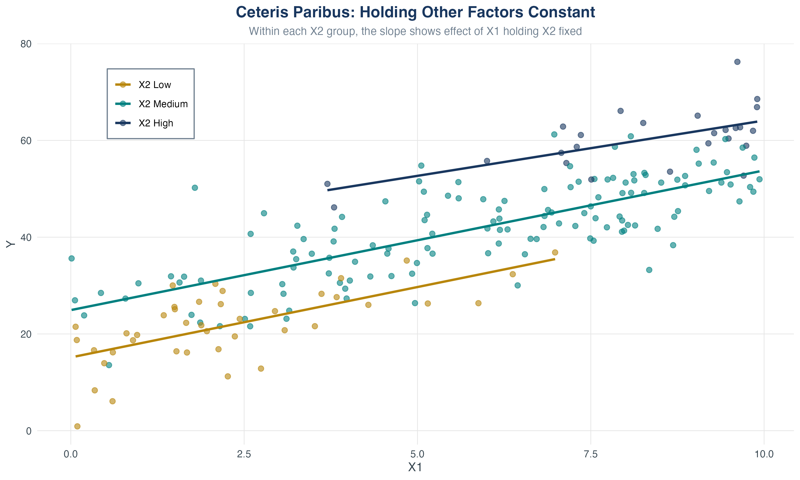
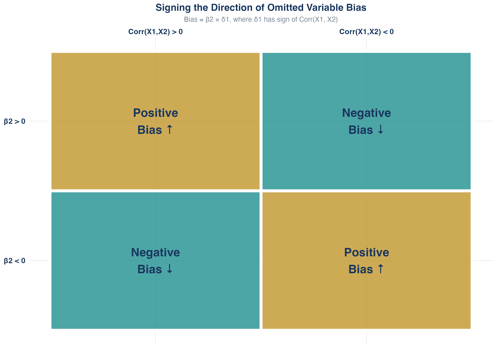
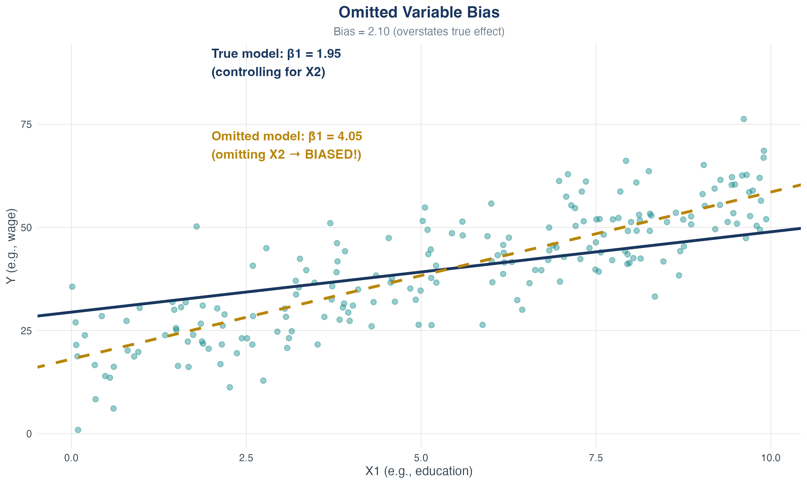
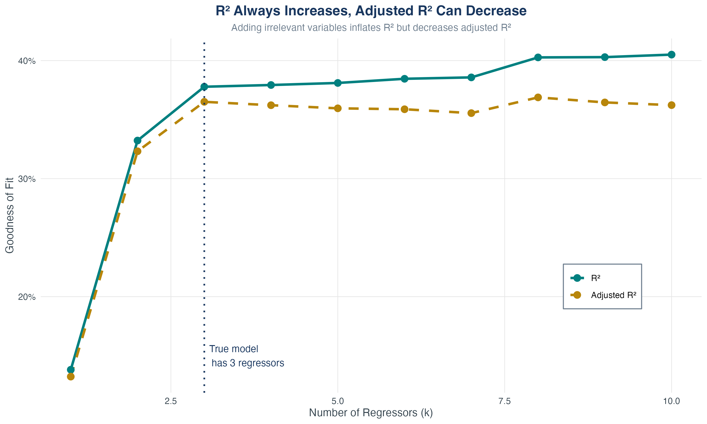
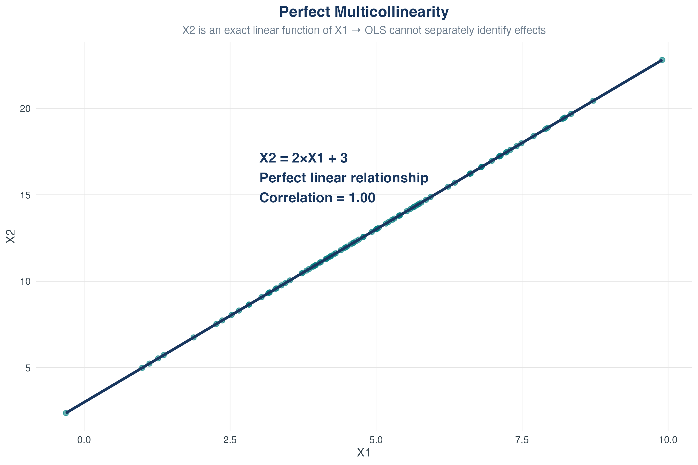
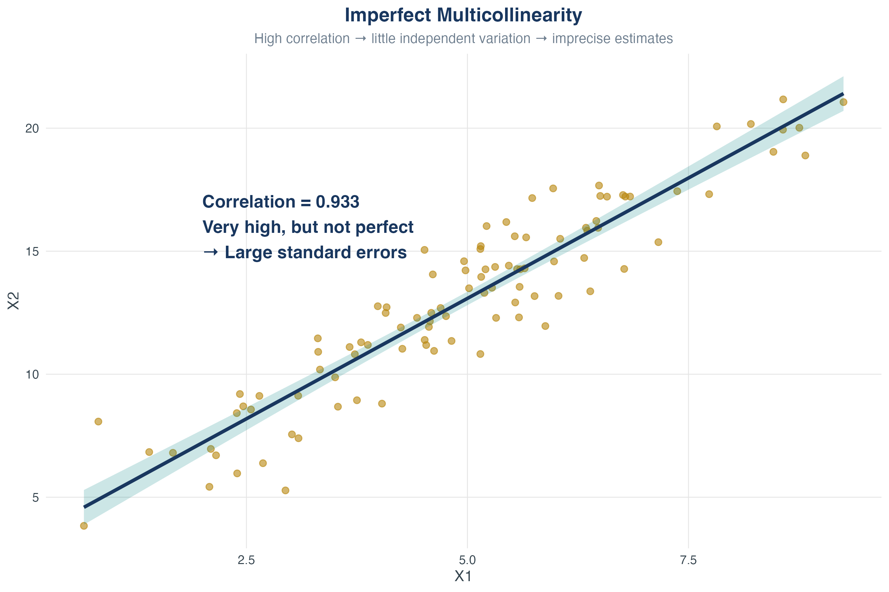
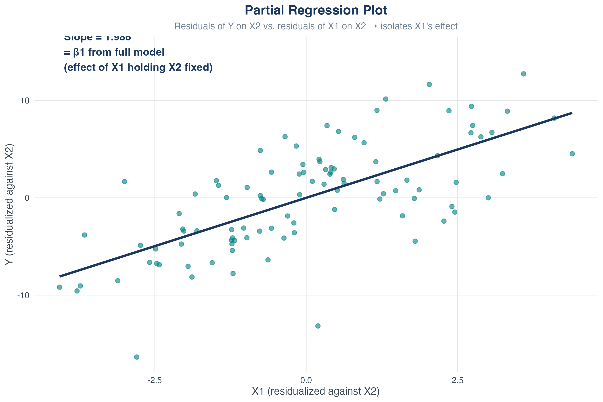

## Roadmap {.scrollable}

[TOC]

## What You'll Learn Today

::: {.callout-important}
## Central Question
How do we estimate the effect of $X_1$ on $Y$ while [holding other factors constant]{.alert}?
:::

**By the end of this chapter, you will:**

1. Estimate and interpret [multiple regression]{.kw} models
2. Understand [omitted variable bias]{.kw} deeply
3. Use [adjusted R²]{.kw} to compare models
4. Recognize and handle [multicollinearity]{.kw}
5. Master [ceteris paribus]{.kw} reasoning

# Why Multiple Regression?

## The Limitation of Simple Regression

Recall our wage equation from Chapter 4:

$$
wage_i = \beta_0 + \beta_1 \cdot education_i + u_i
$$

. . .

**Problem:** What's in $u_i$?

. . .

- Work experience
- Ability
- Location
- Industry
- Gender, race, age...

. . .

If any of these are [correlated with education]{.alert}, then $\hat{\beta}_1$ suffers from [omitted variable bias]{.kw}!

## Three Reasons for Multiple Regression

1. **Control for confounders**
   - Reduce omitted variable bias
   - Get closer to causal effects

2. **More flexible functional forms**
   - Include $X$ and $X^2$ for nonlinear relationships
   - Interaction terms: $X_1 \cdot X_2$

3. **Better predictions**
   - More information $\Rightarrow$ better forecasts

# The Multiple Regression Model

## Definition

::: {.callout-note}
## Multiple Linear Regression Model

$$
Y_i = \beta_0 + \beta_1 X_{1i} + \beta_2 X_{2i} + \cdots + \beta_k X_{ki} + u_i
$$

where:

- $Y_i$: dependent variable (outcome)
- $X_{1i}, \ldots, X_{ki}$: $k$ independent variables (regressors)
- $\beta_0, \ldots, \beta_k$: $k+1$ unknown parameters
- $u_i$: error term
:::

## OLS Estimation

**Same principle as simple regression:** Minimize sum of squared residuals

$$
\min_{\hat{\beta}_0, \hat{\beta}_1, \ldots, \hat{\beta}_k} \sum_{i=1}^n \hat{u}_i^2
$$

where

$$
\hat{u}_i = Y_i - \hat{\beta}_0 - \hat{\beta}_1 X_{1i} - \cdots - \hat{\beta}_k X_{ki}
$$

. . .

**In practice:** We use statistical software (Stata, R, Python) to compute $\hat{\beta}_0, \ldots, \hat{\beta}_k$

## OLS Estimation in Matrix Form [Advanced] {.smaller}

**For mathematically inclined students:**

Define:

- $\mathbf{Y}$: $n \times 1$ vector of outcomes
- $\mathbf{X}$: $n \times (k+1)$ matrix of regressors (includes column of 1s for intercept)
- $\boldsymbol{\beta}$: $(k+1) \times 1$ vector of coefficients

. . .

**OLS solution:**

$$
\hat{\boldsymbol{\beta}} = (\mathbf{X}'\mathbf{X})^{-1}\mathbf{X}'\mathbf{Y}
$$

. . .

**Why perfect multicollinearity breaks OLS:** If columns of $\mathbf{X}$ are linearly dependent, then $\mathbf{X}'\mathbf{X}$ is singular (not invertible)!

# Interpreting Coefficients

## The Ceteris Paribus Interpretation

::: {.callout-important}
## Partial Effect
$\beta_j$ is the [partial effect]{.alert} of $X_j$ on $Y$, holding all other regressors constant.
:::

. . .

Mathematically:

$$
\beta_j = \frac{\partial Y}{\partial X_j} = \frac{\Delta Y}{\Delta X_j} \bigg|_{\text{other } X\text{s fixed}}
$$

. . .

**In words:**

- "Holding $X_2, \ldots, X_k$ constant..."
- "Controlling for $X_2, \ldots, X_k$..."
- "Ceteris paribus" (all else equal)

## Visualizing Ceteris Paribus

{width=85%}

## Example: Wage Equation

**Estimated model:**

```
wage = 5.2 + 2.1*education + 0.6*experience
```

. . .

**Interpretation of $\hat{\beta}_1 = 2.1$:**

- Holding experience constant...
- ...each additional year of education is associated with...
- ...\$2.10 higher hourly wage

. . .

**Interpretation of $\hat{\beta}_2 = 0.6$:**

- Holding education constant...
- ...each additional year of experience is associated with...
- ...\$0.60 higher hourly wage

## Knowledge Check: Interpretation {.smaller}

::: {.callout-tip}
## Question
You estimate: $colGPA = 1.3 + 0.45 \cdot hsGPA + 0.009 \cdot ACT$

Compare two students:

- Student A: hsGPA = 3.5, ACT = 25
- Student B: hsGPA = 4.0, ACT = 25 (same ACT!)

What is the predicted difference in their college GPAs?
:::

. . .

::: {.callout-important}
## Answer
Difference = $0.45 \times (4.0 - 3.5) = 0.45 \times 0.5 = 0.225$

Student B is predicted to have a college GPA 0.225 points higher, [holding ACT constant]{.alert}.
:::

# Omitted Variable Bias

## The Setup

**True population model:**

$$
Y_i = \beta_0 + \beta_1 X_{1i} + \beta_2 X_{2i} + u_i
$$

Both $X_1$ and $X_2$ belong in the model.

. . .

**But we estimate (omitting $X_2$):**

$$
Y_i = \tilde{\beta}_0 + \tilde{\beta}_1 X_{1i} + \tilde{u}_i
$$

. . .

::: {.callout-important}
## Question
Is $\tilde{\beta}_1$ an unbiased estimator of $\beta_1$?
:::

## Deriving the Bias

Assume $X_2$ is linearly related to $X_1$:

$$
X_{2i} = \delta_0 + \delta_1 X_{1i} + v_i
$$

. . .

Substitute into the true model:

$$
\begin{aligned}
Y_i &= \beta_0 + \beta_1 X_{1i} + \beta_2 X_{2i} + u_i \\
    &= \beta_0 + \beta_1 X_{1i} + \beta_2(\delta_0 + \delta_1 X_{1i} + v_i) + u_i \\
    &= (\beta_0 + \beta_2\delta_0) + (\beta_1 + \beta_2\delta_1) X_{1i} + (\beta_2 v_i + u_i)
\end{aligned}
$$

. . .

::: {.callout-important}
## Omitted Variable Bias Formula

$$
E[\tilde{\beta}_1] = \beta_1 + \beta_2 \delta_1
$$

where $\beta_2\delta_1$ is the [bias]{.alert}.
:::

## When Does OVB Occur?

$$
\text{Bias} = \beta_2 \delta_1
$$

. . .

**Bias is ZERO if:**

1. $\beta_2 = 0$ (omitted variable is irrelevant)
2. $\delta_1 = 0$ (omitted variable uncorrelated with $X_1$)

. . .

**Bias is NON-ZERO when:**

- Omitted variable belongs in the model ($\beta_2 \neq 0$), AND
- Omitted variable is correlated with included variable ($\delta_1 \neq 0$)

## Signing the Direction of Bias

{width=75%}

## Visualizing Omitted Variable Bias

{width=90%}

## Example: Returns to Education

**True model:**

$$
wage = \beta_0 + \beta_1 \cdot education + \beta_2 \cdot ability + u
$$

But ability is unobserved!

. . .

**Omitted model:**

$$
wage = \tilde{\beta}_0 + \tilde{\beta}_1 \cdot education + \tilde{u}
$$

. . .

**What's the bias?**

- $\beta_2 > 0$ (higher ability $\Rightarrow$ higher wage)
- $\text{Corr}(education, ability) > 0$ (smarter people get more education)
- Therefore: [Positive bias]{.alert} $\Rightarrow$ $\tilde{\beta}_1$ overstates true return to education

## Knowledge Check: OVB Direction {.smaller}

::: {.callout-tip}
## Question
You're studying the effect of police officers ($X_1$) on crime ($Y$).

True model: $crime = \beta_0 + \beta_1 \cdot police + \beta_2 \cdot poverty + u$

You omit poverty. What's the likely direction of bias on $\hat{\beta}_1$?

Hints:

- Does poverty increase crime? (sign of $\beta_2$?)
- Do high-poverty areas have more police? (sign of correlation?)
:::

. . .

::: {.callout-important}
## Answer
- $\beta_2 > 0$ (poverty increases crime)
- $\text{Corr}(police, poverty) > 0$ (more police where poverty is high)
- Bias = $\beta_2 \times \delta_1 > 0$ $\Rightarrow$ [Positive bias]{.alert}

Omitting poverty makes it look like police *cause* crime (reverse causality illusion)!
:::

# Measures of Fit

## R² in Multiple Regression

**Same definition as simple regression:**

$$
R^2 = \frac{ESS}{TSS} = 1 - \frac{SSR}{TSS}
$$

. . .

**Problem:** $R^2$ [never decreases]{.alert} when you add regressors!

- Even if the new variable is totally irrelevant
- Even if it's just random noise
- $R^2$ mechanically increases (or stays constant)

. . .

This makes $R^2$ useless for comparing models with different numbers of regressors.

## Adjusted R²

::: {.callout-note}
## Adjusted R²

$$
\bar{R}^2 = 1 - \frac{n-1}{n-k-1} \cdot \frac{SSR}{TSS}
$$

where $k$ is the number of regressors (not including intercept).
:::

. . .

**Key property:** $\bar{R}^2$ [penalizes]{.alert} you for adding regressors

- If new variable is relevant: $\bar{R}^2$ increases
- If new variable is irrelevant: $\bar{R}^2$ decreases (or barely changes)
- $\bar{R}^2 < R^2$ always

## Knowledge Check: Calculating Adjusted R² {.smaller}

::: {.callout-tip}
## Question
You estimate a model with $n = 100$ observations and $k = 3$ regressors.

You obtain: $SSR = 200$ and $TSS = 500$

Calculate the adjusted $R^2$.
:::

. . .

::: {.callout-important}
## Answer

$$
\bar{R}^2 = 1 - \frac{n-1}{n-k-1} \cdot \frac{SSR}{TSS} = 1 - \frac{99}{96} \cdot \frac{200}{500}
$$

$$
= 1 - 1.03125 \times 0.4 = 1 - 0.4125 = 0.5875
$$

Note: $R^2 = 1 - \frac{200}{500} = 0.6$, so $\bar{R}^2 < R^2$ as expected.
:::

## R² vs Adjusted R²

{width=85%}

## Using Adjusted R² in Practice

**Model 1:**

```
regress wage education experience
R² = 0.35,  Adjusted R² = 0.34
```

. . .

**Model 2 (adding zodiac sign):**

```
regress wage education experience zodiac_sign
R² = 0.351, Adjusted R² = 0.339
```

. . .

**Conclusion:**

- $R^2$ increased slightly (always does)
- Adjusted $R^2$ [decreased]{.alert} $\Rightarrow$ zodiac sign is not useful!

# Least Squares Assumptions

## The Four LS Assumptions for Multiple Regression

1. **Zero conditional mean:** $E[u_i | X_{1i}, \ldots, X_{ki}] = 0$

2. **i.i.d. sampling:** $(X_{1i}, \ldots, X_{ki}, Y_i)$ are independently and identically distributed

3. **Large outliers rare:** $X$s and $Y$ have finite fourth moments

4. **No perfect multicollinearity:** No $X$ is a perfect linear combination of others

## Assumption 1: Zero Conditional Mean (Extended)

$$
E[u_i | X_{1i}, \ldots, X_{ki}] = 0
$$

. . .

**Same interpretation as before, but now:**

- Error is uncorrelated with [all]{.alert} regressors
- Failure $\Rightarrow$ omitted variable bias
- Best solution: include the omitted variable!

## Assumption 4: No Perfect Multicollinearity (New!)

::: {.callout-note}
## Perfect Multicollinearity
One regressor is an [exact]{.alert} linear function of one or more other regressors.
:::

. . .

**Examples:**

- $X_2 = 3X_1 + 5$
- Including height in inches AND height in centimeters
- Dummy variable trap: including all categories + intercept

. . .

**What happens?** OLS cannot be computed (infinite solutions)

**What Stata does:** Automatically drops one of the collinear variables

## Perfect Multicollinearity

{width=70%}

# Multicollinearity

## Imperfect Multicollinearity

::: {.callout-note}
## Imperfect Multicollinearity
Two or more regressors are [highly]{.alert} (but not perfectly) correlated.
:::

. . .

**Example:** Including education AND test scores

- Correlation $\approx 0.85$ (high, but not 1.0)
- Both can stay in the model
- But estimates will be imprecise

## Imperfect Multicollinearity

{width=70%}

High correlation (e.g., $\text{Corr}(X_1, X_2) \approx 0.9$) makes it hard to disentangle their separate effects

## Why Is Imperfect Multicollinearity a Problem?

**Intuition:**

- $\hat{\beta}_1$ estimates effect of $X_1$ [holding $X_2$ constant]{.alert}
- But if $X_1$ and $X_2$ are highly correlated...
- ...there's very little variation in $X_1$ once $X_2$ is held constant
- Data don't have much information about what happens when $X_1$ changes but $X_2$ doesn't

. . .

**Consequence:** Large standard errors for $\hat{\beta}_1$ and $\hat{\beta}_2$

- Coefficients not statistically significant
- This is [correct]{.alert} — we genuinely can't tell them apart with these data!

## What to Do About Multicollinearity

::: {.callout-important}
## Key Point
Imperfect multicollinearity is [not a violation]{.alert} of OLS assumptions. It's a [data problem]{.alert}, not a method problem.
:::

. . .

**Solutions:**

1. Get more data (increases precision)
2. Drop one of the highly correlated variables (loses information, but may be necessary)
3. Combine variables (e.g., create an index)
4. Accept large standard errors (honest reflection of uncertainty!)

. . .

**What NOT to do:** Ignore it or claim the model is "broken"

# Implementing Multiple Regression in Stata

## Basic Stata Syntax

**Multiple regression:**

```stata
regress Y X1 X2 X3, robust
```

. . .

**Example:**

```stata
regress wage education experience, robust
```

. . .

**Output interpretation:**

- Each coefficient is a [partial effect]{.alert}
- Standard errors are robust to heteroskedasticity
- $R^2$ and adjusted $R^2$ shown at bottom

## Detecting Multicollinearity in Stata {.smaller}

**Check correlations:**

```stata
correlate X1 X2 X3
```

. . .

**Variance Inflation Factor (VIF):**

```stata
regress Y X1 X2 X3, robust
vif
```

. . .

**Rule of thumb:**

- VIF $<$ 5: No serious multicollinearity
- VIF $>$ 10: High multicollinearity, consider action

**Full walkthrough script:** `econ3500_multiple_regression_walkthrough.do`

## Partial Regression Plot

{width=75%}

**Construction:**

1. Regress $Y$ on $X_2$, obtain residuals $\tilde{Y}$ (part of $Y$ not explained by $X_2$)
2. Regress $X_1$ on $X_2$, obtain residuals $\tilde{X}_1$ (part of $X_1$ not explained by $X_2$)
3. Plot $\tilde{Y}$ vs $\tilde{X}_1$ — slope = $\hat{\beta}_1$ from full regression

Shows relationship between $Y$ and $X_1$ [after removing]{.alert} the influence of $X_2$ from both

# Bringing It All Together

## The Multiple Regression Workflow

1. **Specify model:** Which variables belong?
2. **Estimate:** Run OLS with robust SEs
3. **Interpret:** Partial effects (ceteris paribus)
4. **Assess fit:** Use adjusted $R^2$ for comparisons
5. **Check assumptions:** Zero conditional mean, no perfect multicollinearity
6. **Beware OVB:** Did you omit important variables?

## Common Pitfalls

1. [Forgetting "holding other variables constant"]{.alert}
   - Always interpret coefficients as partial effects

2. [Using $R^2$ instead of adjusted $R^2$]{.alert}
   - $R^2$ is misleading when comparing models

3. [Ignoring omitted variable bias]{.alert}
   - Ask: what's in $u$? Is it correlated with $X$?

4. [Panicking about multicollinearity]{.alert}
   - Large SEs are honest! They reflect genuine uncertainty

## Key Formulas Summary

| Concept | Formula |
|--------|---------|
| Multiple regression | $Y = \beta_0 + \beta_1 X_1 + \cdots + \beta_k X_k + u$ |
| Partial effect | $\beta_j = \frac{\partial Y}{\partial X_j}$ (other $X$s fixed) |
| OVB formula | $E[\tilde{\beta}_1] = \beta_1 + \beta_2 \delta_1$ |
| Adjusted $R^2$ | $\bar{R}^2 = 1 - \frac{n-1}{n-k-1} \frac{SSR}{TSS}$ |

## Looking Ahead

**What we've learned:**

- How to estimate effects while controlling for confounders
- How omitted variables create bias
- How to compare models with adjusted $R^2$

. . .

**Next chapter: Nonlinear Relationships**

- Interactions between variables
- Polynomial terms
- Logarithmic specifications

. . .

**Master ceteris paribus thinking — it's the heart of econometrics!**
