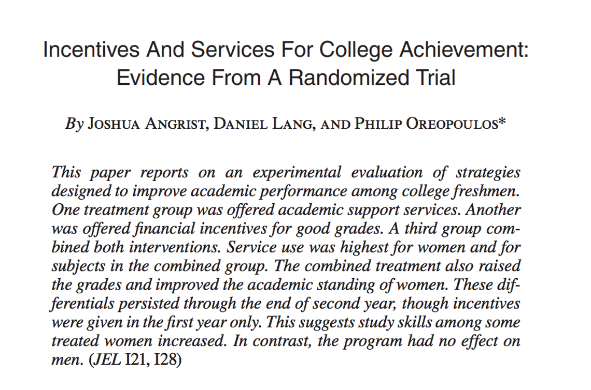
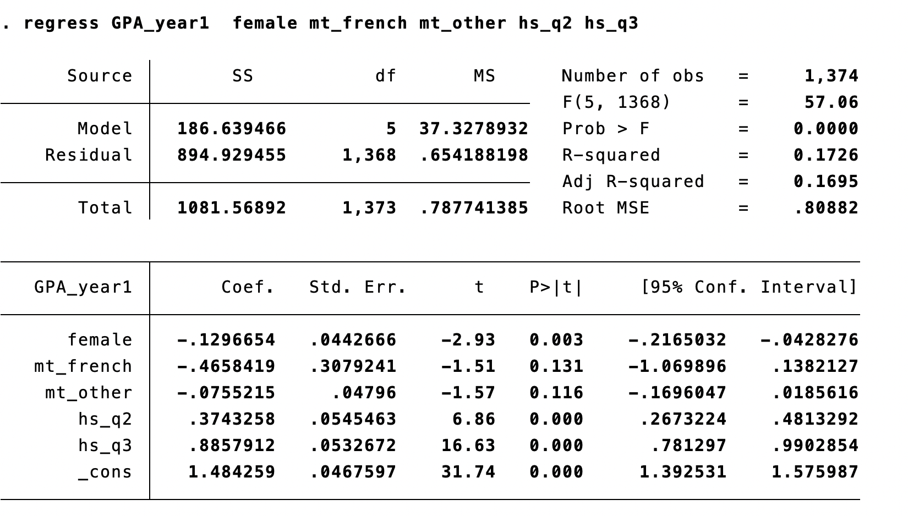
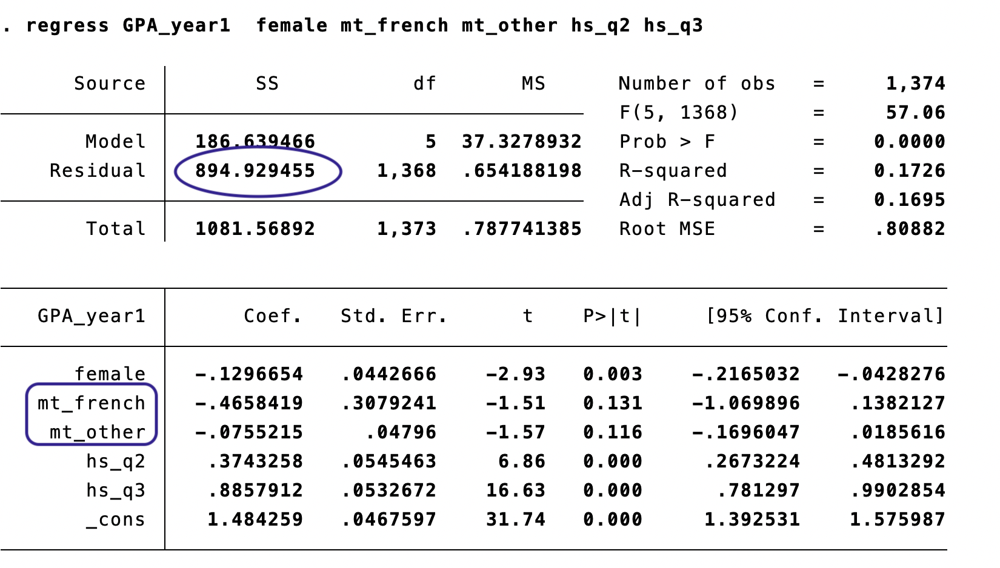
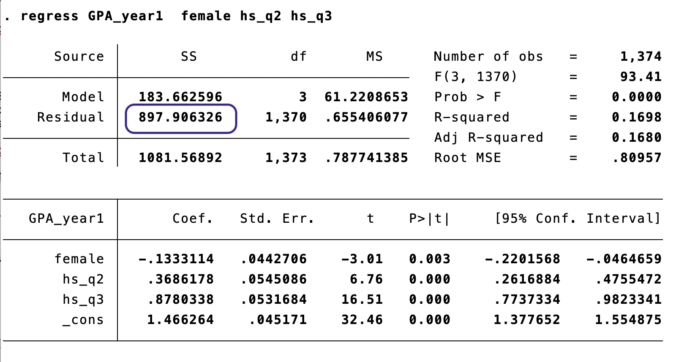
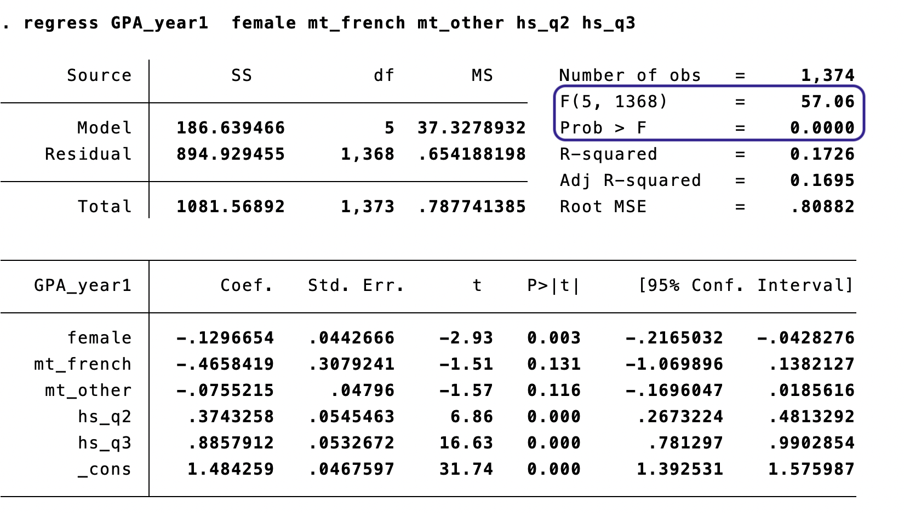

# Unconditional Cash Transfers: Context

## Why Cash Transfers? {.smaller}

**The Challenge:** 700+ million people live on less than $2/day

**Traditional Approaches:**
- In-kind aid (food, blankets, etc.)
- Conditional cash transfers (CCTs): "We give you money IF you send your kids to school / get vaccinated"
- Paternalistic: Government decides what the poor "need"

**Unconditional Cash Transfers (UCTs):**
- Direct, no strings attached
- Trusts recipients to make their own decisions
- Respects agency and autonomy

## Why This Matters {.smaller}

**Economic argument:**
If markets work, cash is most efficient → recipients choose optimally

**But markets often fail in poor areas:**
- Limited local supply (firms don't invest)
- Prices may spike if aggregate demand increases (inflation)
- Spillovers: Money spent in one household affects neighbors via prices and employment

**Key Question:** When we give cash to poor households, what actually happens?
- Do recipients spend it effectively?
- Do local economies benefit or adjust prices upward?
- What are the **general equilibrium effects**?

**This is where hypothesis testing comes in!** We test whether observed effects are statistically significant or just noise.

---

# The Study: GiveDirectly Kenya

## Egger, Haushofer, Miguel, Niehaus, Walker (2022) {.smaller}

**Paper:** "General Equilibrium Effects of Cash Transfers: Experimental Evidence from Kenya"
Published in *Econometrica* 90(6):2603–2643 | **2024 Frisch Medal Winner** 🏅

**Research Question:**
What are the direct and general equilibrium effects of unconditional cash transfers?

**Study Design:**
- 653 villages in rural Kenya (Siaya County)
- 10,500+ poor households
- Cash transfer: ~$1,000 USD (~87,000 KES) per eligible household
- **Fiscal shock:** 15% of local GDP

**Key Innovation:**
Randomized variation at TWO levels:
1. **Village-level:** Treatment vs. control villages
2. **Household-level:** Eligible vs. ineligible within treatment villages
   - Eligible (thatched roof means test) → receive transfer
   - Ineligible (better housing) → NO transfer, but exposed to spillovers

## Main Findings {.smaller}

**Direct Effects (on eligible recipients):**
- ✓ Consumption increased by 1,200-1,800 KES/month (~$12-18/month)
- ✓ Assets increased substantially
- ✓ Income effects from local multipliers

**Spillover Effects (on ineligible neighbors):**
- ✓ Consumption increased by 500-1,200 KES/month (positive spillovers!)
- ✓ Local firms benefited from increased demand
- ✓ **Minimal price inflation** (no evidence of inflation eroding gains)

**Local Fiscal Multiplier:** **2.4**
- For every dollar transferred, local economic activity increased by $2.40
- Suggests powerful local demand effects and limited import leakage

**Bottom Line:** Cash transfers helped both direct recipients AND their neighbors through general equilibrium effects

---

## Learning Objectives

By the end of this chapter, you will be able to:

1. Construct and interpret [confidence intervals]{.kw} for individual coefficients in multiple regression
2. Test hypotheses about [one coefficient]{.kw} (review from Ch5)
3. Test hypotheses about [one restriction involving multiple coefficients]{.kw}
4. Construct and interpret [joint hypothesis tests]{.kw} (the F-test)
5. Explain why testing coefficients [one at a time]{.alert} can be misleading

# Three Types of Hypothesis Tests

## A Taxonomy of Tests {.smaller}

| Type | Null Hypothesis | Example | Statistic |
|------|----------------|---------|-----------|
| 1. One restriction, one coefficient | $H_0: \beta_j = \beta_{j,0}$ | $H_0: \beta_1 = 0$ | $t$ |
| 2. One restriction, multiple coefficients | $H_0: \beta_j = \beta_m$ | $H_0: \beta_1 = \beta_2$ | $t$ |
| 3. Multiple restrictions (joint test) | $H_0: \beta_j = \beta_{j,0}, \; \beta_m = \beta_{m,0}, \ldots$ | $H_0: \beta_1 = \beta_2 = 0$ | $F$ |

. . .

::: {.callout-important}
## Special Case of Type 3
Test of [overall significance]{.kw}: $H_0: \beta_1 = \beta_2 = \cdots = \beta_k = 0$

"Can we exclude *all* the regressors?"
:::

# Confidence Intervals in Multiple Regression

## Confidence Intervals for Individual Coefficients {.smaller}

In simple regression (Ch5), we constructed CIs for $\beta_1$. The same logic extends to [any coefficient]{.kw} in a multiple regression:

$$
\hat{\beta}_j \pm c_{\alpha/2} \cdot SE(\hat{\beta}_j)
$$

. . .

where $c_{\alpha/2}$ is the critical value from the standard normal (large $n$):

| Confidence Level | $c_{\alpha/2}$ |
|:----------------:|:---------------:|
| 90% | 1.645 |
| 95% | 1.96 |
| 99% | 2.58 |

. . .

::: {.callout-note}
## Interpretation
"We are 95% confident that the true value of $\beta_j$, [holding all other regressors constant]{.alert}, lies in this interval."
:::

## CIs in Multiple Regression: What Changes?

Compared to simple regression:

- The [formula is the same]{.kw}: $\hat{\beta}_j \pm c \cdot SE(\hat{\beta}_j)$
- The [standard errors change]{.alert} because they now account for correlations among regressors

. . .

**Key insight:** Adding control variables can either [increase or decrease]{.alert} the SE of $\hat{\beta}_j$:

- Reduces SE if the added variable explains variation in $Y$ (reduces $\hat{\sigma}^2_u$)
- Increases SE if the added variable is correlated with $X_j$ (multicollinearity)

# Type 1: One Restriction, One Coefficient

## Review: Testing a Single Coefficient {.smaller}

$$H_0: \beta_j = \beta_{j,0} \quad \text{vs.} \quad H_a: \beta_j \neq \beta_{j,0}$$

. . .

**Steps:**

1. Choose significance level (e.g., $\alpha = 0.01$)

2. Compute the $t$-statistic:
$$t = \frac{\hat{\beta}_j - \beta_{j,0}}{SE(\hat{\beta}_j)}$$

3. Compare $|t|$ to critical value and reject if $|t| > c$

4. (Optional) Construct CI: $\left(\hat{\beta}_j - c \cdot SE(\hat{\beta}_j), \; \hat{\beta}_j + c \cdot SE(\hat{\beta}_j)\right)$

. . .

::: {.callout-tip}
## Nothing New Here
This is exactly the same procedure as Ch5 — it works for any individual $\beta_j$ in a multiple regression.
:::

# Our Running Example

## Angrist, Lang, and Oreopoulos (2009) {.smaller}

{width=75% fig-align="center"}

We'll use data from this study to explore hypothesis testing in multiple regression.

## The STAR Experiment: Context {.smaller}

**Setting:** A satellite campus of a large Canadian university (University of Toronto at Scarborough)

**Research question:** Can academic support services and financial incentives improve first-year academic performance?

. . .

**Three treatment groups (randomly assigned):**

- [SSP]{.kw} (Student Support Program): peer advising and facilitated study groups
- [SFP]{.kw} (Student Fellowship Program): merit-based scholarships for meeting GPA targets
- [SFSP]{.kw}: combined SSP + SFP treatment

. . .

**Key findings:** The combined program (SFSP) improved grades for women, particularly those with weaker high school backgrounds. Support services alone or financial incentives alone had limited effects.

. . .

**Our focus today:** We'll use the [control variables]{.kw} from this study — gender, mother tongue, and high school quartile — to practice hypothesis testing. This is about the *predictors* of Year 1 GPA, not the treatment effects.

## Recall: The Dummy Variable Trap (Ch6)

When including a categorical variable with $m$ categories, include [$m - 1$ dummy variables]{.kw} and leave one as the [reference group]{.kw}.

. . .

**In our example:**

- Mother tongue has 3 categories: English, French, Other
- We include `mt_french` and `mt_other`; [English is the excluded reference group]{.alert}
- Coefficients on `mt_french` and `mt_other` are interpreted *relative to English speakers*

. . .

::: {.callout-tip}
## Quick Check
If we included all three dummies plus an intercept, what would happen?

. . .

Perfect multicollinearity — Stata would drop one automatically.
:::

## The Base Regression {.smaller}

```stata
regress GPA_year1 female mt_french mt_other hs_q2 hs_q3
```

{width=85% fig-align="center"}

Controls for gender, mother tongue, and HS quartile (no top quartile — this is a satellite campus!)

## Changing the Excluded Group {.smaller}

What if we exclude "Other" mother tongue instead of English?

. . .

English excluded:
$$\widehat{GPA} = 1.484 - 0.130 \cdot female - 0.466 \cdot mt_{french} - 0.076 \cdot mt_{other} + 0.374 \cdot hs_{q2} + 0.886 \cdot hs_{q3}$$

"Other" excluded:
$$\widehat{GPA} = 1.409 - 0.130 \cdot female - 0.390 \cdot mt_{french} + 0.076 \cdot mt_{english} + 0.374 \cdot hs_{q2} + 0.886 \cdot hs_{q3}$$

. . .

::: {.callout-important}
## Same Predictions, Different Interpretation
The predicted values are identical. Only the [reference point]{.kw} for interpretation changes.
:::

## Same Predictions: The Math {.smaller}

Set $female = 0$, $hs_{q2} = 0$, $hs_{q3} = 0$ for simplicity:

**English excluded:**

| Group | Predicted GPA |
|-------|:------------:|
| English ($mt_{english} = 1$) | $1.484$ |
| French ($mt_{french} = 1$) | $1.484 - 0.466 = 1.018$ |
| Other ($mt_{other} = 1$) | $1.484 - 0.076 = 1.409$ |

. . .

**"Other" excluded:**

| Group | Predicted GPA |
|-------|:------------:|
| English ($mt_{english} = 1$) | $1.409 + 0.076 = 1.484$ |
| French ($mt_{french} = 1$) | $1.409 - 0.390 = 1.018$ |
| Other ($mt_{other} = 1$) | $1.409$ |

. . .

Same numbers, different baseline.

## Questions We Might Want to Answer {.smaller}

{width=65% fig-align="center"}

- Do French speakers have the same GPA as English speakers? → [Type 1: test $\beta_{french} = 0$]{.kw}
- Do "Other" speakers have the same GPA as English speakers? → [Type 1: test $\beta_{other} = 0$]{.kw}
- [Do French speakers have the same GPA as "Other" speakers?]{style="color: #008080;"} → [Type 2]{.kw}
- [Are there *any* differences in GPA by mother tongue?]{style="color: #008080;"} → [Type 3]{.kw}

# Type 2: One Restriction, Multiple Coefficients

## Testing Equality of Two Coefficients {.smaller}

[Do French speakers have the same GPA as "Other" speakers?]{style="color: #008080;"}

Population model:
$$GPA_i = \beta_0 + \beta_1 \cdot mt_{french} + \beta_2 \cdot mt_{other} + \beta_3 \cdot hs_{q2} + \beta_4 \cdot hs_{q3} + u_i$$

. . .

$$H_0: \beta_1 = \beta_2 \quad \text{vs.} \quad H_a: \beta_1 \neq \beta_2$$

Equivalently: $H_0: \beta_1 - \beta_2 = 0$

. . .

**Problem:** We can't directly test this with a standard $t$-test on a single coefficient.

**Solution:** [Transform the regression]{.alert}.

## The Transformation Trick {.smaller}

Start with:
$$y_i = \beta_0 + \beta_1 x_{1i} + \beta_2 x_{2i} + \cdots + u_i$$

. . .

Add and subtract $\beta_2 x_{1i}$:
$$y_i = \beta_0 + \beta_1 x_{1i} + {\color{teal}\beta_2 x_{1i} - \beta_2 x_{1i}} + \beta_2 x_{2i} + \cdots + u_i$$

. . .

Rearrange:
$$y_i = \beta_0 + \underbrace{(\beta_1 - \beta_2)}_{\gamma_1} x_{1i} + \beta_2 \underbrace{(x_{1i} + x_{2i})}_{w_i} + \cdots + u_i$$

. . .

Now test: $H_0: \gamma_1 = 0$ — a standard [Type 1]{.kw} $t$-test!

## In Stata: The Easy Way {.smaller}

After running the regression, Stata's `test` command does this automatically:

```stata
regress GPA_year1 female mt_french mt_other hs_q2 hs_q3
test mt_french = mt_other
```

. . .

**Result:**

$$F(1, 1368) = 1.59 \qquad p = 0.2073$$

. . .

We [cannot reject]{.kw} the null that French and "Other" speakers have the same GPA ($p = 0.21$).

::: {.callout-note}
## $F$ vs. $t$ with One Restriction
With a single restriction, $F = t^2$, so the $F$-test and two-sided $t$-test are equivalent. Stata reports $F$ from the `test` command.
:::

# Type 3: Joint Hypothesis Tests (The F-Test)

## Why Not Just Test One at a Time? {.smaller}

[Are there *any* differences in GPA by mother tongue?]{style="color: #008080;"}

. . .

**Tempting approach:** Just look at the individual $t$-statistics!

- $\hat{\beta}_{french}$: $t = -1.51$, $p = 0.131$ → not significant
- $\hat{\beta}_{other}$: $t = -1.57$, $p = 0.116$ → not significant

. . .

**Conclusion:** Mother tongue doesn't matter?

. . .

::: {.callout-warning}
## This Is Wrong!
Testing coefficients one at a time and concluding "none are significant, so the group doesn't matter" is a [logical error]{.alert}.

Each individual test has, say, a 5% chance of Type I error. But when you run [multiple tests]{.kw}, the probability that *at least one* falsely rejects grows quickly.
:::

## The Multiple Testing Problem {.smaller}

Suppose you test $q$ hypotheses, each at the 5% level, and all nulls are true.

- Probability of [not]{.kw} rejecting any single test: $0.95$
- Probability of not rejecting [any]{.kw} of $q$ independent tests: $0.95^q$
- Probability of [at least one]{.alert} false rejection: $1 - 0.95^q$

. . .

| Number of tests ($q$) | P(at least one false rejection) |
|:---------------------:|:-------------------------------:|
| 1 | 5.0% |
| 2 | 9.8% |
| 5 | 22.6% |
| 10 | 40.1% |
| 20 | 64.2% |

. . .

We need a test that evaluates [all restrictions simultaneously]{.kw}: the [F-test]{.alert}.

## Joint Hypothesis Test: Setup {.smaller}

Population model:
$$GPA_i = \beta_0 + \beta_1 \cdot mt_{french} + \beta_2 \cdot mt_{other} + \beta_3 \cdot hs_{q2} + \beta_4 \cdot hs_{q3} + u_i$$

. . .

$$H_0: \beta_1 = 0 \text{ and } \beta_2 = 0 \quad \text{vs.} \quad H_a: \beta_1 \neq 0 \text{ and/or } \beta_2 \neq 0$$

. . .

This is a test of whether the mother tongue coefficients are [jointly significant]{.kw}.

Equivalently: can we [exclude]{.kw} `mt_french` and `mt_other` from the model?

## Key Terms {.smaller}

::: {.callout-note}
## Exclusion Restriction
A test of whether certain covariates can be excluded from the population model.
:::

. . .

- [Unrestricted model]{.kw}: the model with [more]{.alert} covariates
    - "Unrestricted" because those coefficients are free to be zero or anything else
- [Restricted model]{.kw}: the model with [fewer]{.alert} covariates
    - "Restricted" because we are [imposing]{.alert} that those coefficients equal zero

## The Unrestricted Model {.smaller}

The full model with all variables — including the ones we're testing:

{width=85% fig-align="center"}

Note the highlighted values: $SSR_{ur} = 894.93$ and the coefficients on `mt_french` and `mt_other`.

## The Restricted Model {.smaller}

The model [without]{.alert} mother tongue — imposing $\beta_1 = \beta_2 = 0$:

{width=85% fig-align="center"}

$SSR_r = 897.91$ — the sum of squared residuals [necessarily increases]{.alert} when we drop variables.

But is that increase [statistically significant]{.kw}?

## The F-Statistic (Homoskedastic Version) {.smaller}

$$F = \frac{(SSR_r - SSR_{ur})/q}{SSR_{ur}/(n - k_{ur} - 1)} \sim F_{q, \; n-k_{ur}-1}$$

. . .

where:

- $q$ = number of restrictions being tested
- $n - k_{ur} - 1$ = degrees of freedom in the unrestricted model
- $SSR_r$ = sum of squared residuals from the restricted model
- $SSR_{ur}$ = sum of squared residuals from the unrestricted model

. . .

**Intuition:** The $F$-statistic measures the [relative increase in SSR]{.kw} when we impose the restrictions. If the null is true, this increase should be small.

## Equivalent Formula Using $R^2$ {.smaller}

Since $SSR = TSS \cdot (1 - R^2)$ and $TSS$ is the same in both models:

$$F = \frac{(R^2_{ur} - R^2_r)/q}{(1 - R^2_{ur})/(n - k_{ur} - 1)}$$

. . .

This version is useful when regression output reports $R^2$ but not $SSR$.

## The F-Distribution

The $F$-distribution:

- Takes only [positive values]{.kw} (reflecting that $SSR$ can only increase when we drop variables)
- Has two parameters: $q$ (numerator df) and $n - k_{ur} - 1$ (denominator df)
- Rejection is [one-sided]{.alert}: reject when $F > c$

. . .

Choose the critical value $c$ so that the null is falsely rejected in $\alpha$% of cases.

## Computing the F-Test: By Hand {.smaller}

From the Stata output: $SSR_{ur} = 894.93$, $SSR_r = 897.91$, $q = 2$, $n = 1374$, $k_{ur} = 5$

$$F = \frac{(897.91 - 894.93)/2}{894.93/(1374 - 5 - 1)} = \frac{2.98/2}{894.93/1368} = \frac{1.49}{0.654} = 2.28$$

. . .

$$F \sim F_{2, 1368} \quad \rightarrow \quad c_{0.10} = 2.30$$

$$P(F > 2.28) = 0.1032$$

. . .

We [cannot reject]{.kw} the null at conventional significance levels.

The mother tongue variables are not [jointly significant]{.kw} — we cannot conclude that mother tongue predicts GPA.

## In Stata: `test` and `testparm` {.smaller}

After the unrestricted regression, Stata can compute the F-test directly:

```stata
* Test specific equality restrictions
test mt_french = mt_other = 0

* Or equivalently, test joint significance of a group
testparm mt_french mt_other
```

. . .

Both give: $F(2, 1368) = 2.28$, $p = 0.1032$

. . .

::: {.callout-tip}
## Stata Tip
`testparm` is convenient for testing whether a [group of variables]{.kw} is jointly significant — it sets up the $H_0: \beta_j = 0$ for each variable in the list.
:::

## Don't Forget Heteroskedasticity! {.smaller}

The F-statistic formula using $SSR$ assumes [homoskedasticity]{.alert}.

In practice, always estimate with [robust standard errors]{.kw}:

```stata
regress GPA_year1 female mt_french mt_other hs_q2 hs_q3, robust
test mt_french = mt_other = 0
```

. . .

**Robust F-test result:** $F(2, 1368) = 2.86$, $p = 0.0573$

. . .

::: {.callout-important}
## Notice the Difference
Under homoskedasticity: $F = 2.28$, $p = 0.103$

With robust SEs: $F = 2.86$, $p = 0.057$

The robust version is [closer to significance]{.alert}. Always use robust standard errors unless you have a specific reason not to.
:::

# The Overall F-Test

## Test of Overall Significance {.smaller}

**Question:** Can we exclude [all]{.alert} the regressors?

Unrestricted:
$$y_i = \beta_0 + \beta_1 x_{1i} + \beta_2 x_{2i} + \cdots + \beta_k x_{ki} + u_i$$

. . .

$$H_0: \beta_1 = \beta_2 = \cdots = \beta_k = 0$$

. . .

Restricted model (under $H_0$):
$$y_i = \beta_0 + u_i$$

. . .

The F-statistic simplifies to:

$$F = \frac{R^2/k}{(1 - R^2)/(n - k - 1)} \sim F_{k, \; n-k-1}$$

## You've Been Seeing This All Along {.smaller}

{width=85% fig-align="center"}

. . .

The [F(5, 1368) = 57.06]{.kw} and [Prob > F = 0.0000]{.kw} at the top of every Stata regression output is the test of overall significance!

. . .

::: {.callout-note}
## Usually Overwhelmingly Rejected
If your overall F-test is *not* significant, something is likely wrong — your model has essentially no predictive power.
:::

## In Stata: `testparm *` {.smaller}

You can also compute it manually after the regression:

```stata
testparm *
```

. . .

$$F(5, 1368) = 57.06 \qquad p = 0.0000$$

This confirms what Stata already reports at the top of the regression output.

# When to Use Which Test?

## t-Test vs. F-Test {.smaller}

| | $t$-test | $F$-test |
|---|---------|---------|
| **Number of restrictions** | One | One or more |
| **Sided** | One-sided or two-sided | Two-sided only |
| **Use for** | Single coefficient | Joint significance of a group |

. . .

::: {.callout-important}
## Key Relationship
When testing a [single restriction]{.kw}: $F = t^2$

The results are functionally equivalent! The F-test is a [generalization]{.kw} of the two-sided $t$-test to multiple restrictions.
:::

## Recipe Card: Hypothesis Tests in Multiple Regression {.smaller .scrollable}

::: {.callout-note}
## Type 1: One Restriction, One Coefficient
**$H_0: \beta_j = \beta_{j,0}$** (usually $\beta_{j,0} = 0$)

- Statistic: $t = \frac{\hat{\beta}_j - \beta_{j,0}}{SE(\hat{\beta}_j)}$
- Distribution: Standard normal (large $n$)
- Stata: Read directly from regression output, or `test varname = value`
:::

::: {.callout-note}
## Type 2: One Restriction, Multiple Coefficients
**$H_0: \beta_j = \beta_m$**

- Transform the regression so the restriction becomes $\gamma_1 = 0$
- Or use Stata: `test var1 = var2`
:::

::: {.callout-note}
## Type 3: Joint Hypothesis (F-Test)
**$H_0: \beta_1 = 0, \; \beta_2 = 0, \; \ldots$**

- Statistic: $F = \frac{(SSR_r - SSR_{ur})/q}{SSR_{ur}/(n - k_{ur} - 1)}$
- Distribution: $F_{q, \; n-k_{ur}-1}$
- Stata: `test` or `testparm`
- Always use robust SEs!
:::

## Key Takeaways

1. [Confidence intervals]{.kw} in multiple regression use the same formula as simple regression, but SEs account for other regressors

2. Individual $t$-tests work for single restrictions — but [don't test one at a time]{.alert} when you have a joint hypothesis

3. The [F-test]{.kw} tests multiple restrictions simultaneously, avoiding the multiple testing problem

4. The [overall F-test]{.kw} is reported at the top of every regression — it tests whether all regressors are jointly significant

5. Always use [robust standard errors]{.kw} for heteroskedasticity-robust inference

::: {.callout-tip}
## Knowledge Check
If each of 5 individual $t$-tests fails to reject at the 5% level, can you conclude the variables are jointly insignificant? Why or why not?

. . .

No! The joint F-test could still reject. Individual insignificance does not imply joint insignificance — this is precisely why we need the F-test.
:::
