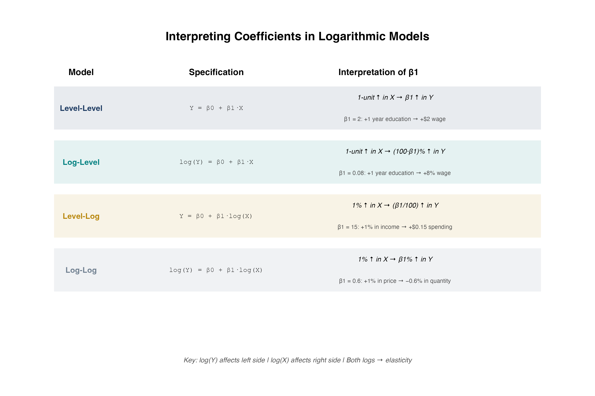
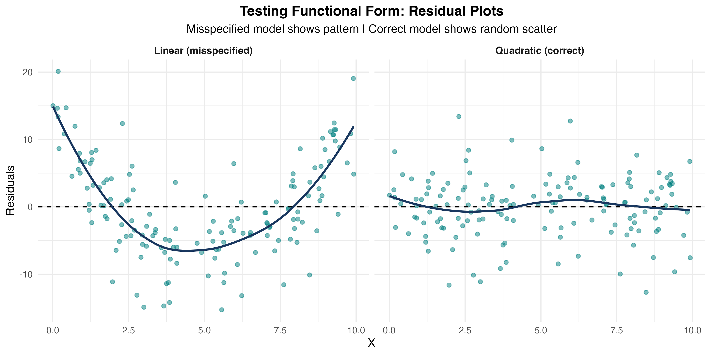

## Roadmap {.scrollable}

[TOC]

## What You'll Learn Today

::: {.callout-important}
## Central Question
What if the relationship between $X$ and $Y$ is [not]{.alert} a straight line?
:::

**By the end of this chapter, you will:**

1. Model [polynomial relationships]{.kw} (quadratic, cubic)
2. Compute and interpret [marginal effects]{.kw}
3. Estimate [interaction effects]{.kw} between variables
4. Use [logarithmic transformations]{.kw} effectively
5. [Test functional form]{.kw} with Ramsey RESET
6. Apply these tools in Stata

# Why Nonlinear?

## The Linear Assumption

So far, we've assumed relationships are linear:

$$
Y_i = \beta_0 + \beta_1 X_i + u_i
$$

. . .

**Interpretation:** A one-unit increase in $X$ changes $Y$ by $\beta_1$ units, [regardless of $X$'s current value]{.alert}.

. . .

**But is this realistic?**

- Does the first year of education have the same effect as the 20th?
- Does doubling advertising from \$1K to \$2K have the same effect as doubling from \$100K to \$200K?
- Does the effect of training depend on whether the worker is already skilled?

## Real-World Examples of Nonlinearity

**Diminishing returns:**

- Fertilizer on crop yield (eventually toxic!)
- Study hours on test scores (exhaustion sets in)
- Experience on wages (plateaus after 30+ years)

. . .

**Increasing returns:**

- Network effects (social media value)
- Learning curves (skills compound)

. . .

**Interactions:**

- Effect of education may depend on ability
- Effect of experience may differ by gender

## Three Tools for Nonlinearity

1. **Polynomial regression** — Add $X^2$, $X^3$, etc. to model curvature

2. **Interaction terms** — Include $X_1 \cdot X_2$ to allow effects to vary

3. **Logarithmic transformations** — Use $\log(Y)$ or $\log(X)$ for percentage changes

. . .

::: {.callout-important}
## Key Insight
All three remain [linear in parameters]{.alert} — we can still use OLS!
:::

# Polynomial Regression

## The Quadratic Model

::: {.callout-note}
## Quadratic Regression Model

$$
Y_i = \beta_0 + \beta_1 X_i + \beta_2 X_i^2 + u_i
$$
:::

. . .

**Why quadratic?**

- Allows for [curvature]{.alert} in the relationship
- Can capture diminishing or increasing returns
- Flexible, but not too flexible (avoids overfitting)

. . .

**Still linear in parameters:** We estimate $\beta_0, \beta_1, \beta_2$ via OLS!

## Visualizing Quadratic Relationships

{width=80%}

## Interpreting Quadratic Coefficients

$$
Y_i = \beta_0 + \beta_1 X_i + \beta_2 X_i^2 + u_i
$$

. . .

**Key point:** The effect of $X$ on $Y$ is [no longer constant]{.alert}!

. . .

::: {.callout-important}
## Marginal Effect in Quadratic Model

$$
\frac{\partial Y}{\partial X} = \beta_1 + 2\beta_2 X
$$

The marginal effect [depends on the value of $X$]{.alert}!
:::

. . .

**Interpretation:**

- At $X = 0$: marginal effect is $\beta_1$
- At $X = 10$: marginal effect is $\beta_1 + 20\beta_2$
- The marginal effect changes by $2\beta_2$ for each unit increase in $X$

## Example: Earnings and Experience

**Model:**

$$
\log(wage) = \beta_0 + \beta_1 \cdot experience + \beta_2 \cdot experience^2 + u
$$

. . .

**Estimated coefficients:**

```
log(wage) = 1.5 + 0.08*experience - 0.0012*experience^2
```

. . .

**Interpretation:**

- $\hat{\beta}_1 = 0.08 > 0$: wages initially increase with experience
- $\hat{\beta}_2 = -0.0012 < 0$: inverted-U shape (diminishing returns)
- Marginal effect = $0.08 - 2(0.0012) \times experience$

## Calculating Marginal Effects

**Estimated model:**

$$
\log(wage) = 1.5 + 0.08 \cdot exper - 0.0012 \cdot exper^2
$$

. . .

At $exper = 10$ years:

$$
\frac{\partial \log(wage)}{\partial exper} = 0.08 - 2(0.0012)(10) = 0.08 - 0.024 = 0.056
$$

. . .

At $exper = 30$ years:

$$
\frac{\partial \log(wage)}{\partial exper} = 0.08 - 2(0.0012)(30) = 0.08 - 0.072 = 0.008
$$

. . .

**Interpretation:** The wage boost from an additional year of experience falls from 5.6% (at 10 years) to 0.8% (at 30 years).

## Finding the Turning Point

For an inverted-U relationship, where does the maximum occur?

. . .

**Set the marginal effect to zero:**

$$
\beta_1 + 2\beta_2 X^* = 0 \quad \Rightarrow \quad X^* = -\frac{\beta_1}{2\beta_2}
$$

. . .

**Example:** $\log(wage) = 1.5 + 0.08 \cdot exper - 0.0012 \cdot exper^2$

$$
exper^* = -\frac{0.08}{2(-0.0012)} = \frac{0.08}{0.0024} \approx 33.3 \text{ years}
$$

. . .

**Interpretation:** Wages peak at about 33 years of experience, then decline.

## Visualizing Marginal Effects

{width=80%}

## Knowledge Check: Quadratic Model {.smaller}

::: {.callout-tip}
## Question
You estimate: $sales = 100 + 15 \cdot price - 0.5 \cdot price^2$

1. What is the marginal effect of price on sales at $price = 10$?
2. At what price are sales maximized?
:::

. . .

::: {.callout-important}
## Answer
**Part 1:** Marginal effect $= 15 - 2(0.5)(10) = 15 - 10 = 5$. At \$10, raising price by \$1 increases sales by 5 units.

**Part 2:** Turning point: $price^* = -\frac{15}{2(-0.5)} = 15$. Sales are maximized at $price = 15$.
:::

## Cubic and Higher-Order Polynomials

**Cubic model:**

$$
Y_i = \beta_0 + \beta_1 X_i + \beta_2 X_i^2 + \beta_3 X_i^3 + u_i
$$

. . .

**Marginal effect:**

$$
\frac{\partial Y}{\partial X} = \beta_1 + 2\beta_2 X + 3\beta_3 X^2
$$

. . .

**When to use:** Multiple turning points, S-shaped patterns.

. . .

**Warning:** Higher-order polynomials can [overfit]{.alert} and behave erratically at extremes. Use sparingly!

## Stata Implementation: Polynomial Regression {.smaller}

**Create polynomial terms:**

```stata
generate experience2 = experience^2
generate experience3 = experience^3
```

**Estimate model:**

```stata
regress log_wage education experience experience2, robust
```

**Compute marginal effect at mean experience:**

```stata
summarize experience
scalar exper_mean = r(mean)
display "Marginal effect = " _b[experience] + 2*_b[experience2]*exper_mean
```

**Shortcut using margins:**

```stata
margins, dydx(experience) at(experience=10)
```

# Interaction Effects

## What Are Interactions?

::: {.callout-note}
## Interaction Effect
The effect of $X_1$ on $Y$ [depends on]{.alert} the value of $X_2$.
:::

. . .

**Examples:**

- Effect of education on wages may differ by gender
- Effect of advertising may depend on product quality
- Effect of fertilizer may depend on rainfall

. . .

**Mathematical representation:**

$$
Y_i = \beta_0 + \beta_1 X_{1i} + \beta_2 X_{2i} + \beta_3 (X_{1i} \times X_{2i}) + u_i
$$

The [interaction term]{.alert} is $X_1 \times X_2$.

## Continuous × Continuous Interaction

**Model:**

$$
Y_i = \beta_0 + \beta_1 X_{1i} + \beta_2 X_{2i} + \beta_3 (X_{1i} \cdot X_{2i}) + u_i
$$

. . .

**Marginal effect of $X_1$:**

$$
\frac{\partial Y}{\partial X_1} = \beta_1 + \beta_3 X_2
$$

. . .

**Interpretation:**

- When $X_2 = 0$: effect of $X_1$ is $\beta_1$
- When $X_2 = 10$: effect of $X_1$ is $\beta_1 + 10\beta_3$
- The effect of $X_1$ changes by $\beta_3$ for each unit increase in $X_2$

## Example: Education and Experience Interaction

**Question:** Does the return to education depend on experience?

**Model:**

$$
wage = \beta_0 + \beta_1 \cdot education + \beta_2 \cdot experience + \beta_3 (education \times experience) + u
$$

**Estimated:**

```
wage = 2.0 + 1.5*education + 0.3*experience + 0.05*(education*experience)
```

. . .

**Interpretation:**

- For someone with 0 years experience: return to education = \$1.50/year
- For someone with 10 years experience: return = \$1.50 + 0.05(10) = \$2.00/year
- Education becomes more valuable as you gain experience!

## Visualizing Continuous × Continuous Interactions

{width=80%}

## Binary × Continuous Interaction

**Model:**

$$
Y_i = \beta_0 + \beta_1 X_i + \beta_2 D_i + \beta_3 (X_i \cdot D_i) + u_i
$$

where $D_i$ is a dummy variable (0 or 1).

. . .

**Interpretation:**

- When $D = 0$: $Y = \beta_0 + \beta_1 X$ (baseline group)
- When $D = 1$: $Y = (\beta_0 + \beta_2) + (\beta_1 + \beta_3) X$ (treatment group)
- $\beta_2$: intercept shift | $\beta_3$: slope shift

## Example: Gender Wage Gap

**Model:**

$$
wage = \beta_0 + \beta_1 \cdot education + \beta_2 \cdot female + \beta_3 (education \times female) + u
$$

**Estimated:**

```
wage = 3.0 + 2.0*education - 1.5*female - 0.3*(education*female)
```

. . .

**Interpretation:**

- **Men** ($female = 0$): $wage = 3.0 + 2.0 \cdot education$
- **Women** ($female = 1$): $wage = 1.5 + 1.7 \cdot education$
- Women earn \$1.50 less at 0 education; \$0.30 less per year of education. Gap widens with education!

## Visualizing Binary × Continuous Interactions

{width=80%}

## Knowledge Check: Interaction Effects {.smaller}

::: {.callout-tip}
## Question
You estimate: $price = 50 + 10 \cdot quality + 5 \cdot advertising + 2 \cdot (quality \times advertising)$

1. What is the marginal effect of advertising when quality = 5?
2. What is the marginal effect of advertising when quality = 10?
:::

. . .

::: {.callout-important}
## Answer
Marginal effect of advertising = $5 + 2 \times quality$

**Part 1:** At quality = 5: effect = $5 + 2(5) = 15$

**Part 2:** At quality = 10: effect = $5 + 2(10) = 25$

Advertising is more effective for higher-quality products!
:::

## Stata Implementation: Interactions

**Method 1: Create interaction manually**

```stata
generate educ_exper = education * experience
regress wage education experience educ_exper, robust
```

**Method 2: Factor variable notation**

```stata
regress wage c.education##c.experience, robust
```

**For dummy × continuous:**

```stata
regress wage c.education##i.female, robust
```

**Compute marginal effects at different values:**

```stata
margins, dydx(education) at(experience=(0 10 20 30))
```

## Common Mistakes with Interactions

1. [Including interaction but not main effects]{.alert} — Always include $X_1$ and $X_2$ when you include $X_1 \times X_2$!

2. [Interpreting $\beta_1$ as "the" effect of $X_1$]{.alert} — With interactions, the effect depends on other variables; $\beta_1$ is only the effect when $X_2 = 0$.

3. [Forgetting to center variables]{.alert} — Centering makes $\beta_1$ interpretable as effect at average $X_2$.

4. [Testing wrong hypothesis]{.alert} — Test $H_0: \beta_3 = 0$ to check if interaction is significant.

# Logarithmic Specifications

## Why Logarithms?

**Three key advantages:**

1. **Percentage interpretation** — Coefficients represent [percentage changes]{.alert}, not unit changes
2. **Diminishing returns automatically** — $\log(X)$ is concave (built-in curvature!)
3. **Elasticities** — Direct estimates of elasticity in log-log models

. . .

**Important:** Can only take log of [positive]{.alert} variables!

## Four Logarithmic Models

| Model | Equation | Interpretation |
|--------|----------|----------------|
| **Level-level** | $Y = \beta_0 + \beta_1 X$ | $\Delta Y = \beta_1 \Delta X$ |
| **Log-level** | $\log Y = \beta_0 + \beta_1 X$ | $\%\Delta Y = 100\beta_1 \Delta X$ |
| **Level-log** | $Y = \beta_0 + \beta_1 \log X$ | $\Delta Y = (\beta_1/100) \%\Delta X$ |
| **Log-log** | $\log Y = \beta_0 + \beta_1 \log X$ | $\%\Delta Y = \beta_1 \%\Delta X$ |

. . .

**Key insight:** Each log transforms a unit change into a percentage change!

## Level-Level (Baseline)

$$
Y_i = \beta_0 + \beta_1 X_i + u_i
$$

**Interpretation:** A one-unit increase in $X$ is associated with a $\beta_1$-unit change in $Y$.

**Example:** $wage = 5 + 2.5 \cdot education$ — Each additional year of education increases wages by \$2.50/hour.

## Log-Level

$$
\log(Y_i) = \beta_0 + \beta_1 X_i + u_i
$$

::: {.callout-important}
## Log-Level Interpretation
A one-unit increase in $X$ is associated with a $100\beta_1$% change in $Y$.
:::

**Example:** $\log(wage) = 1.5 + 0.08 \cdot education$ — Each additional year of education increases wages by 8%.

## Level-Log

$$
Y_i = \beta_0 + \beta_1 \log(X_i) + u_i
$$

::: {.callout-important}
## Level-Log Interpretation
A 1% increase in $X$ is associated with a $\beta_1/100$ unit change in $Y$.
:::

**Example:** $wage = 2 + 5 \log(experience)$ — A 1% increase in experience increases wages by \$0.05/hour. Doubling experience (100% increase) raises wages by \$5/hour.

## Log-Log (Elasticity)

$$
\log(Y_i) = \beta_0 + \beta_1 \log(X_i) + u_i
$$

::: {.callout-important}
## Log-Log Interpretation
$\beta_1$ is the [elasticity]{.alert} of $Y$ with respect to $X$. A 1% increase in $X$ leads to a $\beta_1$% change in $Y$.
:::

**Example:** $\log(quantity) = 2.5 - 1.2 \log(price)$ — A 1% increase in price leads to a 1.2% decrease in quantity (price elasticity of demand).

## Visualizing Log Specifications

{width=75%}

## Log-Log Specification in Detail

{width=75%}

## Knowledge Check: Log Specifications {.smaller}

::: {.callout-tip}
## Question
Match each estimated model to its interpretation:

a) $wage = 5 + 0.3 \cdot experience$  
b) $\log(wage) = 1.2 + 0.04 \cdot experience$  
c) $wage = 8 + 2.5 \log(experience)$  
d) $\log(wage) = 1.5 + 0.15 \log(experience)$  

i) Each year of experience raises wages by \$0.30  
ii) Each year of experience raises wages by 4%  
iii) A 1% increase in experience raises wages by 0.15%  
iv) Doubling experience raises wages by \$2.50
:::

. . .

::: {.callout-important}
## Answer
a) → i) (level-level), b) → ii) (log-level), c) → iv) (level-log), d) → iii) (log-log)
:::

## Interpretation Guide Summary

{width=90%}

## Stata Implementation: Logs

**Generate log variables:**

```stata
generate log_wage = log(wage)
generate log_sales = log(sales)
generate log_price = log(price)
```

**Estimate different specifications:**

```stata
* Log-level
regress log_wage education experience, robust

* Level-log
regress wage log_experience log_sales, robust

* Log-log
regress log_quantity log_price log_income, robust
```

**Important:** Always use natural log (`log` in Stata), not log10 or log2!

# Testing Functional Form

## How Do We Know Which Model to Use?

**We have many choices:** Linear vs quadratic vs cubic? Logs or levels? Interactions or no interactions?

. . .

**Three approaches:**

1. **Theory** — What does economic theory suggest?
2. **Visualization** — Plot the data and residuals
3. **Formal tests** — Ramsey RESET test

## The Ramsey RESET Test

::: {.callout-note}
## Ramsey RESET (Regression Specification Error Test)
Tests whether nonlinear functions of fitted values help explain $Y$. Detects [omitted variables]{.alert} or [incorrect functional form]{.alert}.
:::

**Procedure:**

1. Estimate original model, obtain fitted values $\hat{Y}$
2. Estimate augmented model: $Y = \beta_0 + \beta_1 X + \gamma_1 \hat{Y}^2 + \gamma_2 \hat{Y}^3 + u$
3. Test $H_0: \gamma_1 = \gamma_2 = 0$ (F-test)
4. If reject $H_0$: functional form is misspecified

## Interpreting RESET Results

**If we reject $H_0$ (p-value < 0.05):** Current model is misspecified; try adding polynomial terms, logs, or interactions; re-run RESET after adjusting.

**If we fail to reject $H_0$:** No strong evidence against current specification (but doesn't prove it's correct!).

## Visualizing Functional Form Tests

{width=80%}

## Stata Implementation: RESET Test

```stata
* Estimate model
regress wage education experience, robust

* Run RESET test
estat ovtest
```

**Example output:** Ramsey RESET test using powers of fitted values; $H_0$: Model has no omitted variables; if Prob > F = 0.0000, we reject — try adding quadratic terms or logs!

# Bringing It All Together

## The Nonlinear Toolkit

| Tool | Use When | Gives You |
|------|----------|-----------|
| Polynomial | Curved relationships, turning points | Marginal effects that vary with $X$ |
| Interactions | Effect depends on another variable | Different slopes for different groups |
| Logarithms | Wide ranges, percentage interpretation | Elasticities, diminishing returns |

. . .

**Key principle:** All remain [linear in parameters]{.alert} — we can use OLS and all our inference tools!

## Key Formulas Summary

| Model | Marginal Effect |
|--------|-----------------|
| Quadratic | $\frac{\partial Y}{\partial X} = \beta_1 + 2\beta_2 X$ |
| Interaction | $\frac{\partial Y}{\partial X_1} = \beta_1 + \beta_3 X_2$ |
| Log-level | $\frac{\%\Delta Y}{\Delta X} = 100\beta_1$ |
| Level-log | $\frac{\Delta Y}{\%\Delta X} = \beta_1/100$ |
| Log-log (elasticity) | $\frac{\%\Delta Y}{\%\Delta X} = \beta_1$ |

**Turning point:** $X^* = -\frac{\beta_1}{2\beta_2}$ (quadratic model)

## Looking Ahead

**What we've learned:** How to model curved relationships (polynomials), varying effects (interactions), and percentage/elasticity interpretation (logs); how to test and choose functional forms.

. . .

**Next chapter:** Hypothesis Testing and Confidence Intervals — formal inference, t-tests and F-tests, confidence intervals, joint hypothesis tests.

. . .

**The real world is nonlinear — now you can model it!**
