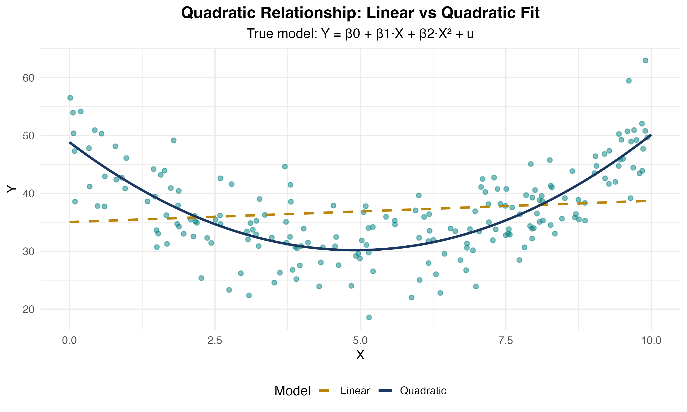
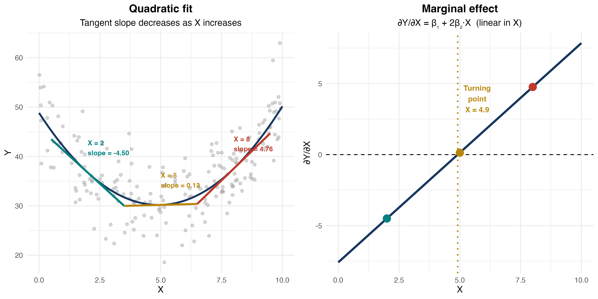
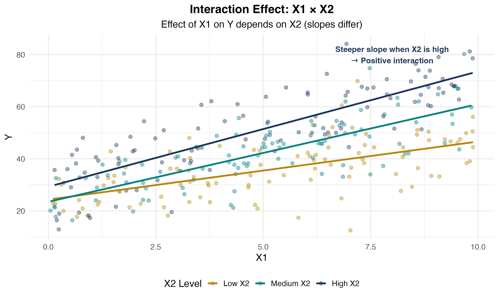
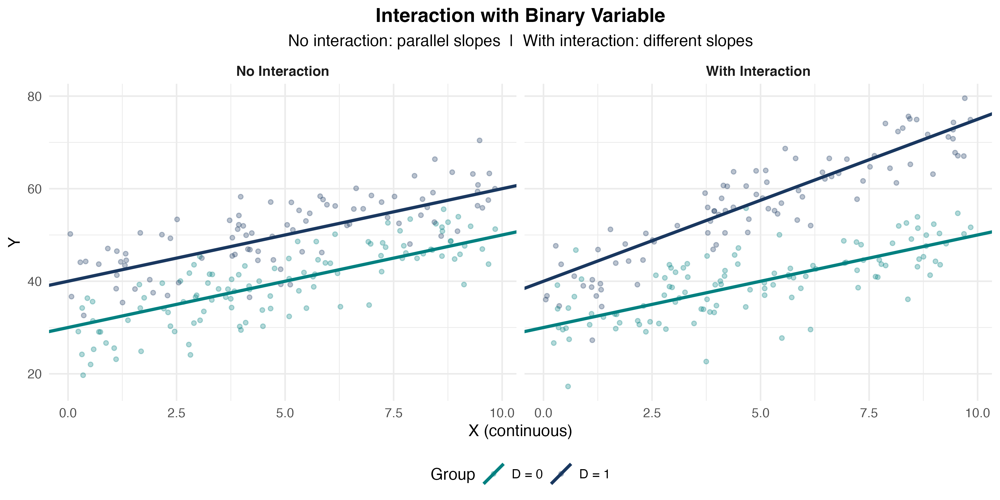
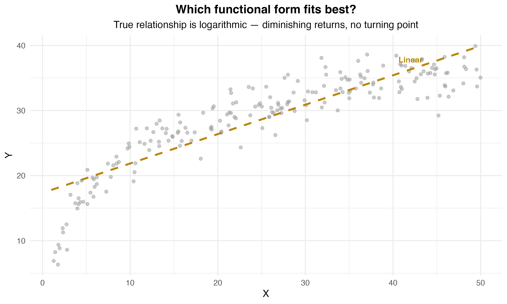
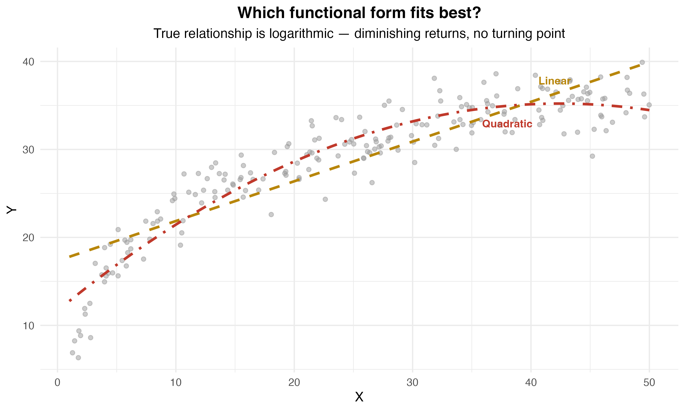
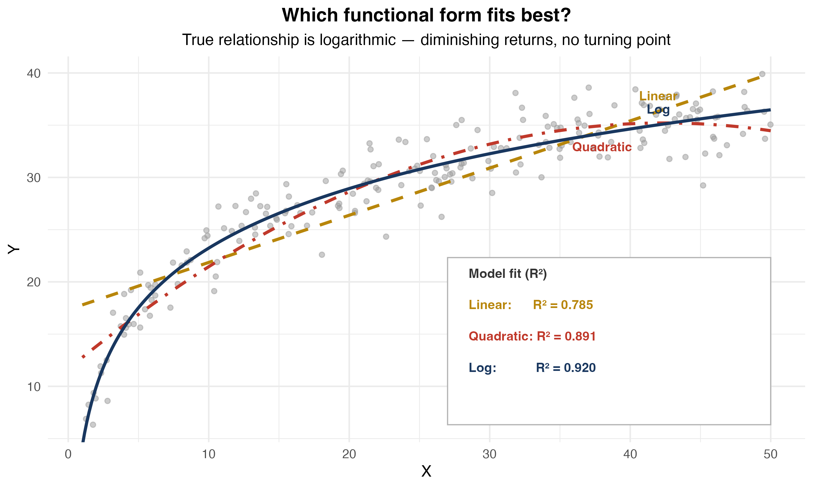
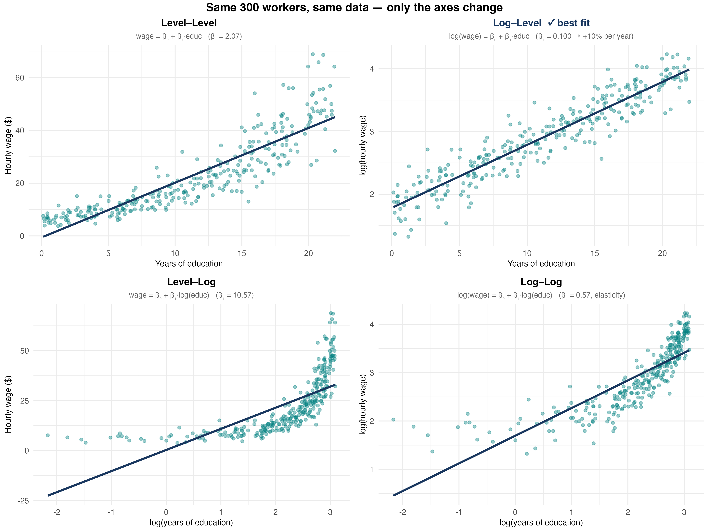
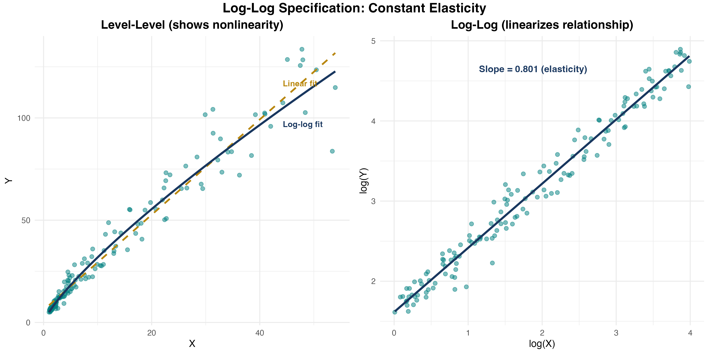

## What You'll Learn Today

::: {.callout-important}
## Central Question
What if the relationship between $X$ and $Y$ is [not]{.alert} a straight line?
:::

**By the end of this chapter, you will:**

1. Model [polynomial relationships]{.kw} (quadratic, cubic)
2. Compute and interpret [marginal effects]{.kw}
3. Estimate [interaction effects]{.kw} between variables
4. Use [logarithmic transformations]{.kw} effectively
5. Apply these tools in Stata

# Why Nonlinear?

## The Linear Assumption

So far, we've assumed relationships are linear:

$$
Y_i = \beta_0 + \beta_1 X_i + u_i
$$

. . .

**Interpretation:** A one-unit increase in $X$ changes $Y$ by $\beta_1$ units, [regardless of $X$'s current value]{.alert}.

. . .

**But is this realistic?**

- Does the first year of education have the same effect as the 20th?
- Does doubling advertising from \$1K to \$2K have the same effect as doubling from \$100K to \$200K?
- Does the effect of training depend on whether the worker is already skilled?

## The Dose Makes the Poison

{width=65% fig-align="center"}

## Real-World Examples of Nonlinearity

**Diminishing returns:**

- Fertilizer on crop yield (eventually toxic!)
- Study hours on test scores (exhaustion sets in)
- Experience on wages (plateaus after 30+ years)

. . .

**Increasing returns:**

- Network effects (social media value)
- Learning curves (skills compound)

. . .

**Interactions:**

- Effect of education may depend on ability
- Effect of experience may differ by gender

## Three Tools for Nonlinearity

1. **Polynomial regression** — Add $X^2$, $X^3$, etc. to model curvature

2. **Interaction terms** — Include $X_1 \cdot X_2$ to allow effects to vary

3. **Logarithmic transformations** — Use $\log(Y)$ or $\log(X)$ for percentage changes

. . .

::: {.callout-important}
## Key Insight
All three remain [linear in parameters]{.alert} — we can still use OLS!
(A model like $Y_i = \beta_0 e^{\beta_1 X_i} + u_i$ is *not* linear in parameters and cannot be estimated by OLS directly.)
:::

## The General Nonlinear Regression Model

::: {.callout-note}
## General Form
$$
Y_i = f(X_{1i}, X_{2i}, \ldots, X_{ki}) + u_i
$$
:::

. . .

**The OLS assumptions carry over unchanged:**

1. $E[u_i \mid X_{1i}, \ldots, X_{ki}] = 0$
2. $(X_{1i}, \ldots, X_{ki}, Y_i)$ are i.i.d.
3. Large outliers are rare
4. No perfect multicollinearity

## Marginal Effects in Nonlinear Models

The effect of a change in $X_1$, holding $X_2, \ldots, X_k$ constant:

$$
\Delta Y = f(X_1 + \Delta X_1, X_2, \ldots, X_k) - f(X_1, X_2, \ldots, X_k)
$$

. . .

**Key difference from the linear model:** the marginal effect [depends on the current value of $X_1$]{.alert} (and possibly other variables).

. . .

In the linear model: $\Delta Y = \beta_1 \Delta X_1$ — constant everywhere.

In a nonlinear model: $\Delta Y$ must be evaluated at a specific value of $X_1$.

# Polynomial Regression

## The Quadratic Model

::: {.callout-note}
## Quadratic Regression Model

$$
Y_i = \beta_0 + \beta_1 X_i + \beta_2 X_i^2 + u_i
$$
:::

. . .

**Why quadratic?**

- Allows for [curvature]{.alert} in the relationship
- Can capture diminishing or increasing returns
- Flexible, but not too flexible (avoids overfitting)

. . .

**Still linear in parameters:** We estimate $\beta_0, \beta_1, \beta_2$ via OLS!

## Visualizing Quadratic Relationships

{width=80%}

## Interpreting Quadratic Coefficients

$$
Y_i = \beta_0 + \beta_1 X_i + \beta_2 X_i^2 + u_i
$$

. . .

**Key point:** The effect of $X$ on $Y$ is [no longer constant]{.alert}!

. . .

::: {.callout-important}
## Marginal Effect in Quadratic Model

$$
\frac{\partial Y}{\partial X} = \beta_1 + 2\beta_2 X
$$

The marginal effect [depends on the value of $X$]{.alert}!
:::

. . .

**Interpretation:**

- At $X = 0$: marginal effect is $\beta_1$
- At $X = 10$: marginal effect is $\beta_1 + 20\beta_2$
- The marginal effect changes by $2\beta_2$ for each unit increase in $X$

## Example: Earnings and Experience

**Model:**

$$
\log(wage) = \beta_0 + \beta_1 \cdot experience + \beta_2 \cdot experience^2 + u
$$

. . .

**Estimated:**

$$
\widehat{\log(wage)} = 1.5 + 0.08 \cdot experience - 0.0012 \cdot experience^2
$$

. . .

**Interpretation:**

- $\hat{\beta}_1 = 0.08 > 0$: wages initially increase with experience
- $\hat{\beta}_2 = -0.0012 < 0$: inverted-U shape (diminishing returns)
- Marginal effect = $0.08 - 2(0.0012) \times experience$

## Calculating Marginal Effects

**Estimated model:**

$$
\log(wage) = 1.5 + 0.08 \cdot exper - 0.0012 \cdot exper^2
$$

. . .

At $exper = 10$ years:

$$
\frac{\partial \log(wage)}{\partial exper} = 0.08 - 2(0.0012)(10) = 0.08 - 0.024 = 0.056
$$

. . .

At $exper = 30$ years:

$$
\frac{\partial \log(wage)}{\partial exper} = 0.08 - 2(0.0012)(30) = 0.08 - 0.072 = 0.008
$$

. . .

**Interpretation:** The wage boost from an additional year of experience falls from 5.6% (at 10 years) to 0.8% (at 30 years).

## Finding the Turning Point

For an inverted-U relationship, where does the maximum occur?

. . .

**Set the marginal effect to zero:**

$$
\beta_1 + 2\beta_2 X^* = 0 \quad \Rightarrow \quad X^* = -\frac{\beta_1}{2\beta_2}
$$

. . .

**Example:** $\log(wage) = 1.5 + 0.08 \cdot exper - 0.0012 \cdot exper^2$

$$
exper^* = -\frac{0.08}{2(-0.0012)} = \frac{0.08}{0.0024} \approx 33.3 \text{ years}
$$

. . .

**Interpretation:** Wages peak at about 33 years of experience, then decline.

## Visualizing Marginal Effects

{width=80%}

## Knowledge Check: Quadratic Model {.smaller}

::: {.callout-tip}
## Question
You estimate: $sales = 100 + 15 \cdot price - 0.5 \cdot price^2$

1. What is the marginal effect of price on sales at $price = 10$?
2. At what price are sales maximized?
:::

. . .

::: {.callout-important}
## Answer
**Part 1:** Marginal effect $= 15 - 2(0.5)(10) = 15 - 10 = 5$. At \$10, raising price by \$1 increases sales by 5 units.

**Part 2:** Turning point: $price^* = -\frac{15}{2(-0.5)} = 15$. Sales are maximized at $price = 15$.
:::

## Cubic and Higher-Order Polynomials

**Cubic model:**

$$
Y_i = \beta_0 + \beta_1 X_i + \beta_2 X_i^2 + \beta_3 X_i^3 + u_i
$$

. . .

**Marginal effect:**

$$
\frac{\partial Y}{\partial X} = \beta_1 + 2\beta_2 X + 3\beta_3 X^2
$$

. . .

**When to use:** Multiple turning points, S-shaped patterns.

. . .

::: {.callout-note}
## Overfitting
[Overfitting]{.alert} occurs when we end up fitting the [noise]{.alert} in the data rather than the underlying relationship. The model fits the sample well but performs poorly out of sample.
:::

**Warning:** Higher-order polynomials can [overfit]{.alert} and behave erratically at extremes. Use sparingly!

## Stata Implementation: Polynomial Regression {.smaller}

**Create polynomial terms:**

```stata
generate experience2 = experience^2
generate experience3 = experience^3
```

**Estimate model:**

```stata
regress log_wage education experience experience2, robust
```

**Compute marginal effect at mean experience:**

```stata
summarize experience
scalar exper_mean = r(mean)
display "Marginal effect = " _b[experience] + 2*_b[experience2]*exper_mean
```

**Shortcut using margins:**

```stata
margins, dydx(experience) at(experience=10)
```

## Testing Whether the Quadratic Term Belongs

**Two key hypothesis tests:**

. . .

**Test 1 — Is the quadratic term significant?**

$$H_0: \beta_2 = 0 \quad \text{vs.} \quad H_1: \beta_2 \neq 0$$

Use the $t$-statistic on $\hat{\beta}_2$. Reject → evidence of a nonlinear relationship.

. . .

**Test 2 — Does $X$ have any effect at all?** (joint test)

$$H_0: \beta_1 = \beta_2 = 0$$

Use the $F$-statistic. Reject → $X$ matters (linearly or nonlinearly).

## Stata: Testing Polynomial Terms {.smaller}

**Test if quadratic term is needed:**

```stata
regress testscore income income2, robust
test income2
```

. . .

**Test if income matters at all (joint F-test):**

```stata
test income income2
```

. . .

::: {.callout-important}
## Interpreting the Tests
- Reject $H_0: \beta_2 = 0$ → keep the quadratic term; relationship is nonlinear
- Fail to reject $H_0: \beta_2 = 0$ → can simplify back to linear model
- Reject $H_0: \beta_1 = \beta_2 = 0$ → income has some effect on test scores
:::

# Interaction Effects

## What Are Interactions?

::: {.callout-note}
## Interaction Effect
The effect of $X_1$ on $Y$ [depends on]{.alert} the value of $X_2$.
:::

. . .

**Examples:**

- Does the effect of job training on employment depend on local unemployment conditions?
- Does the effect of class size on test scores differ by student income level?
- Does the price elasticity of demand differ for necessities vs. luxuries?

. . .

**Mathematical representation:**

$$
Y_i = \beta_0 + \beta_1 X_{1i} + \beta_2 X_{2i} + \beta_3 (X_{1i} \times X_{2i}) + u_i
$$

The [interaction term]{.alert} is $X_1 \times X_2$.

## Three Types of Interactions

1. **Binary × Binary** — Does the effect of one group membership vary by another?
   - *Example: Does the gender wage gap differ by sector (public vs. private)?*

2. **Binary × Continuous** — Does the slope differ across groups?
   - *Example: Does the return to education differ by gender?*

3. **Continuous × Continuous** — Does the effect of one variable depend on the level of another?
   - *Example: Does the return to education grow with experience?*

. . .

All three are estimated the same way: include the product term plus both main effects.

## Binary × Binary Interaction

**Model:**

$$
Y_i = \beta_0 + \beta_1 D_{1i} + \beta_2 D_{2i} + \beta_3 (D_{1i} \cdot D_{2i}) + u_i
$$

where $D_1$ and $D_2$ are dummy variables.

. . .

**Predicted values for each group:**

| | $D_2 = 0$ | $D_2 = 1$ |
|---|---|---|
| $D_1 = 0$ | $\beta_0$ | $\beta_0 + \beta_2$ |
| $D_1 = 1$ | $\beta_0 + \beta_1$ | $\beta_0 + \beta_1 + \beta_2 + \beta_3$ |

. . .

$\beta_3$ captures the [extra effect]{.alert} of being in both groups simultaneously — beyond what you'd expect from the main effects alone.

## Example: Gender Gap by Sector {.smaller}

**Question:** Does the gender wage gap differ in the public sector?

**Model:**

$$
wage = \beta_0 + \beta_1 \cdot female + \beta_2 \cdot public + \beta_3 (female \times public) + u
$$

**Estimated:**

$$
\hat{wage} = 25 - 4 \cdot female + 3 \cdot public + 2 \cdot (female \times public)
$$

. . .

**What is the predicted wage for each group? What does $\hat{\beta}_3$ tell us?**

## Continuous × Continuous Interaction

**Model:**

$$
Y_i = \beta_0 + \beta_1 X_{1i} + \beta_2 X_{2i} + \beta_3 (X_{1i} \cdot X_{2i}) + u_i
$$

. . .

**Marginal effect of $X_1$:**

$$
\frac{\partial Y}{\partial X_1} = \beta_1 + \beta_3 X_2
$$

. . .

**Interpretation:**

- When $X_2 = 0$: effect of $X_1$ is $\beta_1$
- When $X_2 = 10$: effect of $X_1$ is $\beta_1 + 10\beta_3$
- The effect of $X_1$ changes by $\beta_3$ for each unit increase in $X_2$

## Example: Education and Experience Interaction

**Question:** Does the return to education depend on experience?

**Model:**

$$
wage = \beta_0 + \beta_1 \cdot education + \beta_2 \cdot experience + \beta_3 (education \times experience) + u
$$

**Estimated:**

$$
\hat{wage} = 2.0 + 1.5 \cdot education + 0.3 \cdot experience + 0.05 \cdot (education \times experience)
$$

. . .

**Interpretation:**

- For someone with 0 years experience: return to education = \$1.50/year
- For someone with 10 years experience: return = \$1.50 + 0.05(10) = \$2.00/year
- Education becomes more valuable as you gain experience!

## Visualizing Continuous × Continuous Interactions

{width=80%}

## Binary × Continuous Interaction

**Model:**

$$
Y_i = \beta_0 + \beta_1 X_i + \beta_2 D_i + \beta_3 (X_i \cdot D_i) + u_i
$$

where $D_i$ is a dummy variable (0 or 1).

. . .

**Interpretation:**

- When $D = 0$: $Y = \beta_0 + \beta_1 X$ (baseline group)
- When $D = 1$: $Y = (\beta_0 + \beta_2) + (\beta_1 + \beta_3) X$ (treatment group)
- $\beta_2$: intercept shift | $\beta_3$: slope shift

## Example: Gender Wage Gap

**Model:**

$$
wage = \beta_0 + \beta_1 \cdot education + \beta_2 \cdot female + \beta_3 (education \times female) + u
$$

**Estimated:**

$$
\hat{wage} = 3.0 + 2.0 \cdot education - 1.5 \cdot female - 0.3 \cdot (education \times female)
$$

. . .

**Interpretation:**

- **Men** ($female = 0$): $wage = 3.0 + 2.0 \cdot education$
- **Women** ($female = 1$): $wage = 1.5 + 1.7 \cdot education$
- Women earn \$1.50 less at 0 education; \$0.30 less per year of education. Gap widens with education!

## Visualizing Binary × Continuous Interactions

{width=80%}

## Knowledge Check: Interaction Effects {.smaller}

::: {.callout-tip}
## Question
You estimate: $price = 50 + 10 \cdot quality + 5 \cdot advertising + 2 \cdot (quality \times advertising)$

1. What is the marginal effect of advertising when quality = 5?
2. What is the marginal effect of advertising when quality = 10?
:::

. . .

::: {.callout-important}
## Answer
Marginal effect of advertising = $5 + 2 \times quality$

**Part 1:** At quality = 5: effect = $5 + 2(5) = 15$

**Part 2:** At quality = 10: effect = $5 + 2(10) = 25$

Advertising is more effective for higher-quality products!
:::

## Stata Implementation: Interactions {.smaller}

**Method 1: Create interaction manually**

```stata
generate educ_exper = education * experience
regress wage education experience educ_exper, robust
```

**Method 2: Factor variable notation (preferred)**

```stata
regress wage c.education##c.experience, robust  // continuous × continuous
regress wage c.education##i.female, robust       // continuous × dummy
regress wage i.female##i.public, robust          // dummy × dummy
```

**Compute marginal effects at different values:**

```stata
margins, dydx(education) at(experience=(0 10 20 30))
```

::: {.callout-note}
## Factor variable prefixes
- `c.varname` — tells Stata to treat the variable as [continuous]{.kw}
- `i.varname` — tells Stata to treat the variable as [categorical/dummy]{.kw}
- `##` — includes the interaction *and* both main effects automatically

**String variables:** Factor notation requires numeric variables. If your variable is a string, convert it first: `encode strvar, gen(numvar)`, then use `i.numvar`. Alternatively, use the older `xi:` prefix: `xi: regress wage i.female*education`.
:::

## Common Mistakes with Interactions {.smaller}

[**Mistake 1: Including interaction but omitting main effects**]{.alert}

Never include $X_1 \times X_2$ without also including $X_1$ and $X_2$ separately. Omitting a main effect forces a constraint (e.g., that the baseline group has a zero intercept) that is almost always wrong.

. . .

[**Mistake 2: Interpreting $\beta_1$ as "the" effect of $X_1$**]{.alert}

In $Y = \beta_0 + \beta_1 X_1 + \beta_2 X_2 + \beta_3 X_1 X_2$, the effect of $X_1$ is $\beta_1 + \beta_3 X_2$ — it depends on $X_2$. $\beta_1$ is only the effect of $X_1$ when $X_2 = 0$, which may not be a meaningful value.

. . .

[**Mistake 3: Testing the wrong hypothesis**]{.alert}

To test whether an interaction matters, test $H_0: \beta_3 = 0$ (not $H_0: \beta_1 = 0$). In Stata: `test` after `regress`, or read the $t$-statistic on the interaction term directly.

## Choosing Interaction Terms

**When should you include an interaction?**

. . .

1. **Theory first** — Is there a compelling reason that the effect of $X_1$ depends on $X_2$? If yes, include the interaction regardless of significance.

. . .

2. **Statistical test** — Test $H_0: \beta_3 = 0$. If rejected, the interaction is statistically significant.

. . .

3. **Model fit** — The [adjusted $R^2$]{.kw} ($\bar{R}^2$) penalizes for added parameters. If $\bar{R}^2$ rises when you add the interaction term, that provides additional support for including it.

# Logarithmic Specifications

## When Is a Log the Right Tool?

::: {.r-stack}
{width=90%}

{width=90% .fragment}

{width=90% .fragment}
:::

## Why Logarithms?

**Three key advantages:**

1. **Percentage interpretation** — Coefficients represent [percentage changes]{.alert}, not unit changes
2. **Diminishing returns automatically** — $\log(X)$ is concave (built-in curvature!)
3. **Elasticities** — Direct estimates of elasticity in log-log models

. . .

**Important:** Can only take log of [positive]{.alert} variables!

## Advantages and Caveats of Logs

**Advantages:**

- Coefficients have convenient percentage/elasticity interpretations
- Slope coefficients are invariant to rescaling of the variable
- Often reduces the influence of outliers
- Can improve normality and homoskedasticity of residuals

. . .

**Caveats:**

- Cannot log zero or negative values (income, price: fine; test scores starting at 0: not fine)
- Do not log variables measured in years or percentage points (e.g., age, interest rate)
- Harder to reverse the log transformation when constructing predictions

## Four Logarithmic Models

| Model | Equation | Interpretation |
|--------|----------|----------------|
| **Level-level** | $Y = \beta_0 + \beta_1 X$ | $\Delta Y = \beta_1 \Delta X$ |
| **Log-level** | $\log Y = \beta_0 + \beta_1 X$ | $\%\Delta Y = 100\beta_1 \Delta X$ |
| **Level-log** | $Y = \beta_0 + \beta_1 \log X$ | $\Delta Y = (\beta_1/100) \%\Delta X$ |
| **Log-log** | $\log Y = \beta_0 + \beta_1 \log X$ | $\%\Delta Y = \beta_1 \%\Delta X$ |

. . .

**Key insight:** Each log transforms a unit change into a percentage change!

## The Log Approximation

::: {.callout-note}
## Key Fact
For **small** changes in $X$:

$$100 \cdot \Delta \log(X) \approx \%\Delta X$$
:::

. . .

| Change in $X$ | Log approximation | Exact % change |
|---|---|---|
| 50 → 51 | 1.98% | 2.00% |
| 50 → 50.5 | 0.995% | 1.00% |
| 50 → 60 | 18.2% | 20.0% |
| 50 → 80 | 47.0% | 60.0% |

. . .

**Rule of thumb:** Approximation works well for changes up to ~10%. For larger changes, use the exact formula: $\%\Delta Y = 100(e^{\hat{\beta}} - 1)$.

## Level-Level (Baseline)

$$
Y_i = \beta_0 + \beta_1 X_i + u_i
$$

**Interpretation:** A one-unit increase in $X$ is associated with a $\beta_1$-unit change in $Y$.

**Example:** $wage = 5 + 2.5 \cdot education$ — Each additional year of education increases wages by \$2.50/hour.

## Log-Level

$$
\log(Y_i) = \beta_0 + \beta_1 X_i + u_i
$$

::: {.callout-important}
## Log-Level Interpretation
A one-unit increase in $X$ is associated with a $100\beta_1$% change in $Y$.
:::

**Example:** $\log(wage) = 1.5 + 0.08 \cdot education$ — Each additional year of education increases wages by 8%.

. . .

**Large changes:** When $100\beta_1 > 10\%$, use the exact formula:

$$\%\Delta \hat{Y} = 100(e^{\hat{\beta}_1} - 1)$$

*Always preserve the sign of the coefficient!*

## Level-Log

$$
Y_i = \beta_0 + \beta_1 \log(X_i) + u_i
$$

::: {.callout-important}
## Level-Log Interpretation
A 1% increase in $X$ is associated with a $\beta_1/100$ unit change in $Y$.
:::

**Example:** $wage = 2 + 5 \log(experience)$ — A 1% increase in experience increases wages by \$0.05/hour. Doubling experience (100% increase) raises wages by \$5/hour.

## Where Does Log-Level Come From? {.smaller}

**Model:** $\log(wage) = \beta_0 + \beta_1 \cdot educ + u$

**Goal:** What happens to $wage$ when $educ$ increases by 1?

. . .

**Step 1:** Take the partial derivative of both sides with respect to $educ$:

$$\Delta \log(wage) = \beta_1 \cdot \Delta educ$$

. . .

**Step 2:** Multiply both sides by 100:

$$100 \cdot \Delta \log(wage) = 100\beta_1 \cdot \Delta educ$$

. . .

**Step 3:** Apply the log approximation ($100 \cdot \Delta \log(x) \approx \%\Delta x$):

$$\%\Delta wage \approx 100\beta_1 \cdot \Delta educ$$

. . .

**Conclusion:** A one-unit increase in $educ$ is associated with a $100\beta_1$% change in $wage$.

## Where Does Level-Log Come From? {.smaller}

**Model:** $wage = \beta_0 + \beta_1 \log(educ) + u$

**Goal:** What happens to $wage$ when $educ$ increases by 1%?

. . .

**Step 1:** Take the partial derivative of both sides with respect to $\log(educ)$:

$$\Delta wage = \beta_1 \cdot \Delta \log(educ)$$

. . .

**Step 2:** Multiply and divide the right side by 100:

$$\Delta wage = \frac{\beta_1}{100} \cdot 100 \cdot \Delta \log(educ)$$

. . .

**Step 3:** Apply the log approximation ($100 \cdot \Delta \log(x) \approx \%\Delta x$):

$$\Delta wage \approx \frac{\beta_1}{100} \cdot \%\Delta educ$$

. . .

**Conclusion:** A 1% increase in $educ$ is associated with a $\beta_1 / 100$ unit change in $wage$.

## Log-Log (Elasticity)

$$
\log(Y_i) = \beta_0 + \beta_1 \log(X_i) + u_i
$$

::: {.callout-important}
## Log-Log Interpretation
$\beta_1$ is the [elasticity]{.alert} of $Y$ with respect to $X$. A 1% increase in $X$ leads to a $\beta_1$% change in $Y$.
:::

**Example:** $\log(quantity) = 2.5 - 1.2 \log(price)$ — A 1% increase in price leads to a 1.2% decrease in quantity (price elasticity of demand).

## Visualizing Log Specifications

{width=75%}

## Log-Log Specification in Detail

{width=75%}

## Knowledge Check: Log Specifications

**What are the units? How do we interpret each coefficient?**

::: {.incremental}
- a) $wage = 5 + 0.3 \cdot experience$

- b) $\log(wage) = 1.2 + 0.04 \cdot experience$

- c) $wage = 8 + 2.5 \log(experience)$

- d) $\log(wage) = 1.5 + 0.15 \log(experience)$
:::

## Knowledge Check: Answers {.smaller .scrollable}

**a)** $wage = 5 + 0.3 \cdot experience$ — **level-level**
$\Delta wage = 0.3 \cdot \Delta experience$ → each additional year raises wages by **\$0.30**

. . .

**b)** $\log(wage) = 1.2 + 0.04 \cdot experience$ — **log-level**
$\Delta \log(wage) = 0.04 \cdot \Delta experience$, so $\%\Delta wage \approx 100(0.04)(1)$ → each additional year raises wages by **4%**

. . .

**c)** $wage = 8 + 2.5 \log(experience)$ — **level-log**
$\Delta wage = 2.5 \cdot \Delta \log(experience)$, so $\Delta wage = (2.5/100) \cdot \%\Delta experience$ → a 1% increase in experience raises wages by **\$0.025**

. . .

**d)** $\log(wage) = 1.5 + 0.15 \log(experience)$ — **log-log (elasticity)**
$\%\Delta wage = 0.15 \cdot \%\Delta experience$ → a 1% increase in experience raises wages by **0.15%**

## Interpretation Guide Summary {.smaller}

| Model | Specification | Interpret $\hat\beta_1$ as... |
|-------|--------------|-------------------------------|
| **Level–Level** | $Y = \beta_0 + \beta_1 X$ | +1 unit in $X$ → $+\beta_1$ units in $Y$ |
| **Log–Level** | $\log(Y) = \beta_0 + \beta_1 X$ | +1 unit in $X$ → $+(100\beta_1)$% in $Y$ |
| **Level–Log** | $Y = \beta_0 + \beta_1 \log(X)$ | +1% in $X$ → $+\beta_1/100$ units in $Y$ |
| **Log–Log** | $\log(Y) = \beta_0 + \beta_1 \log(X)$ | +1% in $X$ → $+\beta_1$% in $Y$ (**elasticity**) |

. . .

::: {.callout-tip}
## Memory aid

- Is $Y$ logged? → interpret as % change in $Y$
- Is $X$ logged? → interpret as % change in $X$
- Both logged? → elasticity
:::

## Stata Implementation: Logs

**Generate log variables:**

```stata
generate log_wage = log(wage)
generate log_sales = log(sales)
generate log_price = log(price)
```

**Estimate different specifications:**

```stata
* Log-level
regress log_wage education experience, robust

* Level-log
regress wage log_experience log_sales, robust

* Log-log
regress log_quantity log_price log_income, robust
```

**Important:** Always use natural log (`log` in Stata), not log10 or log2!

## When to Use Logarithms?

**Ask: which is more meaningful for your variable?**

. . .

1. [Absolute changes]{.kw} → use **levels**
   - "An additional year of education raises wages by \$3"

2. [Percent changes]{.kw} → use **logs**
   - "An additional year of education raises wages by 8%"

. . .

::: {.callout-tip}
## Practical Guidance
- **Wages, income, prices, GDP** → usually log (wide range; percent interpretation natural)
- **Test scores, years of education, rates** → usually levels (bounded; percentage interpretation less natural)
- **Variables that can be zero or negative** → cannot log; use levels
- You do not need to transform all variables — mix levels and logs as theory dictates
:::

# Bringing It All Together

## The Nonlinear Toolkit

| Tool | Use When | Gives You |
|------|----------|-----------|
| Polynomial | Curved relationships, turning points | Marginal effects that vary with $X$ |
| Interactions | Effect depends on another variable | Different slopes for different groups |
| Logarithms | Wide ranges, percentage interpretation | Elasticities, diminishing returns |

. . .

**Key principle:** All remain [linear in parameters]{.alert} — we can use OLS and all our inference tools!

## Key Formulas Summary

| Model | Marginal Effect |
|--------|-----------------|
| Quadratic | $\frac{\partial Y}{\partial X} = \beta_1 + 2\beta_2 X$ |
| Interaction | $\frac{\partial Y}{\partial X_1} = \beta_1 + \beta_3 X_2$ |
| Log-level | $\frac{\%\Delta Y}{\Delta X} = 100\beta_1$ |
| Level-log | $\frac{\Delta Y}{\%\Delta X} = \beta_1/100$ |
| Log-log (elasticity) | $\frac{\%\Delta Y}{\%\Delta X} = \beta_1$ |

**Turning point:** $X^* = -\frac{\beta_1}{2\beta_2}$ (quadratic model)

