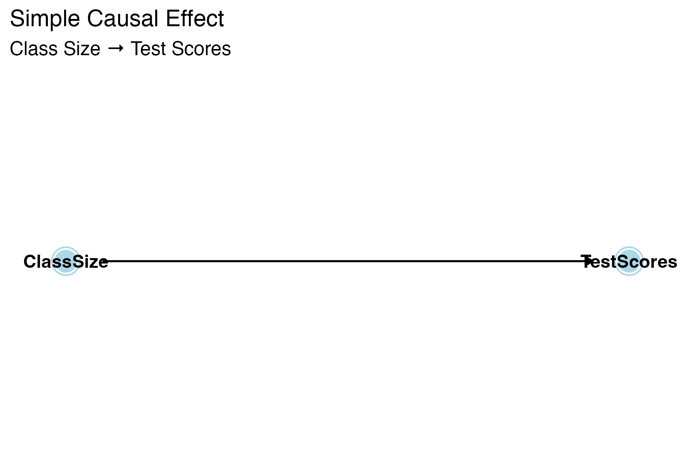
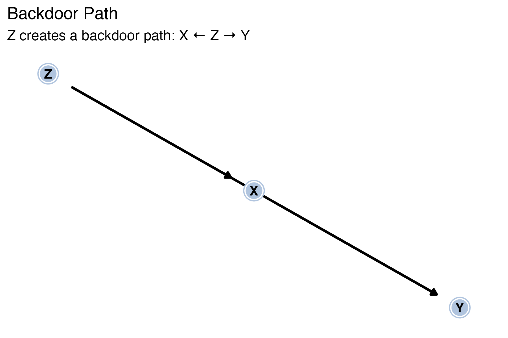
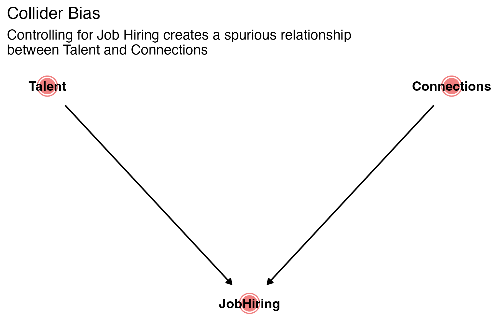
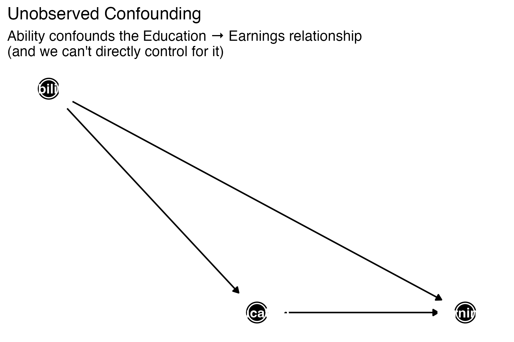
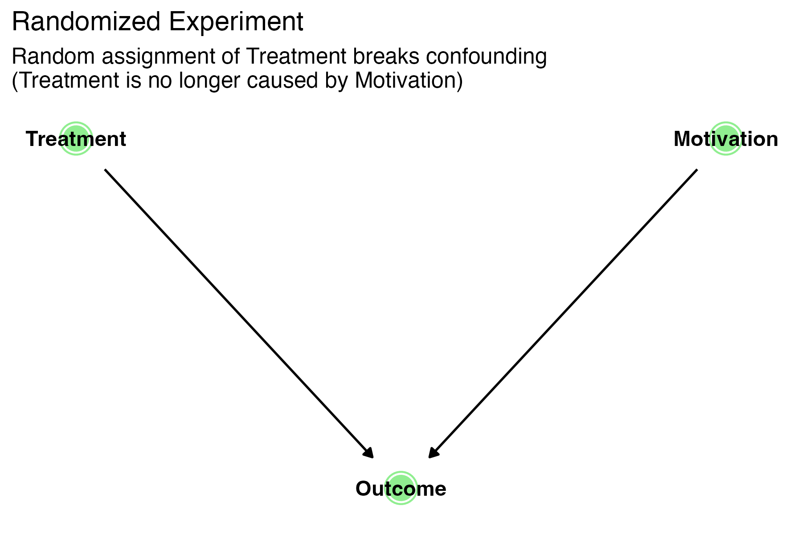
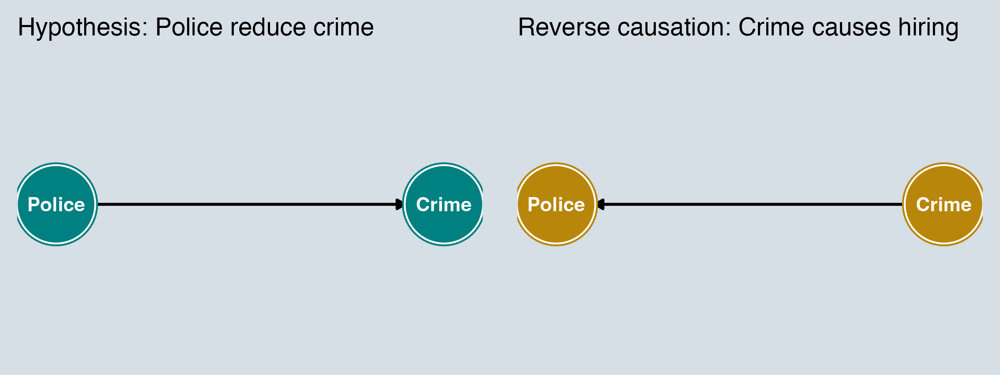
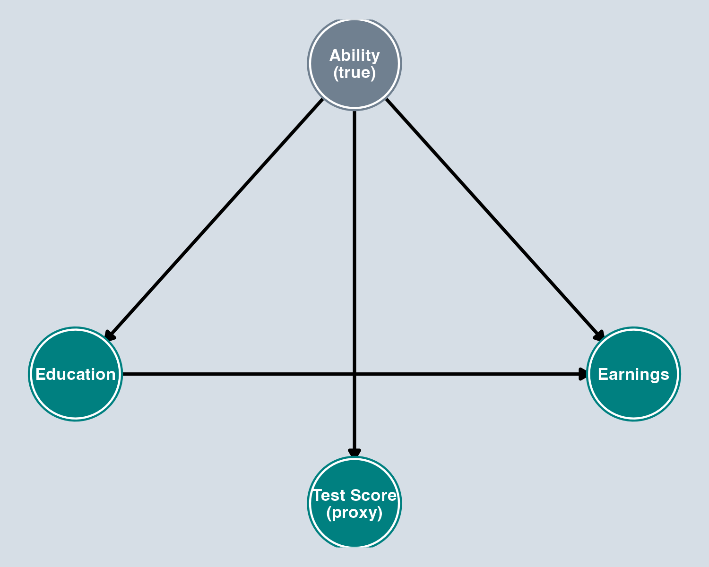
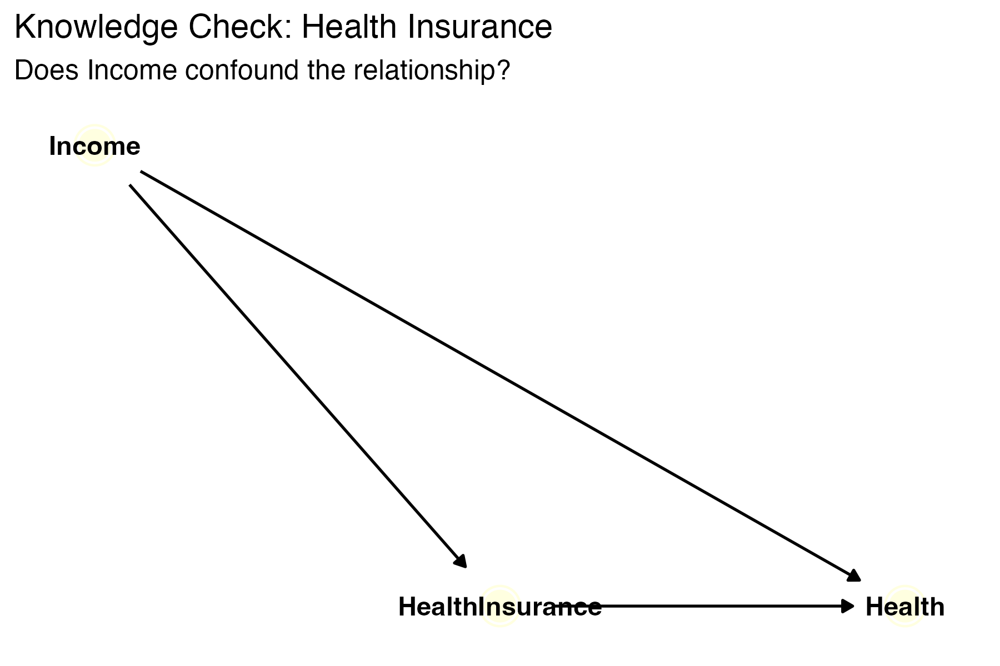
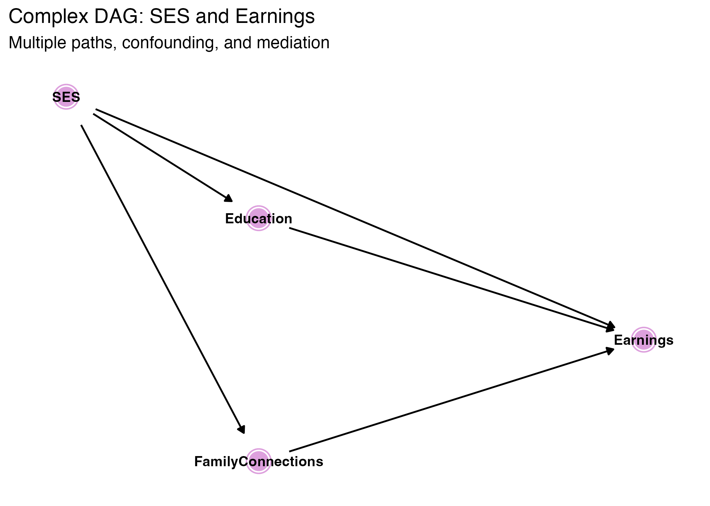

## Learning Objectives

By the end of this lecture, you will be able to:

1. Draw and interpret [directed acyclic graphs (DAGs)]{.kw}
2. Identify [causal paths]{.kw}, [backdoor paths]{.kw}, and [colliders]{.kw}
3. Determine which variables to [control for]{.kw} to identify a causal effect
4. Explain why controlling for the wrong variables can [bias]{.alert} your estimates
5. Apply DAG logic to real research questions

. . .

::: {.callout-tip}
## Reading
Huntington-Klein, *The Effect*: **Chapters 6, 7, and 8** (available free at [theeffectbook.net](https://theeffectbook.net))
:::

# What Is Causality?

## The Data Generating Process

Every dataset we observe is produced by a [data generating process (DGP)]{.kw} — the real-world laws, behaviors, and institutions that determine the values we see.

. . .

**Our challenge as econometricians:**

- We observe the *data*, not the DGP
- Multiple DGPs could produce the same data patterns
- We need a framework for reasoning about *which variation* in our data answers our research question

. . .

::: {.callout-important}
## Identification
[Identification]{.kw} is the process of figuring out what part of the variation in your data answers your research question.
:::

## Association vs. Causation

::: {.callout-note}
## Association
Two variables move together (correlation). $X$ and $Y$ are related statistically.
:::

. . .

::: {.callout-note}
## Causation
Changing $X$ **causes** $Y$ to change. Formally: if we could *intervene* to change $X$, the distribution of $Y$ would change as a result.
:::

. . .

- **Association:** Useful for prediction, not necessarily for policy
- **Causation:** Required for policy impact, program evaluation, treatment effects

## The Framework: Causal Diagrams (DAGs) {.smaller}

A **directed acyclic graph (DAG)** is a visual representation of a data generating process:

- **Variables** (nodes) — circles representing measured or unmeasured quantities
- **Causal relationships** (arrows) — direction of causality
- **No cycles** — causality flows forward (you can't follow arrows back to where you started)

. . .

**Key insight:** Once we draw the DAG, we can **mechanically determine** which variables to control for to identify a causal effect.

. . .

::: {.callout-warning}
## Important assumption
Every variable and arrow that is *not* on the diagram is an assumption we're making. Drawing a DAG forces you to be explicit about your identifying assumptions.
:::

# Drawing and Reading DAGs

## DAG Basics: Nodes and Arrows

:::: {.columns}

::: {.column width="50%"}
**Node:** A variable in the system.

Each circle represents a variable — either observed or unobserved.

**Arrow:** $X \rightarrow Y$ means "$X$ causes $Y$."

- Direction matters (from cause to effect)
- $X$ is a [parent]{.kw} (ancestor) of $Y$
- $Y$ is a [child]{.kw} (descendant) of $X$
:::

::: {.column width="50%"}
{width=100% fig-align="center"}
:::

::::

## Example: Class Size and Student Achievement

:::: {.columns}

::: {.column width="45%"}
{width=100% fig-align="center"}
:::

::: {.column width="55%"}
**Variables:**

- $X$ = Class Size, $Y$ = Test Scores, $Z$ = Wealth

**Causal arrows:**

- Wealth → Class Size (wealthy areas have smaller classes)
- Wealth → Test Scores (wealthier students score higher)
- Class Size → Test Scores (smaller classes improve learning)
:::

::::

## Causal (Front Door) Paths

$X \rightarrow Y$ (or $X \rightarrow M \rightarrow Y$)

Direct or indirect effect of $X$ on $Y$, with all arrows pointing *away from* $X$.

These are [good paths]{.kw} — they represent what we *want* to estimate.

. . .

**Example:** Class Size → Test Scores

## Backdoor Paths

$X \leftarrow Z \rightarrow Y$

$X$ and $Y$ are connected through a common cause $Z$. These are [bad paths]{.alert} — they create **confounding**.

. . .

**Example:** Class Size ← Wealth → Test Scores

. . .

::: {.callout-important}
## Connection to OVB
A backdoor path is exactly what creates [omitted variable bias]{.kw}. If $Z$ is a common cause of $X$ and $Y$ and you leave it out of the regression, you have an open backdoor path — and OVB.
:::

## Collider Paths

$X \rightarrow Z \leftarrow Y$

$X$ and $Y$ both cause $Z$. These paths are [closed by default]{.kw} — no confounding flows through them *unless* we make a mistake.

. . .

**Example:** Talent → Job Hiring ← Connections

No spurious relationship between Talent and Connections... unless we condition on who got hired.

## Open and Closed Paths {.smaller}

::: {.callout-important}
## Key Concept
A path is [open]{.kw} if the relationship flows freely between variables along it. A path is [closed]{.kw} if something blocks that flow.
:::

. . .

| Path Type | Default Status | What controls do |
|-----------|---------------|-----------------|
| Backdoor ($X \leftarrow Z \rightarrow Y$) | **Open** | Controlling for $Z$ **closes** it |
| Collider ($X \rightarrow Z \leftarrow Y$) | **Closed** | Controlling for $Z$ **opens** it |

. . .

**Our goal:** Close all bad (backdoor) paths while keeping good (causal) paths open.

# Confounding and the OVB Connection

## The Confounding Problem

::: {.callout-important}
## Confounding
When $X$ and $Y$ share a common cause $Z$, they are **confounded**. A regression of $Y$ on $X$ will pick up both the causal effect AND the confounding association.
:::

. . .

**In the class size example:**

$$\text{Association} = \underbrace{\text{Causal Effect}}_{\text{Class Size} \rightarrow \text{Scores}} + \underbrace{\text{Confounding Bias}}_{\text{via Wealth}}$$

## OVB Is an Open Backdoor Path {.smaller}

Remember [omitted variable bias]{.kw} from Chapter 6?

OVB occurs when a variable that belongs in the regression is left out. In DAG language:

- The omitted variable creates a [backdoor path]{.alert} between $X$ and $Y$
- Leaving it out of the regression means the path stays **open**
- The bias flows through that open path into your estimate of $\hat{\beta}_1$

. . .

::: {.callout-note}
## OVB ↔ Backdoor Paths
**Every case of OVB is an open backdoor path.** The DAG just gives you a visual way to see it — and to figure out what to control for.
:::

## Blocking Backdoor Paths

:::: {.columns}

::: {.column width="35%"}
{width=100% fig-align="center"}
:::

::: {.column width="60%"}
::: {.callout-note}
## Blocking a Backdoor Path
Control for (include in regression) the confounder $Z$ to "close" the backdoor path $X \leftarrow Z \rightarrow Y$.
:::

**In the class size example:**

- **Without controlling for Wealth:** Regression picks up confounding bias (path is [open]{.alert})
- **With controlling for Wealth:** Regression isolates the causal effect (path is [closed]{.kw})
:::

::::

## Knowledge Check: Direction of Bias

::: {.callout-tip}
## Think About It
If we regress Test Scores on Class Size *without* controlling for Wealth, will the class size coefficient be biased up or down?
:::

. . .

**Answer:** The coefficient on class size is biased *toward zero* (understates the negative effect).

- Wealthy areas → smaller classes AND higher scores
- This creates a *positive* confounding association between class size and scores
- The positive confounding partially cancels the true negative causal effect

# Which Variables to Control For?

## The Backdoor Criterion {.smaller}

To identify the causal effect of $X$ on $Y$:

::: {.callout-important}
## Backdoor Criterion
Control for a set of variables $\mathbf{Z}$ such that:

1. No variable in $\mathbf{Z}$ is a [descendant]{.alert} of $X$
2. Controlling for $\mathbf{Z}$ [closes all backdoor paths]{.kw} from $X$ to $Y$
:::

. . .

**In plain language:**

- **Do** control for common causes (confounders) — they create open backdoor paths
- **Don't** control for variables that $X$ affects — that would block part of the causal effect
- **Don't** control for colliders — that would *open* a path that was safely closed

## What NOT to Control For: Colliders

:::: {.columns}

::: {.column width="35%"}
{width=100% fig-align="center"}
:::

::: {.column width="60%"}
::: {.callout-warning}
## Collider Bias
If you control for a [collider]{.alert} — a variable caused by *both* $X$ and $Y$ — you **open** a previously closed path and create bias.
:::

- Talent and Connections both cause Job Hiring
- The path Talent → Job Hiring ← Connections is [closed by default]{.kw}
- If we condition on people who were hired (control for the collider), the path **opens**
- Among the hired: low Talent becomes correlated with high Connections
:::

::::

## What NOT to Control For: Mediators

::: {.callout-warning}
## Bad Control: Mediator
If $X \rightarrow M \rightarrow Y$, then $M$ is a [mediator]{.alert}. Controlling for $M$ blocks part of the causal effect of $X$ on $Y$.
:::

. . .

**Example:** Does education affect earnings?

- Education → Job Type → Earnings
- If we control for Job Type, we block the indirect effect of education that works *through* job placement
- We'd only estimate the effect of education holding job type fixed — not the total causal effect

# Applications: Identifying Causal Effects

## Does Education Cause Earnings?

:::: {.columns}

::: {.column width="35%"}
{width=100% fig-align="center"}

::: {.smaller}
[Gray node]{style="color: #708090; font-weight: bold;"} = unobserved variable
:::
:::

::: {.column width="60%"}
1. **Causal path?** Yes: Education → Earnings
2. **Backdoor paths?** Yes: Education ← Ability → Earnings
3. **What to control for?** Ability
:::

::::

## Does Education Cause Earnings? (cont.)

**Challenge:** Ability is [unobserved]{.alert}! We can't directly control for it.

This is why economists turn to **identification strategies** — instruments, experiments, panel data — to close backdoor paths when confounders are unobservable.

## Does Job Training Improve Employment? {.smaller}

:::: {.columns}

::: {.column width="35%"}
{width=100% fig-align="center"}
:::

::: {.column width="60%"}
**The problem without randomization:**

- Motivated workers are more likely to sign up for training
- Motivated workers are also more likely to find jobs
- Backdoor path: Training ← Motivation → Employment

. . .

**With an RCT:**

- Randomly assign workers to training
- Now Motivation does [not]{.alert} cause Training — that arrow is severed
- All backdoor paths are closed *by design*
:::

::::

. . .

::: {.callout-important}
This is why [randomized controlled trials (RCTs)]{.kw} are the gold standard for causal inference — they eliminate confounding mechanically.
:::

## Reverse Causation

:::: {.columns}

::: {.column width="55%"}
{width=100% fig-align="center"}
:::

::: {.column width="45%"}
::: {.callout-warning}
## Reverse Causation
Sometimes the arrow between $X$ and $Y$ runs in the **opposite direction** from what we assume.
:::

- We observe a positive correlation between police and crime
- **Our hypothesis:** More police → less crime
- **The problem:** Cities with more crime hire more police
:::

::::

. . .

In DAG terms: we've drawn the wrong DAG. The true DGP has the arrow reversed (or both arrows exist — [simultaneity]{.kw}).

## Measurement Error

:::: {.columns}

::: {.column width="40%"}
{width=100% fig-align="center"}

::: {.smaller}
[Gray]{style="color: #708090; font-weight: bold;"} = unobserved
:::
:::

::: {.column width="60%"}
::: {.callout-warning}
## Measurement Error
When we can't perfectly measure a variable in our DAG, we introduce [measurement error]{.alert}.
:::

- We want to control for Ability to close a backdoor path
- We can't measure Ability directly, so we use a proxy (Test Score)
- But Test Score ≠ Ability (noisy measurement)
- Controlling for the proxy only *partially* closes the backdoor path
- Result: our estimate is still biased — [attenuation bias]{.kw}
:::

::::

# Knowledge Checks and Practice

## Knowledge Check 1: Health Insurance

:::: {.columns}

::: {.column width="35%"}
{width=100% fig-align="center"}
:::

::: {.column width="60%"}
Does Income confound the effect of Health Insurance on Health?

To estimate the effect of Health Insurance on Health, should we control for Income?
:::

::::

## Knowledge Check 1: Answer

::: {.callout-tip}
## Answer
- There is a backdoor path: Health Insurance ← Income → Health
- Income is a common cause of both Health Insurance and Health
- So yes, we **should** control for Income — it's a confounder
:::

## Knowledge Check 2: SES and Earnings

:::: {.columns}

::: {.column width="40%"}
{width=100% fig-align="center"}
:::

::: {.column width="60%"}
**Questions:**

1. What are the backdoor paths from SES to Earnings?
2. What minimal set of variables should we control for?
:::

::::

## Knowledge Check 2: Answer

::: {.callout-tip}
## Answer
1. **Backdoor path:** SES ← (shared causes) → Earnings via Family Connections
2. **Controls:** Family Connections (to close the backdoor)
   - Do [NOT]{.alert} control for Education — it is a *descendant* of SES (mediator)
:::

## Practice: Draw Your Own DAG

Think of a causal question from your own interest or research paper:

1. What is the treatment ($X$) and outcome ($Y$)?
2. What variables might confound this relationship?
3. Draw a simple DAG (3–5 variables)
4. Identify the backdoor paths
5. What would you need to control for?

. . .

::: {.callout-tip}
## Tip from *The Effect*
Start with your treatment and outcome. Then ask: "What are all the things that cause my treatment? What are all the things that cause my outcome? Do any of those overlap?" Those overlapping causes are your confounders.
:::

# Summary

## Key Takeaways

1. **The DGP is what we're trying to understand.** A DAG is our best model of that process.

2. **Association ≠ Causation.** DAGs help us think systematically about *why*.

3. **OVB = an open backdoor path.** If a confounder is omitted, the path stays open and your estimate is biased.

4. **The Backdoor Criterion is mechanical.** Once you draw the DAG, you can determine what to control for.

5. **Collider bias is real.** Controlling for the wrong variable can *introduce* bias by opening a closed path.

6. **Randomization is powerful.** Random assignment closes backdoor paths by design.

## What's Next?

These ideas connect directly to **Chapter 9: Assessing Regression Validity**:

- [Omitted variable bias]{.kw} = an open backdoor path you haven't closed
- [Measurement error]{.kw} = your DAG nodes don't match what you actually measured
- [Simultaneity / reverse causation]{.kw} = the arrows in your DAG might be wrong

. . .

**The DAG framework gives you a visual language for diagnosing every threat to internal validity.**

## For the Curious: d-Separation

The backdoor criterion is actually a special case of a more general concept called [d-separation]{.kw}.

- Two variables are **d-separated** by $\mathbf{Z}$ if every path between them is closed after conditioning on $\mathbf{Z}$
- If d-separated, the variables are conditionally independent given $\mathbf{Z}$

You don't need to know d-separation for this course — the backdoor criterion is the tool you'll use. But if you want to go deeper, see *The Effect* Chapter 8 or Pearl (2009).
