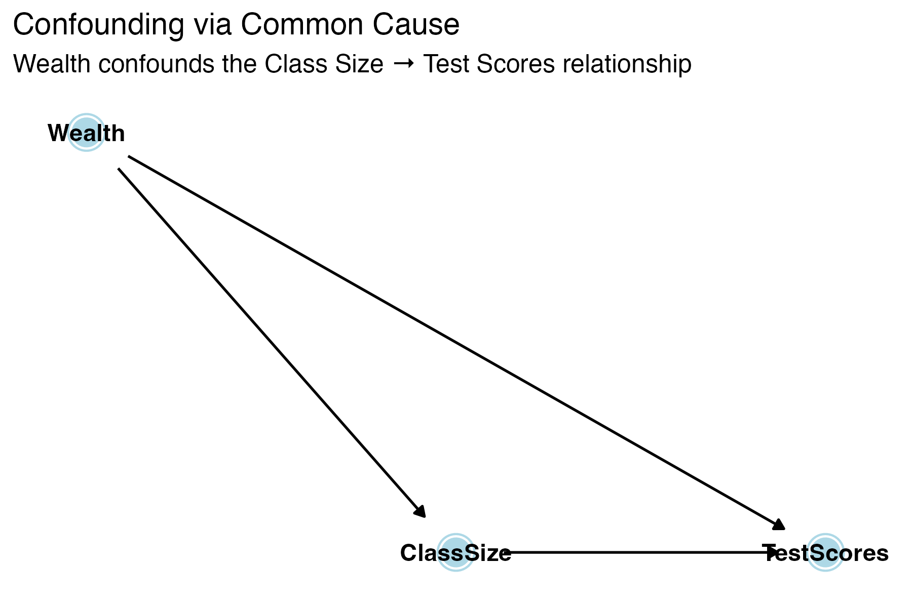

## Roadmap

| Chapter | Topic | Key Skills |
|---------|-------|------------|
| 8 | Nonlinear Relationships | Marginal effects, log interpretation, interactions |
| 9 | Assessing Studies | Threats to internal validity |
| 10 | Panel Data & DiD | Fixed effects, difference-in-differences |
| 12 | Instrumental Variables | 2SLS, instrument validity, LATE |

. . .

::: {.callout-important}
## Exam 3: April 23
Closed book. One-page formula sheet (double-sided) + calculator allowed. No Stata.
:::

# Chapter 8: Nonlinear Relationships

## Ch 8 Big Picture

We relax the assumption that the effect of $X$ on $Y$ is [constant]{.alert}.

. . .

Three tools — all still [linear in parameters]{.kw}, so OLS still works:

1. **Polynomial regression** — model curvature with $X^2$, $X^3$
2. **Logarithmic transformations** — model percentage changes
3. **Interaction terms** — allow the effect of $X_1$ to depend on $X_2$

## Polynomial Regression: Example {.smaller}

$$\widehat{TestScore} = 607.3 + 3.85 \times Income - 0.0423 \times Income^2$$

. . .

**What is the marginal effect of income at $Income = 10$ (thousand)?**

. . .

$$\frac{\Delta TestScore}{\Delta Income} \approx 3.85 + 2(-0.0423)(10) = 3.85 - 0.846 = 3.00$$

. . .

**At $Income = 40$?**

. . .

$$\frac{\Delta TestScore}{\Delta Income} \approx 3.85 + 2(-0.0423)(40) = 3.85 - 3.384 = 0.47$$

. . .

**Takeaway:** You [cannot]{.alert} interpret $\beta_1$ or $\beta_2$ in isolation. Always compute the [marginal effect at a specific value of $X$]{.kw}.

## The Log Interpretation Table {.smaller}

| Specification | Model | Interpretation of $\beta_1$ |
|:---|:---|:---|
| [Level-level]{.kw} | $Y = \beta_0 + \beta_1 X$ | A 1-unit $\uparrow$ in $X$ → $\beta_1$ unit $\uparrow$ in $Y$ |
| [Log-level]{.kw} | $\ln(Y) = \beta_0 + \beta_1 X$ | A 1-unit $\uparrow$ in $X$ → $(100 \times \beta_1)$% $\uparrow$ in $Y$ |
| [Level-log]{.kw} | $Y = \beta_0 + \beta_1 \ln(X)$ | A 1% $\uparrow$ in $X$ → $(\beta_1 / 100)$ unit $\uparrow$ in $Y$ |
| [Log-log]{.kw} | $\ln(Y) = \beta_0 + \beta_1 \ln(X)$ | A 1% $\uparrow$ in $X$ → $\beta_1$% $\uparrow$ in $Y$ (elasticity) |

. . .

**Must Know:** This table is one of the [highest-value things]{.alert} to have on your formula sheet. Know how to apply it.

## Log Interpretation: Practice

$$\ln(\widehat{Wage}) = 1.5 + 0.08 \times Educ$$

. . .

**This is log-level.** One additional year of education is associated with an approximately [8% increase]{.alert} in wages.

. . .

$$\widehat{Wage} = 12.5 + 3.2 \times \ln(Experience)$$

. . .

**This is level-log.** A 1% increase in experience is associated with a $3.2/100 = \$0.032$ increase in wages.

## Interaction Terms: The Idea

The effect of $X_1$ on $Y$ may [depend on the value of another variable]{.alert} $X_2$.

. . .

$$Y_i = \beta_0 + \beta_1 X_{1i} + \beta_2 X_{2i} + \beta_3 (X_{1i} \times X_{2i}) + u_i$$

. . .

**Marginal effect of $X_1$:**

$$\frac{\Delta Y}{\Delta X_1} = \beta_1 + \beta_3 X_2$$

The effect of $X_1$ [varies with]{.kw} $X_2$.

## Interaction Terms: Practice {.smaller}

$$\widehat{TestScore} = 700 - 1.0 \times STR - 0.5 \times PctEL - 0.02 \times (STR \times PctEL)$$

where $STR$ = student-teacher ratio (students per teacher), $PctEL$ = percent English learners (percentage, 0 to 100), and $TestScore$ = points on a standardized test.

. . .

**Q: What is the effect of reducing STR by 1 in a district where PctEL = 20%?**

. . .

$$\frac{\Delta TestScore}{\Delta STR} = -1.0 + (-0.02)(20) = -1.0 - 0.4 = -1.4$$

Reducing STR by 1 raises test scores by [1.4 points]{.alert} in a district with 20% English learners.

## Interaction Terms: Practice (cont.) {.smaller}

**Q: What about in a district where PctEL = 0?**

. . .

$$\frac{\Delta TestScore}{\Delta STR} = -1.0 + (-0.02)(0) = -1.0$$

Reducing STR by 1 raises test scores by [1.0 point]{.alert}.

. . .

**Knowledge Check:** Does the interaction term suggest a [larger]{.alert} or [smaller]{.alert} effect of reducing class size in districts with many English learners?

. . .

[Larger]{.alert} — the negative effect of STR is amplified when PctEL is high.

## Ch 8 Summary

| Tool | Use When... | Key Skill |
|------|-------------|-----------|
| Polynomial ($X^2$) | Effect of $X$ changes as $X$ increases | Marginal effect at specific $X$ |
| Logs | Think in percentages; skewed data | Log interpretation table |
| Interactions | Effect of $X_1$ depends on $X_2$ | Marginal effect at specific $X_2$ |

. . .

**Common Mistakes:**

1. Interpreting $\beta_1$ alone in a polynomial or interaction model
2. Forgetting to multiply by 100 (or divide by 100) for log models
3. Including the interaction but forgetting to include the [constituent terms]{.alert}

# Chapter 9: Assessing Studies

## Ch 9 Big Picture

Chapter 9 gives a [framework]{.kw} for evaluating regression studies.

. . .

- [Internal validity]{.kw}: Are the statistical inferences correct *for the population studied*? (Getting the right answer)
- [External validity]{.kw}: Can the results be *generalized* to other populations and settings? (Applying it elsewhere)

. . .

Internal validity is what we can [test and address]{.alert} with econometric tools. External validity requires [judgment]{.alert} — no mechanical test.

## The Five Threats to Internal Validity {.smaller}

When we estimate $Y_i = \beta_0 + \beta_1 X_i + u_i$, internal validity requires:

1. $E(u_i | X_i) = 0$ — no bias
2. Correct standard errors — valid inference

. . .

**Five threats that can violate these:**

1. [Omitted variable bias]{.kw}
2. [Wrong functional form]{.kw}
3. [Measurement error]{.kw} (errors-in-variables)
4. [Sample selection bias]{.kw}
5. [Simultaneous causality]{.kw}

## Threat 1: Omitted Variable Bias

An omitted variable $Z$ causes bias if:

1. $Z$ is a determinant of $Y$ (i.e., $Z$ is in the error term), **and**
2. $Z$ is correlated with $X$

. . .

**ECON 3500 solutions:** Include the omitted variable, use proxy variables, use panel data — difference-in-differences and fixed effects methods (Ch 10) — or use instrumental variables (Ch 12).

. . .

**Watch Out:** Adding "kitchen sink" controls can introduce its own problems — only control for variables that satisfy the OVB conditions. Bad controls can [create]{.alert} bias rather than remove it.

## Threat 3: Measurement Error

The variable you observe ($\tilde{X}$) differs from the true variable ($X$):

$$\tilde{X}_i = X_i + w_i$$

where $w_i$ is the measurement error.

. . .

| Type | Where | Bias Effect |
|:---|:---|:---|
| Classical ME in $X$ | Independent variable | Attenuation bias (toward zero) |
| ME in $Y$ | Dependent variable | No bias in $\hat{\beta}_1$; larger SEs |
| Non-classical ME in $X$ | Correlated with $X$ or $u$ | Bias direction uncertain |

## Attenuation Bias (Classical ME in $X$)

$$\hat{\beta}_1 \xrightarrow{p} \beta_1 \times \frac{\sigma_X^2}{\sigma_X^2 + \sigma_w^2}$$

. . .

The ratio $\frac{\sigma_X^2}{\sigma_X^2 + \sigma_w^2} < 1$, so $|\hat{\beta}_1|$ is too [small]{.alert}.

OLS is biased [toward zero]{.alert} — you underestimate the true effect.

. . .

**Solution:** Get better data, use IV (Ch 12).

## Other Threats at a Glance

| Threat | Problem | Example | Solution |
|:---|:---|:---|:---|
| [Wrong functional form]{.kw} | True relationship is nonlinear | Income → test scores is quadratic, you fit a line | Ch 8 tools (polynomials, logs, interactions) |
| [Sample selection]{.kw} | Sample not representative due to selection on $Y$ | Studying wages for employed only (survivorship bias) | Random sampling, Heckman correction |
| [Simultaneous causality]{.kw} | $X$ causes $Y$ **and** $Y$ causes $X$ | More police → less crime, but more crime → more police | IV (Ch 12), experiments |

## DAGs: Three Types of Paths {.smaller}

:::: {.columns}

::: {.column width="55%"}

| Path Type | Structure | Default | Example |
|:---|:---|:---|:---|
| [Causal]{.kw} (front-door) | $X \rightarrow M \rightarrow Y$ | Open | Education → Job → Earnings |
| [Backdoor]{.alert} | $X \leftarrow Z \rightarrow Y$ | Open | Class Size ← Wealth → Scores |
| [Collider]{.kw} | $X \rightarrow Z \leftarrow Y$ | Closed | Talent → Hiring ← Connections |

:::

::: {.column width="45%"}
{width=100% fig-align="center"}
:::

::::

. . .

- [Causal paths]{.kw} = what we want to estimate. Leave them open.
- [Backdoor paths]{.alert} = confounding. Must close them.
- [Collider paths]{.kw} = safely closed. Don't open them!

## What "Controlling For" Does {.smaller}

**Key identity:** $\text{Association} = \underbrace{\text{Causal Effect}}_{\text{front-door}} + \underbrace{\text{Bias}}_{\text{open backdoor}}$

Confounding = OVB = an [open backdoor path]{.alert}. Controlling for a variable [blocks all paths]{.kw} through it — but this can be good or bad:

| Path Type | Default | Controlling... | Result |
|:---|:---|:---|:---|
| Backdoor ($X \leftarrow Z \rightarrow Y$) | Open | [Closes]{.kw} it | Removes bias ✓ |
| Collider ($X \rightarrow Z \leftarrow Y$) | Closed | [Opens]{.alert} it | Creates bias ✗ |
| Mediator ($X \rightarrow Z \rightarrow Y$) | Open | [Closes]{.alert} it | Blocks causal effect ✗ |

. . .

**Bad Controls:**

- **Don't control for mediators** — you'll block the effect you're trying to measure
- **Don't control for colliders** — you'll introduce bias where there was none
- **Do control for confounders** — they create open backdoor paths (= OVB)

## DAG Practice {.smaller}

**You want to estimate the causal effect of Fertilizer on Crop Yield.**

You believe that Soil Quality affects both Fertilizer use (farmers apply more fertilizer to poor soil) and Crop Yield (better soil → higher yields). Rainfall also independently affects Crop Yield but does *not* affect how much fertilizer farmers apply.

. . .

The DAG:

- Fertilizer → Crop Yield
- Soil Quality → Fertilizer
- Soil Quality → Crop Yield
- Rainfall → Crop Yield

. . .

**Knowledge Check:**

1. List all paths from Fertilizer to Crop Yield
2. Classify each as causal or backdoor
3. What should you control for?

. . .

**Paths:**

- Fertilizer → Crop Yield (causal — leave open)
- Fertilizer ← Soil Quality → Crop Yield (backdoor — [control for Soil Quality]{.alert})

. . .

Rainfall has no path connecting Fertilizer and Crop Yield, so it does not need to be controlled for (though including it may reduce noise).

After controlling for Soil Quality, the only open path is causal. Effect is identified.

## Collider Bias: Practice {.smaller}

**You want to know whether Academic Ability affects Athletic Ability.**

Both cause College Admission:

- Academic Ability → College Admission
- Athletic Ability → College Admission

There is [no direct causal link]{.alert} between Academic Ability and Athletic Ability.

. . .

**Knowledge Check:** Should you study this relationship [among admitted students only]{.alert}?

. . .

**No!** Conditioning on College Admission (the collider) [opens]{.alert} a spurious path between Academic Ability and Athletic Ability.

Among admitted students, low Academic Ability becomes correlated with high Athletic Ability — because students who got in despite weak academics likely got in on athletic merit, and vice versa.

This is [collider bias]{.kw} (a.k.a. selection bias). The two abilities are independent in the full population, but conditioning on the collider creates a spurious negative association.

## Ch 9: What to Focus On

- Be able to [name and define]{.kw} each of the five threats
- Given a research scenario, [identify which threat(s)]{.kw} apply
- Know the [direction of bias]{.kw} when possible (especially OVB and attenuation bias)
- Know at least one [solution]{.kw} for each threat
- [Draw and interpret]{.kw} simple DAGs — identify causal vs. backdoor vs. collider paths
- Know what to [control for]{.kw} and what [not to control for]{.alert} (mediators, colliders)
- Explain why confounding = OVB = open backdoor path

# Chapter 10: Panel Data & DiD

## Ch 10 Big Picture

[Panel data]{.kw} = same units observed over multiple time periods.

. . .

Two powerful tools:

1. [Fixed effects]{.kw} — control for all time-invariant unobserved characteristics
2. [Difference-in-differences]{.kw} — estimate causal effects by comparing changes over time between treatment and control groups

## Why Panel Data?

[Panel data]{.kw} = the [same units]{.alert} observed over multiple time periods (not pooled cross-sections, which draw different samples each period).

. . .

The key advantage: we can control for [unobserved, time-invariant]{.alert} characteristics.

. . .

$$Y_{it} = \beta_0 + \beta_1 X_{it} + \alpha_i + u_{it}$$

- $\alpha_i$ = [entity fixed effect]{.kw} — captures everything about unit $i$ that doesn't change over time
- Examples: ability, geography, institutional culture, baseline preferences

. . .

**Key Insight:** Fixed effects eliminate OVB from [any]{.alert} time-invariant omitted variable — even ones you can't observe or measure.

## Entity Fixed Effects: Mechanics {.smaller}

**Approach 1: First-difference estimator**

Take the difference between two periods:

$$Y_{it} - Y_{i,t-1} = \beta_1(X_{it} - X_{i,t-1}) + (u_{it} - u_{i,t-1})$$

. . .

The fixed effect $\alpha_i$ [drops out]{.alert} because $\alpha_i - \alpha_i = 0$.

. . .

**Approach 2: Entity dummies**

Include a dummy variable for each entity:

$$Y_{it} = \beta_1 X_{it} + \gamma_1 D_{1i} + \gamma_2 D_{2i} + \cdots + u_{it}$$

. . .

**Approach 3: Demeaning**

Subtract the entity mean: $\tilde{Y}_{it} = Y_{it} - \bar{Y}_i$, then regress $\tilde{Y}$ on $\tilde{X}$.

All three approaches give the [same $\hat{\beta}_1$]{.alert}.

## Time Fixed Effects

$$Y_{it} = \beta_1 X_{it} + \alpha_i + \lambda_t + u_{it}$$

- $\lambda_t$ = [time fixed effect]{.kw} — captures anything affecting all units in period $t$
- Examples: macroeconomic shocks, federal policy changes, technological trends

. . .

**Entity FE + Time FE together** control for:

- All time-invariant unit characteristics ($\alpha_i$)
- All unit-invariant time shocks ($\lambda_t$)

. . .

**Limitation:** Fixed effects [cannot]{.alert} control for omitted variables that change over time *and* vary across units. For that, you may need other methods such as IV (Ch 12) or DiD.

## Difference-in-Differences: Setup {.smaller}

[DiD]{.kw} estimates a causal effect by comparing [changes over time]{.alert} between a [treatment group]{.kw} and a [control group]{.kw}.

. . .

|  | Before | After | Change |
|:---|:---|:---|:---|
| [Treatment]{.kw} | $\bar{Y}_{T,before}$ | $\bar{Y}_{T,after}$ | $\Delta \bar{Y}_T$ |
| [Control]{.kw} | $\bar{Y}_{C,before}$ | $\bar{Y}_{C,after}$ | $\Delta \bar{Y}_C$ |

. . .

**DiD estimate:**

$$\hat{\delta}_{DiD} = (\bar{Y}_{T,after} - \bar{Y}_{T,before}) - (\bar{Y}_{C,after} - \bar{Y}_{C,before})$$

$$= \Delta \bar{Y}_T - \Delta \bar{Y}_C$$

## DiD as a Regression {.smaller}

$$Y_{it} = \beta_0 + \beta_1 \text{Treat}_i + \beta_2 \text{After}_t + \beta_3 (\text{Treat}_i \times \text{After}_t) + u_{it}$$

. . .

| Coefficient | Meaning |
|:---|:---|
| $\beta_0$ | Control group mean, before |
| $\beta_1$ | Difference between treatment and control, before |
| $\beta_2$ | Change over time for control group |
| [$\beta_3$]{.alert} | [DiD estimate]{.kw} = causal effect of treatment |

. . .

**The DiD Coefficient:** $\beta_3$ is the coefficient on the [interaction term]{.alert} $\text{Treat} \times \text{After}$. This is the causal effect of interest.

## The Parallel Trends Assumption

::: {.callout-note}
## Parallel Trends
In the [absence of treatment]{.alert}, the treatment and control groups would have followed the [same trend]{.kw} over time.
:::

. . .

- This is the [key identifying assumption]{.alert} of DiD.
- It is [not directly testable]{.alert} — we never observe what would have happened to the treatment group without treatment.
- We can check [pre-treatment trends]{.kw} — if they are parallel before treatment, it is more plausible they would have remained parallel.

. . .

**If Parallel Trends Fails:** The DiD estimate is [biased]{.alert}. Any pre-existing divergence between groups gets picked up as a "treatment effect."

## DiD Calculation: Practice {.smaller}

A state raises its minimum wage in 2020. You have average teen employment rates:

|  | 2019 | 2021 |
|:---|:---|:---|
| Treatment state | 50% | 47% |
| Control state | 53% | 52% |

. . .

Calculate the DiD estimate of the minimum wage effect on teen employment.

. . .

**Step 1:** Change in treatment: $47 - 50 = -3$ pp

. . .

**Step 2:** Change in control: $52 - 53 = -1$ pp

. . .

**Step 3:** DiD = $(-3) - (-1) = -2$ pp

. . .

The minimum wage increase is associated with a [2 percentage point decrease]{.alert} in teen employment.

## Ch 10: What to Focus On

- [Distinguish]{.kw} cross-sectional, time-series, and panel data
- Explain what [entity fixed effects]{.kw} control for and what they [cannot]{.alert} control for
- Know how the [first-difference estimator]{.kw} eliminates fixed effects (the algebra)
- [Calculate a DiD estimate]{.kw} from a 2x2 table
- State the [parallel trends assumption]{.kw} and explain why it matters
- Know which coefficient in the regression is the DiD estimate ($\beta_3$, the interaction)

. . .

**Standard Errors in Panel Data:** With panel data, observations within the same entity are likely correlated over time. Use [clustered standard errors]{.alert} (cluster at the entity level) — otherwise SEs are too small and you over-reject.

# Chapter 12: Instrumental Variables

## Ch 12 Big Picture

When $E(u_i | X_i) \neq 0$ (endogeneity), OLS is [biased and inconsistent]{.alert}.

. . .

[Instrumental variables (IV)]{.kw} solve this by finding a variable $Z$ that:

- Affects $X$ (so we can use it to predict $X$)
- But has no direct relationship with $Y$ except through $X$

. . .

Think of IV as [isolating]{.kw} the "good" variation in $X$ — the part unrelated to the error term.

## Why Do We Need IV?

Three threats produce endogeneity ($E(u_i | X_i) \neq 0$):

| Threat | Example |
|:---|:---|
| Omitted variable bias | Ability biases returns to schooling |
| Simultaneous causality | Police ↔ crime |
| Measurement error | Self-reported income |

. . .

When we cannot fix these with controls, panel data, or experiments, we turn to [instrumental variables]{.kw}.

## The Three Conditions for a Valid Instrument

An instrument $Z$ must satisfy:

::: {.callout-note}
## 1. Relevance
$Z$ is correlated with $X$: $\text{corr}(Z_i, X_i) \neq 0$

*$Z$ must actually affect $X$. Testable with the first-stage regression.*
:::

## Instrument Validity (cont.)

::: {.callout-note}
## 2. Exogeneity (Independence)
$Z$ is uncorrelated with the error term: $\text{corr}(Z_i, u_i) = 0$

*$Z$ must be "as good as randomly assigned." [Not directly testable]{.alert} — requires reasoning.*
:::

. . .

::: {.callout-note}
## 3. Exclusion Restriction
$Z$ affects $Y$ [only through $X$]{.alert}, not directly.

*There is no direct causal path from $Z$ to $Y$ that bypasses $X$. [Not directly testable]{.alert}.*
:::

## Classic Example: Returns to Education {.smaller}

**Problem:** Estimate the causal effect of schooling on wages.

$$\ln(wage_i) = \beta_0 + \beta_1 schooling_i + u_i$$

OVB: Ability is in $u_i$ and correlated with schooling → $\hat{\beta}_1$ is biased upward.

. . .

**Proposed instrument:** Quarter of birth ($Z$)

- [Relevance]{.kw}: Compulsory schooling laws mean people born earlier in the year can drop out sooner → less schooling. ✓
- [Exogeneity]{.kw}: Quarter of birth is essentially random. ✓ (plausibly)
- [Exclusion]{.kw}: Quarter of birth doesn't directly affect wages — only through schooling. ✓ (debatable)

. . .

**Caution:** Exclusion restriction is always [arguable]{.alert}, not provable. This is where most debates about IV studies focus.

## Two-Stage Least Squares (2SLS) {.smaller}

::: {.callout-note}
## Stage 1: First-Stage Regression
Regress $X$ on $Z$ (and any controls $W$):

$$X_i = \pi_0 + \pi_1 Z_i + \pi_2 W_i + v_i$$

Save the predicted values $\hat{X}_i$.
:::

. . .

::: {.callout-note}
## Stage 2: Second-Stage Regression
Regress $Y$ on $\hat{X}$ (and any controls $W$):

$$Y_i = \beta_0 + \beta_1 \hat{X}_i + \beta_2 W_i + u_i$$
:::

. . .

**Why this works:** $\hat{X}_i$ contains only the variation in $X$ that comes from $Z$. Since $Z$ is exogenous, $\hat{X}_i$ is uncorrelated with $u_i$.

. . .

**Important:** Use a proper IV/2SLS command (e.g., `ivregress 2sls` in Stata). Running two separate regressions gives [wrong standard errors]{.alert}.

## The Wald Estimator (Binary Instrument)

When the instrument $Z$ is [binary]{.kw} (0 or 1), the IV estimate simplifies:

$$\hat{\beta}_1^{Wald} = \frac{\text{Reduced form}}{\text{First stage}}$$

. . .

- [Reduced form]{.kw}: regress $Y$ on $Z$ — total effect of $Z$ on $Y$
- [First stage]{.kw}: regress $X$ on $Z$ — effect of $Z$ on $X$
- [Wald estimate]{.kw}: the ratio — causal effect of $X$ on $Y$, scaled by how much $Z$ moves $X$

. . .

**Intuition:** The reduced form tells you how much $Z$ moves $Y$. The first stage tells you how much $Z$ moves $X$. Dividing gives you how much $X$ moves $Y$.

## Weak Instruments {.smaller}

If $Z$ is only [weakly correlated]{.alert} with $X$, the IV estimator has serious problems:

- Large standard errors
- Biased (toward OLS) in finite samples
- Unreliable hypothesis tests

. . .

**The F > 10 Rule of Thumb:** Test instrument relevance with the [first-stage F-statistic]{.kw}.

- $F > 10$: Instrument is sufficiently strong ✓
- $F < 10$: Weak instrument — IV estimates are unreliable ✗

This is a [necessary condition]{.alert} you should always check.

. . .

**How to get the F-statistic:** Run the first-stage regression and look at the F-statistic on the excluded instrument(s).

## LATE: What Does IV Actually Estimate?

::: {.callout-note}
## Local Average Treatment Effect (LATE)
IV estimates the causal effect for [compliers]{.alert} — the subpopulation whose treatment status is changed by the instrument.
:::

. . .

- IV estimates the effect [only for compliers]{.alert} — not for the whole population.
- This is a [local]{.kw} estimate, not a global one.
- The IV estimate may differ from the ATE if compliers are not representative — think carefully about [who the estimate applies to]{.alert}.

## Evaluating Instruments: Practice {.smaller}

A researcher wants to estimate the effect of [years of education]{.kw} on earnings. She proposes using [distance from the nearest college]{.kw} (where the person grew up) as an instrument.

. . .

Evaluate each condition:

. . .

**1. Relevance:** Living closer to a college lowers the cost of attending → more schooling. ✓ (testable)

. . .

**2. Exogeneity:** Is distance from college correlated with unobserved determinants of earnings?
Growing up near a college often means growing up in an urban area — urban/rural differences in family income, school quality, and job markets could violate this. ⚠️

. . .

**3. Exclusion:** Does distance affect earnings [only through]{.alert} education?
Possibly not — proximity to a college town may independently affect local labor markets and earnings. ⚠️

. . .

**Verdict:** Relevance is plausible, but exogeneity and exclusion are [debatable]{.alert} — the researcher would need to add controls for urban/rural, family background, and local labor market conditions.

## Ch 12 Summary

| Concept | Key Point |
|:---|:---|
| Endogeneity | $E(u_i \mid X_i) \neq 0$ → OLS is biased |
| Valid instrument | Relevant + exogenous + exclusion restriction |
| 2SLS | First stage predicts $X$; second stage uses $\hat{X}$ |
| Weak instruments | $F < 10$ in first stage → unreliable |
| LATE | IV estimates effect for compliers only |

. . .

**Common Mistakes:**

1. Claiming an instrument is valid without arguing exclusion restriction
2. Running 2SLS as two separate regressions (wrong SEs)
3. Ignoring the weak instrument problem
4. Interpreting IV as the ATE instead of the LATE

# Putting It All Together

## Connections Across Chapters {.smaller}

These chapters are deeply linked:

. . .

- **Ch 8 → Ch 9**: Wrong functional form (Ch 9) is solved by nonlinear models (Ch 8)

. . .

- **Ch 9 → Ch 10**: Omitted variable bias (Ch 9) can be addressed by fixed effects (Ch 10) when the omitted variable is time-invariant

. . .

- **Ch 9 → Ch 12**: OVB, simultaneous causality, and measurement error (Ch 9) are all forms of endogeneity addressed by IV (Ch 12)

. . .

- **Ch 10 + Ch 12**: IV can be combined with panel data/fixed effects when endogeneity remains after controlling for fixed effects

## Decision Tree: Which Tool? {.smaller}

**You suspect your OLS estimate is biased. What do you do?**

| If the problem is... | Try... |
|:---|:---|
| Wrong functional form | Polynomials, logs, interactions (Ch 8) |
| Time-invariant omitted variable + panel data available | Entity fixed effects (Ch 10) |
| Common time shock | Time fixed effects (Ch 10) |
| Clear before/after treatment with a control group | DiD (Ch 10) |
| Endogeneity remains (OVB, simultaneity, meas. error) | Instrumental variables (Ch 12) |
| Non-random sample | Address selection, or be cautious |

## Formula Sheet Suggestions

Your double-sided formula sheet should include:

- [Log interpretation table]{.alert} (Ch 8) — you will almost certainly need this
- Marginal effect formulas for polynomials and interactions (Ch 8)
- Five threats to internal validity (Ch 9)
- DiD formula and regression setup (Ch 10)
- Three conditions for a valid instrument (Ch 12)
- 2SLS steps (Ch 12)
- $F > 10$ rule (Ch 12)
